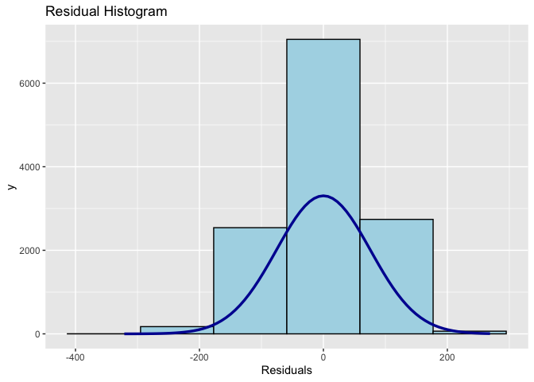

Lab 1
================

## Importing your data

Let’s import the `usa` dataset which we will work on today.

Let’s inspect the data using `head()`

``` r
head(data3) # head() function will only give you a short overview of your dataset
```

    ## # A tibble: 6 × 725
    ##   idcntry idbook idschool idclass idstud idgrade     itbirthd  itbirthm itbirthy
    ##     <dbl>  <dbl>    <dbl>   <dbl>  <dbl> <dbl+lbl>   <dbl+lbl> <dbl+lb> <dbl+lb>
    ## 1     840      2        1     102  10201 4 [GRADE 4] NA(a)      1       2002    
    ## 2     840      3        1     102  10202 4 [GRADE 4] NA(a)      9       2001    
    ## 3     840      4        1     102  10203 4 [GRADE 4] NA(a)     10       2001    
    ## 4     840      5        1     102  10204 4 [GRADE 4] NA(a)      8       2001    
    ## 5     840      6        1     102  10205 4 [GRADE 4] NA(a)      8       2001    
    ## 6     840      7        1     102  10206 4 [GRADE 4] NA(a)     11       2001    
    ## # ℹ 716 more variables: itsex <dbl+lbl>, itadmini <dbl+lbl>, itdate <dbl>,
    ## #   itlang <dbl+lbl>, asbg01 <dbl+lbl>, asbg02a <dbl+lbl>, asbg02b <dbl+lbl>,
    ## #   asbg03 <dbl+lbl>, asbg04 <dbl+lbl>, asbg05a <dbl+lbl>, asbg05b <dbl+lbl>,
    ## #   asbg05c <dbl+lbl>, asbg05d <dbl+lbl>, asbg05e <dbl+lbl>, asbg05f <dbl+lbl>,
    ## #   asbg05g <dbl+lbl>, asbg05h <dbl+lbl>, asbg05i <dbl+lbl>, asbg05j <dbl+lbl>,
    ## #   asbg05k <dbl+lbl>, asbg06a <dbl+lbl>, asbg06b <dbl+lbl>, asbg06c <dbl+lbl>,
    ## #   asbg07a <dbl+lbl>, asbg07b <dbl+lbl>, asbg07c <dbl+lbl>, …

``` r
colnames(data3)[1:20]
```

    ##  [1] "idcntry"  "idbook"   "idschool" "idclass"  "idstud"   "idgrade" 
    ##  [7] "itbirthd" "itbirthm" "itbirthy" "itsex"    "itadmini" "itdate"  
    ## [13] "itlang"   "asbg01"   "asbg02a"  "asbg02b"  "asbg03"   "asbg04"  
    ## [19] "asbg05a"  "asbg05b"

### Check Outliers and Missing Values

Let’s check outliers and missing values. Today we will be only using the
variable `math1` and `age`.

``` r
#install.packages('psych')
summary(data3[c('math1', 'age')])
```

    ##      math1            age        
    ##  Min.   :225.8   Min.   : 8.750  
    ##  1st Qu.:491.0   1st Qu.: 9.917  
    ##  Median :544.1   Median :10.250  
    ##  Mean   :540.4   Mean   :10.249  
    ##  3rd Qu.:593.3   3rd Qu.:10.500  
    ##  Max.   :804.1   Max.   :13.083

``` r
# can you get me the mean mean() and st.dev sd() for math1 and age 
m_math <- mean(data3$math1)
sd_math <- sd(data3$math1)

m_age <- mean(data3$age)
sd_age <- sd(data3$age)
##############

boxplot(data3$age)
```

<!-- -->

``` r
out <- boxplot.stats(data3$age)$out
#out

out_ind <- which(data3$age %in% c(out))
out_ind[1:20]
```

    ##  [1] 101 152 289 291 293 420 436 446 453 579 620 657 780 784 790 792 813 867 871
    ## [20] 881

### Histogram

Let’s create a histogram for the two variables: `math1` and `age`

``` r
#math1
hist(data3$math1)
```

<!-- -->

``` r
#age
hist(data3$age)
```

<!-- -->

### Assumption 1: Linearity

Let’s check for the relationship between the two variables: `math1` and
`age`

``` r
# what type of statistics would i introduce here?
cor(data3$math1, data3$age) # pearson's c
```

    ## [1] -0.07133461

### Assumption 3: variance of your x variable `age`

``` r
#age
library(psych)
describe(data3) # this will give you the descriptive stats for the entire dataset
```

    ## Warning in FUN(newX[, i], ...): no non-missing arguments to min; returning Inf

    ## Warning in FUN(newX[, i], ...): no non-missing arguments to min; returning Inf

    ## Warning in FUN(newX[, i], ...): no non-missing arguments to max; returning -Inf

    ## Warning in FUN(newX[, i], ...): no non-missing arguments to max; returning -Inf

    ##                 vars     n          mean           sd        median
    ## idcntry            1 12569  8.400000e+02 0.000000e+00  8.400000e+02
    ## idbook             2 12569  7.500000e+00 4.030000e+00  7.000000e+00
    ## idschool           3 12569  3.721100e+02 5.244200e+02  2.730000e+02
    ## idclass            4 12569  3.721428e+04 5.244214e+04  2.730100e+04
    ## idstud             5 12569  3.721440e+06 5.244214e+06  2.730103e+06
    ## idgrade            6 12569  4.000000e+00 0.000000e+00  4.000000e+00
    ## itbirthd           7 12269  1.568000e+01 8.830000e+00  1.600000e+01
    ## itbirthm           8 12569  6.560000e+00 3.420000e+00  7.000000e+00
    ## itbirthy           9 12569  2.000620e+03 5.300000e-01  2.001000e+03
    ## itsex             10 12569  1.500000e+00 5.000000e-01  1.000000e+00
    ## itadmini          11 12569  1.000000e+00 0.000000e+00  1.000000e+00
    ## itdate            12 12569  1.352367e+10 1.367302e+06  1.352385e+10
    ## itlang            13 12569  1.000000e+00 0.000000e+00  1.000000e+00
    ## asbg01            14 12554  1.500000e+00 5.000000e-01  1.000000e+00
    ## asbg02a           15 12554  6.560000e+00 3.420000e+00  7.000000e+00
    ## asbg02b           16 12554  3.620000e+00 5.300000e-01  4.000000e+00
    ## asbg03            17 12569  1.190000e+00 4.400000e-01  1.000000e+00
    ## asbg04            18 12407  2.870000e+00 1.180000e+00  3.000000e+00
    ## asbg05a           19 12442  9.300000e-01 2.500000e-01  1.000000e+00
    ## asbg05b           20 12411  7.700000e-01 4.200000e-01  1.000000e+00
    ## asbg05c           21 12411  9.100000e-01 2.800000e-01  1.000000e+00
    ## asbg05d           22 12425  7.200000e-01 4.500000e-01  1.000000e+00
    ## asbg05e           23 12371  8.500000e-01 3.500000e-01  1.000000e+00
    ## asbg05f           24 12368  6.800000e-01 4.600000e-01  1.000000e+00
    ## asbg05g           25 12437  9.500000e-01 2.200000e-01  1.000000e+00
    ## asbg05h           26 12423  9.500000e-01 2.100000e-01  1.000000e+00
    ## asbg05i           27 12569  0.000000e+00 0.000000e+00  0.000000e+00
    ## asbg05j           28 12569  0.000000e+00 0.000000e+00  0.000000e+00
    ## asbg05k           29 12569  0.000000e+00 0.000000e+00  0.000000e+00
    ## asbg06a           30 12234  1.820000e+00 9.700000e-01  2.000000e+00
    ## asbg06b           31 11774  2.170000e+00 8.800000e-01  2.000000e+00
    ## asbg06c           32 11748  2.870000e+00 1.100000e+00  3.000000e+00
    ## asbg07a           33 12310  6.100000e-01 4.900000e-01  1.000000e+00
    ## asbg07b           34 12195  4.800000e-01 5.000000e-01  0.000000e+00
    ## asbg07c           35 12187  7.800000e-01 4.100000e-01  1.000000e+00
    ## asbg07d           36 12249  7.700000e-01 4.200000e-01  1.000000e+00
    ## asbg08a           37 12374  1.910000e+00 9.600000e-01  2.000000e+00
    ## asbg08b           38 12287  1.590000e+00 8.700000e-01  1.000000e+00
    ## asbg08c           39 12262  1.700000e+00 9.900000e-01  1.000000e+00
    ## asbg09a           40 12341  2.990000e+00 1.160000e+00  3.000000e+00
    ## asbg09b           41 12277  3.160000e+00 1.100000e+00  4.000000e+00
    ## asbg09c           42 12212  3.160000e+00 1.090000e+00  4.000000e+00
    ## asbg09d           43 12146  3.290000e+00 1.020000e+00  4.000000e+00
    ## asbg09e           44 12232  3.270000e+00 1.050000e+00  4.000000e+00
    ## asbg09f           45 12285  3.550000e+00 9.000000e-01  4.000000e+00
    ## asbm01a           46 12379  3.220000e+00 9.800000e-01  4.000000e+00
    ## asbm01b           47 12284  2.890000e+00 1.160000e+00  3.000000e+00
    ## asbm01c           48 12158  3.030000e+00 1.120000e+00  3.000000e+00
    ## asbm01d           49 12182  3.420000e+00 9.000000e-01  4.000000e+00
    ## asbm01e           50 12139  3.180000e+00 1.040000e+00  4.000000e+00
    ## asbm01f           51 12311  3.800000e+00 5.700000e-01  4.000000e+00
    ## asbm02a           52 12388  1.250000e+00 5.700000e-01  1.000000e+00
    ## asbm02b           53 12266  2.830000e+00 1.120000e+00  3.000000e+00
    ## asbm02c           54 12161  1.490000e+00 7.800000e-01  1.000000e+00
    ## asbm02d           55 12247  1.610000e+00 8.300000e-01  1.000000e+00
    ## asbm02e           56 12310  1.570000e+00 8.500000e-01  1.000000e+00
    ## asbm03a           57 12365  1.570000e+00 7.900000e-01  1.000000e+00
    ## asbm03b           58 12272  2.990000e+00 1.110000e+00  3.000000e+00
    ## asbm03c           59 12068  3.270000e+00 1.040000e+00  4.000000e+00
    ## asbm03d           60 12153  1.830000e+00 9.500000e-01  2.000000e+00
    ## asbm03e           61 12218  1.980000e+00 1.000000e+00  2.000000e+00
    ## asbm03f           62 12208  1.900000e+00 9.800000e-01  2.000000e+00
    ## asbm03g           63 12290  3.100000e+00 1.140000e+00  4.000000e+00
    ## asbs04a           64 12352  1.610000e+00 9.200000e-01  1.000000e+00
    ## asbs04b           65 12254  3.160000e+00 1.080000e+00  4.000000e+00
    ## asbs04c           66 12166  2.810000e+00 1.140000e+00  3.000000e+00
    ## asbs04d           67 12131  3.270000e+00 1.030000e+00  4.000000e+00
    ## asbs04e           68 12191  1.400000e+00 7.900000e-01  1.000000e+00
    ## asbs04f           69 12178  1.640000e+00 9.600000e-01  1.000000e+00
    ## asbs04g           70 12256  1.290000e+00 6.600000e-01  1.000000e+00
    ## asbs05a           71 12307  1.300000e+00 6.400000e-01  1.000000e+00
    ## asbs05b           72 12229  2.930000e+00 1.120000e+00  3.000000e+00
    ## asbs05c           73 12167  1.460000e+00 7.800000e-01  1.000000e+00
    ## asbs05d           74 12194  1.520000e+00 8.200000e-01  1.000000e+00
    ## asbs05e           75 12244  1.480000e+00 8.200000e-01  1.000000e+00
    ## asbs06a           76 12298  1.590000e+00 8.000000e-01  1.000000e+00
    ## asbs06b           77 12216  3.150000e+00 1.040000e+00  4.000000e+00
    ## asbs06c           78 12078  3.290000e+00 1.010000e+00  4.000000e+00
    ## asbs06d           79 12074  1.820000e+00 9.400000e-01  2.000000e+00
    ## asbs06e           80 12128  2.090000e+00 1.040000e+00  2.000000e+00
    ## asbs06f           81 12217  3.240000e+00 1.060000e+00  4.000000e+00
    ## ssystem           82 12569  3.195838e+04 8.290830e+03  3.168600e+04
    ## itaccomm1         83 12569  0.000000e+00 0.000000e+00  0.000000e+00
    ## idpop             84 12569  1.000000e+00 0.000000e+00  1.000000e+00
    ## idgrader          85 12569  2.000000e+00 0.000000e+00  2.000000e+00
    ## condvar1          86 12328  2.170000e+00 1.520000e+00  2.000000e+00
    ## asdage            87 12569  1.021000e+01 4.400000e-01  1.017000e+01
    ## idstrate          88     0           NaN           NA            NA
    ## idstrati          89     0           NaN           NA            NA
    ## totwgt            90 12569  2.838600e+02 1.954100e+02  2.333500e+02
    ## houwgt            91 12569  1.000000e+00 6.900000e-01  8.200000e-01
    ## senwgt            92 12569  4.000000e-02 3.000000e-02  3.000000e-02
    ## wgtadj1           93 12569  1.150000e+00 2.300000e-01  1.110000e+00
    ## wgtadj2           94 12569  1.000000e+00 1.000000e-02  1.000000e+00
    ## wgtadj3           95 12569  1.050000e+00 7.000000e-02  1.040000e+00
    ## wgtfac1           96 12569  1.062200e+02 7.469000e+01  9.352000e+01
    ## wgtfac2           97 12569  2.420000e+00 1.030000e+00  2.000000e+00
    ## wgtfac3           98 12569  1.000000e+00 0.000000e+00  1.000000e+00
    ## jkzone            99 12569  3.667000e+01 2.133000e+01  3.400000e+01
    ## jkrep            100 12569  5.100000e-01 5.000000e-01  1.000000e+00
    ## asmmat01         101 12569  5.404400e+02 7.606000e+01  5.440600e+02
    ## asmmat02         102 12569  5.405700e+02 7.617000e+01  5.443100e+02
    ## asmmat03         103 12569  5.408700e+02 7.497000e+01  5.440300e+02
    ## asmmat04         104 12569  5.402100e+02 7.595000e+01  5.438300e+02
    ## asmmat05         105 12569  5.408500e+02 7.588000e+01  5.448500e+02
    ## asssci01         106 12569  5.435600e+02 7.885000e+01  5.482100e+02
    ## asssci02         107 12569  5.416400e+02 7.898000e+01  5.467300e+02
    ## asssci03         108 12569  5.416800e+02 7.933000e+01  5.467200e+02
    ## asssci04         109 12569  5.411300e+02 7.954000e+01  5.460600e+02
    ## asssci05         110 12569  5.428700e+02 7.853000e+01  5.475800e+02
    ## asmdat01         111 12569  5.449800e+02 7.504000e+01  5.479800e+02
    ## asmdat02         112 12569  5.449400e+02 7.474000e+01  5.472500e+02
    ## asmdat03         113 12569  5.445200e+02 7.512000e+01  5.473500e+02
    ## asmdat04         114 12569  5.449400e+02 7.641000e+01  5.491700e+02
    ## asmdat05         115 12569  5.438600e+02 7.645000e+01  5.478300e+02
    ## asmgeo01         116 12569  5.341700e+02 8.432000e+01  5.372500e+02
    ## asmgeo02         117 12569  5.348100e+02 8.392000e+01  5.379000e+02
    ## asmgeo03         118 12569  5.346100e+02 8.466000e+01  5.379000e+02
    ## asmgeo04         119 12569  5.349600e+02 8.606000e+01  5.381600e+02
    ## asmgeo05         120 12569  5.342600e+02 8.559000e+01  5.377700e+02
    ## asmnum01         121 12569  5.433300e+02 7.763000e+01  5.455700e+02
    ## asmnum02         122 12569  5.440600e+02 7.743000e+01  5.467400e+02
    ## asmnum03         123 12569  5.427300e+02 7.729000e+01  5.455400e+02
    ## asmnum04         124 12569  5.427500e+02 7.776000e+01  5.457700e+02
    ## asmnum05         125 12569  5.426300e+02 7.758000e+01  5.457100e+02
    ## assear01         126 12569  5.369300e+02 8.425000e+01  5.417500e+02
    ## assear02         127 12569  5.351700e+02 8.560000e+01  5.396300e+02
    ## assear03         128 12569  5.369500e+02 8.561000e+01  5.405600e+02
    ## assear04         129 12569  5.357600e+02 8.520000e+01  5.399500e+02
    ## assear05         130 12569  5.370100e+02 8.346000e+01  5.408000e+02
    ## asslif01         131 12569  5.465200e+02 8.426000e+01  5.516000e+02
    ## asslif02         132 12569  5.440800e+02 8.460000e+01  5.495100e+02
    ## asslif03         133 12569  5.439000e+02 8.437000e+01  5.481000e+02
    ## asslif04         134 12569  5.455700e+02 8.396000e+01  5.494300e+02
    ## asslif05         135 12569  5.451000e+02 8.276000e+01  5.495100e+02
    ## assphy01         136 12569  5.430900e+02 7.639000e+01  5.473700e+02
    ## assphy02         137 12569  5.407800e+02 7.711000e+01  5.455700e+02
    ## assphy03         138 12569  5.408200e+02 7.676000e+01  5.444100e+02
    ## assphy04         139 12569  5.420400e+02 7.733000e+01  5.465400e+02
    ## assphy05         140 12569  5.423000e+02 7.664000e+01  5.459700e+02
    ## asmkno01         141 12569  5.562000e+02 7.773000e+01  5.586200e+02
    ## asmkno02         142 12569  5.562300e+02 7.739000e+01  5.595600e+02
    ## asmkno03         143 12569  5.567400e+02 7.616000e+01  5.592900e+02
    ## asmkno04         144 12569  5.558400e+02 7.815000e+01  5.589600e+02
    ## asmkno05         145 12569  5.549400e+02 7.671000e+01  5.580700e+02
    ## asmapp01         146 12569  5.392900e+02 8.172000e+01  5.422300e+02
    ## asmapp02         147 12569  5.386300e+02 8.198000e+01  5.421100e+02
    ## asmapp03         148 12569  5.394400e+02 8.182000e+01  5.429200e+02
    ## asmapp04         149 12569  5.381700e+02 8.243000e+01  5.412300e+02
    ## asmapp05         150 12569  5.389100e+02 8.184000e+01  5.427600e+02
    ## asmrea01         151 12569  5.244200e+02 7.578000e+01  5.260100e+02
    ## asmrea02         152 12569  5.257600e+02 7.581000e+01  5.288200e+02
    ## asmrea03         153 12569  5.255300e+02 7.337000e+01  5.276800e+02
    ## asmrea04         154 12569  5.250800e+02 7.550000e+01  5.275000e+02
    ## asmrea05         155 12569  5.263100e+02 7.676000e+01  5.288000e+02
    ## asskno01         156 12569  5.444500e+02 8.106000e+01  5.497200e+02
    ## asskno02         157 12569  5.436900e+02 8.083000e+01  5.470700e+02
    ## asskno03         158 12569  5.436000e+02 8.026000e+01  5.462900e+02
    ## asskno04         159 12569  5.440300e+02 8.034000e+01  5.479600e+02
    ## asskno05         160 12569  5.447300e+02 7.956000e+01  5.479400e+02
    ## assapp01         161 12569  5.431700e+02 8.163000e+01  5.480800e+02
    ## assapp02         162 12569  5.409700e+02 8.297000e+01  5.456100e+02
    ## assapp03         163 12569  5.423100e+02 8.293000e+01  5.465400e+02
    ## assapp04         164 12569  5.423300e+02 8.267000e+01  5.467700e+02
    ## assapp05         165 12569  5.433300e+02 8.258000e+01  5.484500e+02
    ## assrea01         166 12569  5.378300e+02 7.705000e+01  5.419700e+02
    ## assrea02         167 12569  5.347100e+02 7.632000e+01  5.388000e+02
    ## assrea03         168 12569  5.360000e+02 7.783000e+01  5.398700e+02
    ## assrea04         169 12569  5.344500e+02 7.759000e+01  5.386300e+02
    ## assrea05         170 12569  5.352300e+02 7.758000e+01  5.398800e+02
    ## asmibm01         171 12569  3.360000e+00 1.020000e+00  3.000000e+00
    ## asmibm02         172 12569  3.370000e+00 1.020000e+00  3.000000e+00
    ## asmibm03         173 12569  3.370000e+00 1.010000e+00  3.000000e+00
    ## asmibm04         174 12569  3.360000e+00 1.020000e+00  3.000000e+00
    ## asmibm05         175 12569  3.370000e+00 1.020000e+00  3.000000e+00
    ## assibm01         176 12569  3.410000e+00 1.050000e+00  3.000000e+00
    ## assibm02         177 12569  3.380000e+00 1.040000e+00  3.000000e+00
    ## assibm03         178 12569  3.380000e+00 1.050000e+00  3.000000e+00
    ## assibm04         179 12569  3.380000e+00 1.050000e+00  3.000000e+00
    ## assibm05         180 12569  3.400000e+00 1.040000e+00  3.000000e+00
    ## asbgsbs          181 12319  1.013000e+01 2.070000e+00  1.013000e+01
    ## asdgsbs          182 12319  1.680000e+00 7.800000e-01  1.000000e+00
    ## asbgslm          183 12330  9.720000e+00 2.180000e+00  9.620000e+00
    ## asdgslm          184 12330  1.770000e+00 7.800000e-01  2.000000e+00
    ## asbgsls          185 12283  1.000000e+01 2.170000e+00  9.780000e+00
    ## asdgsls          186 12283  1.600000e+00 7.400000e-01  1.000000e+00
    ## asbgscm          187 12315  1.023000e+01 2.100000e+00  9.930000e+00
    ## asdgscm          188 12315  1.790000e+00 7.400000e-01  2.000000e+00
    ## asbgscs          189 12238  1.007000e+01 2.060000e+00  9.760000e+00
    ## asdgscs          190 12238  1.730000e+00 7.800000e-01  2.000000e+00
    ## asbgeml          191 12323  1.012000e+01 1.940000e+00  9.620000e+00
    ## asdgeml          192 12323  1.610000e+00 6.200000e-01  2.000000e+00
    ## asbgesl          193 12254  1.026000e+01 2.000000e+00  1.016000e+01
    ## asdgesl          194 12254  1.550000e+00 6.300000e-01  1.000000e+00
    ## asdg05s          195 12350  1.570000e+00 6.100000e-01  2.000000e+00
    ## asdmlowp         196 12549  1.990000e+00 1.000000e-01  2.000000e+00
    ## asdslowp         197 12549  1.990000e+00 9.000000e-02  2.000000e+00
    ## dpcdate          198 12569  1.357232e+10 0.000000e+00  1.357232e+10
    ## female           199 12569  5.000000e-01 5.000000e-01  1.000000e+00
    ## female_flag      200 12569  0.000000e+00 0.000000e+00  0.000000e+00
    ## month            201 12554 -1.560000e+00 3.420000e+00 -2.000000e+00
    ## year             202 12554  1.038000e+01 5.300000e-01  1.000000e+01
    ## age              203 12569  1.025000e+01 4.300000e-01  1.025000e+01
    ## age_flag         204 12569  0.000000e+00 3.000000e-02  0.000000e+00
    ## lan_flag         205 12569  3.000000e-02 1.600000e-01  0.000000e+00
    ## lan              206 12569  8.300000e-01 3.800000e-01  1.000000e+00
    ## book             207 12569  2.870000e+00 1.170000e+00  3.000000e+00
    ## book_flag        208 12569  1.000000e-02 1.100000e-01  0.000000e+00
    ## item             209 12569  6.790000e+00 1.310000e+00  7.000000e+00
    ## item_flag        210 12569  3.000000e-02 1.700000e-01  0.000000e+00
    ## att              211 12569  3.260000e+00 7.400000e-01  3.330000e+00
    ## att_flag         212 12569  6.000000e-02 2.400000e-01  0.000000e+00
    ## learn1           213 12569  3.800000e-01 4.900000e-01  0.000000e+00
    ## learn2           214 12310  6.100000e-01 4.900000e-01  1.000000e+00
    ## work1            215 12569  5.100000e-01 5.000000e-01  1.000000e+00
    ## work2            216 12195  4.800000e-01 5.000000e-01  0.000000e+00
    ## time1            217 12569  2.100000e-01 4.100000e-01  0.000000e+00
    ## time2            218 12187  7.800000e-01 4.100000e-01  1.000000e+00
    ## checkwork1       219 12569  2.300000e-01 4.200000e-01  0.000000e+00
    ## checkwork2       220 12249  7.700000e-01 4.200000e-01  1.000000e+00
    ## learn1_flag      221 12569  2.000000e-02 1.400000e-01  0.000000e+00
    ## work1_flag       222 12569  3.000000e-02 1.700000e-01  0.000000e+00
    ## time1_flag       223 12569  3.000000e-02 1.700000e-01  0.000000e+00
    ## checkwork1_flag  224 12569  3.000000e-02 1.600000e-01  0.000000e+00
    ## mfemale          225 12569  5.000000e-01 1.000000e-01  5.000000e-01
    ## mfemale_flag     226 12569  0.000000e+00 0.000000e+00  0.000000e+00
    ## mbook            227 12569  2.870000e+00 5.200000e-01  2.890000e+00
    ## mbook_flag       228 12569  1.000000e-02 3.000000e-02  0.000000e+00
    ## mitem            229 12569  6.790000e+00 5.200000e-01  6.890000e+00
    ## mitem_flag       230 12569  3.000000e-02 4.000000e-02  0.000000e+00
    ## matt             231 12569  3.260000e+00 2.400000e-01  3.270000e+00
    ## matt_flag        232 12569  6.000000e-02 6.000000e-02  5.000000e-02
    ## idteach          233 12569  3.721374e+04 5.244216e+04  2.730100e+04
    ## idlink           234 12569  2.370000e+00 1.320000e+00  2.000000e+00
    ## idtealin         235 12569  3.721377e+06 5.244216e+06  2.730101e+06
    ## lsystem          236 12569  3.195843e+10 8.290831e+09  3.168605e+10
    ## idsubj           237 12569  2.610000e+00 7.900000e-01  3.000000e+00
    ## itcourse         238 12569  5.840000e+00 2.370000e+00  7.000000e+00
    ## matsubj          239 12569  1.000000e+00 0.000000e+00  1.000000e+00
    ## scisubj          240 12569  8.100000e-01 3.900000e-01  1.000000e+00
    ## nmteach          241 12569  1.010000e+00 7.000000e-02  1.000000e+00
    ## nteach           242 12569  1.200000e+00 4.000000e-01  1.000000e+00
    ## nsteach          243 12569  1.000000e+00 6.000000e-02  1.000000e+00
    ## matwgt           244 12569  2.824000e+02 1.917100e+02  2.330300e+02
    ## sciwgt           245 12569  2.267700e+02 2.064800e+02  2.127400e+02
    ## tchwgt           246 12569  2.545400e+02 1.853100e+02  2.143300e+02
    ## atbg01           247 12569  1.394000e+01 8.400000e+00  1.400000e+01
    ## atbg02           248 12569  1.240000e+00 4.300000e-01  1.000000e+00
    ## atbg03           249 10802  3.750000e+00 1.210000e+00  4.000000e+00
    ## atbg04           250 12569  4.980000e+00 1.700000e+00  6.000000e+00
    ## atbg05aa         251 10766  1.160000e+00 3.700000e-01  1.000000e+00
    ## atbg05ab         252 10743  1.940000e+00 2.400000e-01  2.000000e+00
    ## atbg05ac         253 10695  1.950000e+00 2.300000e-01  2.000000e+00
    ## atbg05ad         254 10726  1.940000e+00 2.400000e-01  2.000000e+00
    ## atbg05ae         255 10714  1.930000e+00 2.600000e-01  2.000000e+00
    ## atbg05af         256 10568  1.670000e+00 4.700000e-01  2.000000e+00
    ## atbg05ba         257  9909  1.900000e+00 3.000000e-01  2.000000e+00
    ## atbg05bb         258  9876  1.940000e+00 2.300000e-01  2.000000e+00
    ## atbg05bc         259  9909  1.810000e+00 3.900000e-01  2.000000e+00
    ## atbg05bd         260  9920  1.690000e+00 4.600000e-01  2.000000e+00
    ## atbg06a          261 10611  2.070000e+00 7.900000e-01  2.000000e+00
    ## atbg06b          262 10612  1.620000e+00 6.500000e-01  2.000000e+00
    ## atbg06c          263 10651  1.820000e+00 7.000000e-01  2.000000e+00
    ## atbg06d          264 10679  1.520000e+00 6.500000e-01  1.000000e+00
    ## atbg06e          265 10649  2.720000e+00 9.900000e-01  3.000000e+00
    ## atbg06f          266 10660  2.830000e+00 1.060000e+00  3.000000e+00
    ## atbg06g          267 10596  2.500000e+00 8.700000e-01  2.000000e+00
    ## atbg06h          268 10644  2.500000e+00 7.500000e-01  2.000000e+00
    ## atbg07a          269 10695  1.420000e+00 7.600000e-01  1.000000e+00
    ## atbg07b          270 10707  1.200000e+00 4.800000e-01  1.000000e+00
    ## atbg07c          271 10628  1.340000e+00 6.200000e-01  1.000000e+00
    ## atbg07d          272 10695  1.710000e+00 7.900000e-01  2.000000e+00
    ## atbg07e          273 10695  1.670000e+00 7.900000e-01  2.000000e+00
    ## atbg08a          274 10613  1.680000e+00 8.400000e-01  1.000000e+00
    ## atbg08b          275 10575  1.970000e+00 9.400000e-01  2.000000e+00
    ## atbg08c          276 10545  1.600000e+00 8.400000e-01  1.000000e+00
    ## atbg08d          277 10614  1.630000e+00 8.200000e-01  1.000000e+00
    ## atbg08e          278 10636  1.630000e+00 8.300000e-01  1.000000e+00
    ## atbg09aa         279 10650  1.030000e+00 1.600000e-01  1.000000e+00
    ## atbg09ab         280 10650  1.090000e+00 2.900000e-01  1.000000e+00
    ## atbg09ac         281 10650  1.040000e+00 1.900000e-01  1.000000e+00
    ## atbg09ba         282 10221  1.280000e+00 4.900000e-01  1.000000e+00
    ## atbg09bb         283 10244  1.830000e+00 9.500000e-01  2.000000e+00
    ## atbg09bc         284 10220  1.760000e+00 8.500000e-01  2.000000e+00
    ## atbg10a          285 10670  2.890000e+00 9.200000e-01  3.000000e+00
    ## atbg10b          286 10647  2.770000e+00 8.700000e-01  3.000000e+00
    ## atbg10c          287 10641  2.690000e+00 9.300000e-01  3.000000e+00
    ## atbg10d          288 10648  1.390000e+00 7.000000e-01  1.000000e+00
    ## atbg10e          289 10657  2.440000e+00 9.300000e-01  2.000000e+00
    ## atbg11a          290 10603  1.450000e+00 6.900000e-01  1.000000e+00
    ## atbg11b          291 10592  1.370000e+00 6.600000e-01  1.000000e+00
    ## atbg11c          292 10559  2.440000e+00 1.110000e+00  2.000000e+00
    ## atbg11d          293 10603  1.050000e+00 2.700000e-01  1.000000e+00
    ## atbg11e          294 10591  1.360000e+00 7.000000e-01  1.000000e+00
    ## atbg11f          295 10601  2.590000e+00 9.900000e-01  2.000000e+00
    ## atbg12a          296  9717  2.462000e+01 5.260000e+00  2.400000e+01
    ## atbg12b          297  9518  2.430000e+01 5.520000e+00  2.400000e+01
    ## atbg13           298  3448  3.680000e+00 3.990000e+00  2.000000e+00
    ## atbg14a          299 10395  1.170000e+00 3.800000e-01  1.000000e+00
    ## atbg14b          300 10395  1.030000e+00 1.800000e-01  1.000000e+00
    ## atbg14c          301 10395  1.180000e+00 3.800000e-01  1.000000e+00
    ## atbg15a          302 10392  1.200000e+00 4.500000e-01  1.000000e+00
    ## atbg15b          303 10373  1.340000e+00 5.400000e-01  1.000000e+00
    ## atbg15c          304 10350  1.130000e+00 3.600000e-01  1.000000e+00
    ## atbg15d          305 10392  1.030000e+00 1.900000e-01  1.000000e+00
    ## atbg15e          306 10301  1.030000e+00 1.800000e-01  1.000000e+00
    ## atbg15f          307 10392  1.810000e+00 7.000000e-01  2.000000e+00
    ## atbg16a          308 10299  3.070000e+00 6.300000e-01  3.000000e+00
    ## atbg16b          309 10333  2.300000e+00 6.600000e-01  2.000000e+00
    ## atbg16c          310 10249  2.790000e+00 6.200000e-01  3.000000e+00
    ## atbg16d          311 10315  2.730000e+00 7.000000e-01  3.000000e+00
    ## atbg16e          312 10333  3.010000e+00 5.800000e-01  3.000000e+00
    ## atbg16f          313 10333  2.940000e+00 5.100000e-01  3.000000e+00
    ## atbg17a          314 10356  3.100000e+00 1.000000e+00  3.000000e+00
    ## atbg17b          315 10375  2.630000e+00 9.100000e-01  3.000000e+00
    ## atbm01a          316 10300  5.530000e+00 2.190000e+00  6.000000e+00
    ## atbm01b          317 10300  1.575000e+01 1.643000e+01  1.500000e+01
    ## atbm02a          318 10209  1.070000e+00 2.500000e-01  1.000000e+00
    ## atbm02b          319 10239  1.150000e+00 3.700000e-01  1.000000e+00
    ## atbm02c          320 10200  1.290000e+00 4.600000e-01  1.000000e+00
    ## atbm02d          321 10213  1.260000e+00 4.400000e-01  1.000000e+00
    ## atbm02e          322 10227  1.220000e+00 4.200000e-01  1.000000e+00
    ## atbm03a          323 10219  1.440000e+00 7.500000e-01  1.000000e+00
    ## atbm03b          324 10206  2.080000e+00 8.400000e-01  2.000000e+00
    ## atbm03c          325 10070  1.310000e+00 6.100000e-01  1.000000e+00
    ## atbm03d          326 10219  1.310000e+00 6.300000e-01  1.000000e+00
    ## atbm03e          327 10204  2.440000e+00 1.150000e+00  3.000000e+00
    ## atbm03f          328 10165  1.300000e+00 5.500000e-01  1.000000e+00
    ## atbm03g          329 10149  1.680000e+00 7.300000e-01  2.000000e+00
    ## atbm03h          330 10219  2.420000e+00 7.700000e-01  3.000000e+00
    ## atbm04a          331 10149  1.680000e+00 6.800000e-01  2.000000e+00
    ## atbm04b          332 10104  1.670000e+00 5.100000e-01  2.000000e+00
    ## atbm04c          333 10155  1.560000e+00 5.200000e-01  2.000000e+00
    ## atbm04d          334 10173  1.950000e+00 5.600000e-01  2.000000e+00
    ## atbm05           335 10218  2.410000e+00 5.400000e-01  2.000000e+00
    ## atbm06a          336 10218  1.340000e+00 4.700000e-01  1.000000e+00
    ## atbm06b          337  5865  1.020000e+00 1.400000e-01  1.000000e+00
    ## atbm06ca         338  6612  2.710000e+00 1.030000e+00  3.000000e+00
    ## atbm06cb         339  6640  2.290000e+00 9.600000e-01  2.000000e+00
    ## atbm06cc         340  6622  3.070000e+00 9.200000e-01  3.000000e+00
    ## atbm07aa         341 10115  1.370000e+00 4.800000e-01  1.000000e+00
    ## atbm07ab         342 10138  1.690000e+00 4.700000e-01  2.000000e+00
    ## atbm07ac         343 10138  1.970000e+00 4.200000e-01  2.000000e+00
    ## atbm07ad         344 10138  2.260000e+00 5.100000e-01  2.000000e+00
    ## atbm07ae         345 10046  2.060000e+00 4.100000e-01  2.000000e+00
    ## atbm07af         346 10082  2.090000e+00 4.600000e-01  2.000000e+00
    ## atbm07ag         347 10079  1.750000e+00 4.900000e-01  2.000000e+00
    ## atbm07ah         348 10031  1.630000e+00 5.500000e-01  2.000000e+00
    ## atbm07ba         349 10138  1.860000e+00 5.100000e-01  2.000000e+00
    ## atbm07bb         350 10113  2.130000e+00 5.200000e-01  2.000000e+00
    ## atbm07bc         351 10119  2.090000e+00 5.800000e-01  2.000000e+00
    ## atbm07bd         352 10063  1.630000e+00 5.500000e-01  2.000000e+00
    ## atbm07be         353 10015  2.070000e+00 6.000000e-01  2.000000e+00
    ## atbm07bf         354  9979  2.120000e+00 6.100000e-01  2.000000e+00
    ## atbm07bg         355 10138  2.060000e+00 4.600000e-01  2.000000e+00
    ## atbm07ca         356 10138  1.650000e+00 5.600000e-01  2.000000e+00
    ## atbm07cb         357 10088  1.840000e+00 5.200000e-01  2.000000e+00
    ## atbm07cc         358 10126  1.800000e+00 5.600000e-01  2.000000e+00
    ## atbm08a          359  9686  5.521000e+01 1.630000e+01  5.500000e+01
    ## atbm08b          360  9686  1.871000e+01 7.850000e+00  2.000000e+01
    ## atbm08c          361  9686  1.527000e+01 7.300000e+00  1.500000e+01
    ## atbm08d          362  9665  1.093000e+01 1.281000e+01  1.000000e+01
    ## atbm09a          363 10111  4.120000e+00 8.600000e-01  4.000000e+00
    ## atbm09b          364  9917  1.790000e+00 5.800000e-01  2.000000e+00
    ## atbm09ca         365  9887  1.270000e+00 5.200000e-01  1.000000e+00
    ## atbm09cb         366  9920  1.300000e+00 4.900000e-01  1.000000e+00
    ## atbm09cc         367  9836  1.040000e+00 2.100000e-01  1.000000e+00
    ## atbm10a          368 10116  1.130000e+00 3.400000e-01  1.000000e+00
    ## atbm10b          369 10092  1.290000e+00 4.700000e-01  1.000000e+00
    ## atbm10c          370 10087  1.570000e+00 6.200000e-01  1.000000e+00
    ## atbm11a          371 10346  1.300000e+00 4.600000e-01  1.000000e+00
    ## atbm11b          372 10390  1.430000e+00 5.000000e-01  1.000000e+00
    ## atbm11c          373 10343  1.300000e+00 4.600000e-01  1.000000e+00
    ## atbm11d          374 10390  1.470000e+00 5.000000e-01  1.000000e+00
    ## atbm11e          375 10365  1.460000e+00 5.000000e-01  1.000000e+00
    ## atbm11f          376 10381  1.270000e+00 4.400000e-01  1.000000e+00
    ## atbm12aa         377 10280  2.010000e+00 2.200000e-01  2.000000e+00
    ## atbm12ab         378 10261  2.020000e+00 2.100000e-01  2.000000e+00
    ## atbm12ac         379 10234  2.090000e+00 3.400000e-01  2.000000e+00
    ## atbm12ad         380 10250  1.990000e+00 4.100000e-01  2.000000e+00
    ## atbm12ae         381 10148  2.040000e+00 2.800000e-01  2.000000e+00
    ## atbm12af         382 10238  2.000000e+00 2.500000e-01  2.000000e+00
    ## atbm12ag         383 10255  2.050000e+00 2.700000e-01  2.000000e+00
    ## atbm12ah         384 10257  2.040000e+00 2.900000e-01  2.000000e+00
    ## atbm12ba         385 10275  2.010000e+00 3.300000e-01  2.000000e+00
    ## atbm12bb         386 10252  2.030000e+00 4.300000e-01  2.000000e+00
    ## atbm12bc         387 10191  2.000000e+00 4.200000e-01  2.000000e+00
    ## atbm12bd         388 10190  2.040000e+00 3.300000e-01  2.000000e+00
    ## atbm12be         389 10240  2.060000e+00 4.000000e-01  2.000000e+00
    ## atbm12bf         390 10200  2.100000e+00 4.700000e-01  2.000000e+00
    ## atbm12bg         391  9778  2.050000e+00 3.300000e-01  2.000000e+00
    ## atbm12ca         392 10280  2.010000e+00 2.700000e-01  2.000000e+00
    ## atbm12cb         393 10280  2.070000e+00 3.300000e-01  2.000000e+00
    ## atbm12cc         394 10233  2.030000e+00 3.100000e-01  2.000000e+00
    ## atbs01a          395  8487  1.100000e+00 3.000000e-01  1.000000e+00
    ## atbs01ba         396  8392  2.650000e+00 1.460000e+00  2.000000e+00
    ## atbs01bb         397  8392  1.413000e+01 1.641000e+01  0.000000e+00
    ## atbs02a          398  8376  1.530000e+00 5.400000e-01  2.000000e+00
    ## atbs02b          399  8323  1.590000e+00 5.800000e-01  2.000000e+00
    ## atbs02c          400  8354  1.750000e+00 6.200000e-01  2.000000e+00
    ## atbs02d          401  8376  1.460000e+00 5.600000e-01  1.000000e+00
    ## atbs02e          402  8332  1.400000e+00 5.400000e-01  1.000000e+00
    ## atbs03a          403  8333  2.440000e+00 8.200000e-01  3.000000e+00
    ## atbs03b          404  8343  2.630000e+00 6.600000e-01  3.000000e+00
    ## atbs03c          405  8299  2.680000e+00 7.500000e-01  3.000000e+00
    ## atbs03d          406  8300  2.490000e+00 7.600000e-01  3.000000e+00
    ## atbs03e          407  8302  2.130000e+00 8.700000e-01  2.000000e+00
    ## atbs03f          408  8320  2.780000e+00 8.300000e-01  3.000000e+00
    ## atbs03g          409  8313  1.670000e+00 8.200000e-01  1.000000e+00
    ## atbs03h          410  8297  1.760000e+00 7.900000e-01  2.000000e+00
    ## atbs03i          411  8286  3.160000e+00 6.900000e-01  3.000000e+00
    ## atbs03j          412  8331  2.580000e+00 8.000000e-01  3.000000e+00
    ## atbs04a          413  8325  1.660000e+00 7.200000e-01  2.000000e+00
    ## atbs04b          414  8277  1.820000e+00 5.200000e-01  2.000000e+00
    ## atbs04c          415  8311  1.570000e+00 5.300000e-01  2.000000e+00
    ## atbs04d          416  8289  2.330000e+00 6.100000e-01  2.000000e+00
    ## atbs04e          417  8286  2.140000e+00 4.600000e-01  2.000000e+00
    ## atbs05a          418  8368  1.360000e+00 4.800000e-01  1.000000e+00
    ## atbs05b          419  4886  1.020000e+00 1.300000e-01  1.000000e+00
    ## atbs05ca         420  5264  3.210000e+00 9.000000e-01  3.000000e+00
    ## atbs05cb         421  5258  2.860000e+00 7.800000e-01  3.000000e+00
    ## atbs05cc         422  5282  3.320000e+00 8.100000e-01  4.000000e+00
    ## atbs05cd         423  5282  3.300000e+00 8.000000e-01  3.000000e+00
    ## atbs06aa         424  8278  2.180000e+00 7.900000e-01  2.000000e+00
    ## atbs06ab         425  8241  1.860000e+00 7.300000e-01  2.000000e+00
    ## atbs06ac         426  8186  1.970000e+00 6.000000e-01  2.000000e+00
    ## atbs06ad         427  8252  1.880000e+00 6.100000e-01  2.000000e+00
    ## atbs06ae         428  8218  2.020000e+00 6.600000e-01  2.000000e+00
    ## atbs06af         429  8258  2.410000e+00 7.500000e-01  3.000000e+00
    ## atbs06ba         430  8254  1.940000e+00 7.100000e-01  2.000000e+00
    ## atbs06bb         431  8277  2.130000e+00 6.700000e-01  2.000000e+00
    ## atbs06bc         432  8226  2.450000e+00 7.100000e-01  3.000000e+00
    ## atbs06bd         433  8150  2.330000e+00 7.100000e-01  2.000000e+00
    ## atbs06be         434  8244  2.050000e+00 6.100000e-01  2.000000e+00
    ## atbs06bf         435  8204  2.170000e+00 7.200000e-01  2.000000e+00
    ## atbs06bg         436  8257  2.180000e+00 5.700000e-01  2.000000e+00
    ## atbs06bh         437  8259  2.080000e+00 6.900000e-01  2.000000e+00
    ## atbs06ca         438  8255  2.020000e+00 6.700000e-01  2.000000e+00
    ## atbs06cb         439  8265  1.890000e+00 6.600000e-01  2.000000e+00
    ## atbs06cc         440  8241  1.810000e+00 6.600000e-01  2.000000e+00
    ## atbs06cd         441  8273  1.950000e+00 7.900000e-01  2.000000e+00
    ## atbs06ce         442  8267  1.850000e+00 8.200000e-01  2.000000e+00
    ## atbs06cf         443  8272  1.980000e+00 7.600000e-01  2.000000e+00
    ## atbs07a          444  7966  3.362000e+01 1.299000e+01  3.300000e+01
    ## atbs07b          445  7966  2.860000e+01 1.273000e+01  3.000000e+01
    ## atbs07c          446  7966  2.855000e+01 1.347000e+01  3.000000e+01
    ## atbs07d          447  7904  9.290000e+00 1.381000e+01  1.000000e+00
    ## atbs08a          448  8018  1.960000e+00 8.100000e-01  2.000000e+00
    ## atbs08b          449  5608  1.540000e+00 6.000000e-01  1.000000e+00
    ## atbs08ca         450  5696  1.300000e+00 5.300000e-01  1.000000e+00
    ## atbs08cb         451  5708  1.340000e+00 5.700000e-01  1.000000e+00
    ## atbs08cc         452  5675  1.120000e+00 4.000000e-01  1.000000e+00
    ## atbs09a          453  8281  1.220000e+00 4.400000e-01  1.000000e+00
    ## atbs09b          454  8272  1.490000e+00 5.900000e-01  1.000000e+00
    ## atbs09c          455  8227  2.070000e+00 7.800000e-01  2.000000e+00
    ## atbs10a          456  8311  1.650000e+00 4.800000e-01  2.000000e+00
    ## atbs10b          457  8311  1.720000e+00 4.500000e-01  2.000000e+00
    ## atbs10c          458  8311  1.650000e+00 4.800000e-01  2.000000e+00
    ## atbs10d          459  8288  1.760000e+00 4.300000e-01  2.000000e+00
    ## atbs10e          460  8268  1.750000e+00 4.300000e-01  2.000000e+00
    ## atbs10f          461  8239  1.630000e+00 4.800000e-01  2.000000e+00
    ## atbs11aa         462  8329  2.200000e+00 7.900000e-01  2.000000e+00
    ## atbs11ab         463  8299  2.250000e+00 6.900000e-01  2.000000e+00
    ## atbs11ac         464  8248  2.260000e+00 6.500000e-01  2.000000e+00
    ## atbs11ad         465  8250  2.200000e+00 6.100000e-01  2.000000e+00
    ## atbs11ae         466  8329  2.220000e+00 6.800000e-01  2.000000e+00
    ## atbs11af         467  8267  2.230000e+00 8.700000e-01  2.000000e+00
    ## atbs11ba         468  8274  2.170000e+00 7.300000e-01  2.000000e+00
    ## atbs11bb         469  8309  2.280000e+00 7.200000e-01  2.000000e+00
    ## atbs11bc         470  8272  2.280000e+00 9.500000e-01  2.000000e+00
    ## atbs11bd         471  8230  2.230000e+00 8.600000e-01  2.000000e+00
    ## atbs11be         472  8271  2.270000e+00 6.900000e-01  2.000000e+00
    ## atbs11bf         473  8310  2.310000e+00 8.100000e-01  2.000000e+00
    ## atbs11bg         474  8279  2.370000e+00 7.400000e-01  2.000000e+00
    ## atbs11bh         475  8172  2.270000e+00 7.500000e-01  2.000000e+00
    ## atbs11ca         476  8329  2.200000e+00 7.000000e-01  2.000000e+00
    ## atbs11cb         477  8282  2.150000e+00 6.200000e-01  2.000000e+00
    ## atbs11cc         478  8329  2.150000e+00 6.400000e-01  2.000000e+00
    ## atbs11cd         479  8290  2.230000e+00 8.400000e-01  2.000000e+00
    ## atbs11ce         480  8292  2.100000e+00 7.700000e-01  2.000000e+00
    ## atbs11cf         481  8286  2.130000e+00 7.700000e-01  2.000000e+00
    ## tsystem          482 12569  5.854632e+04 1.819920e+04  5.067600e+04
    ## atbgtwc          483 10636  1.095000e+01 1.900000e+00  1.070000e+01
    ## atdgtwc          484 10636  1.650000e+00 6.700000e-01  2.000000e+00
    ## atbgeas          485 10679  1.095000e+01 1.990000e+00  1.105000e+01
    ## atdgeas          486 10679  2.000000e+00 5.700000e-01  2.000000e+00
    ## atbgsos          487 10707  1.051000e+01 2.120000e+00  1.028000e+01
    ## atdgsos          488 10707  1.390000e+00 5.600000e-01  1.000000e+00
    ## atbmctm          489 10239  1.065000e+01 1.710000e+00  1.196000e+01
    ## atdmctm          490 10239  1.160000e+00 3.600000e-01  1.000000e+00
    ## atbscts          491  8376  9.590000e+00 2.160000e+00  9.970000e+00
    ## atdscts          492  8376  1.490000e+00 5.000000e-01  1.000000e+00
    ## atbgtcs          493 10635  9.720000e+00 2.060000e+00  9.520000e+00
    ## atdgtcs          494 10635  1.620000e+00 6.300000e-01  2.000000e+00
    ## atbgcit          495 10670  1.044000e+01 2.110000e+00  1.057000e+01
    ## atdgcit          496 10670  1.600000e+00 6.500000e-01  2.000000e+00
    ## atbgies          497 10392  1.093000e+01 1.730000e+00  1.104000e+01
    ## atdgies          498 10392  1.100000e+00 3.200000e-01  1.000000e+00
    ## atbsesi          499  8343  9.640000e+00 1.990000e+00  9.530000e+00
    ## atdsesi          500  8343  1.630000e+00 4.800000e-01  2.000000e+00
    ## atdm05           501 10766  2.220000e+00 8.200000e-01  2.000000e+00
    ## atds05           502 10766  2.240000e+00 7.900000e-01  2.000000e+00
    ## atdg01           503 10727  2.270000e+00 9.800000e-01  2.000000e+00
    ## atdmhw           504 12569  5.780000e+00 2.000000e+00  5.710000e+00
    ## atdshw           505  8392  2.890000e+00 1.420000e+00  2.500000e+00
    ## atdm12nu         506 10227  9.518000e+01 1.407000e+01  1.000000e+02
    ## atdm12ge         507 10227  9.068000e+01 1.997000e+01  1.000000e+02
    ## atdm12dt         508 10280  9.209000e+01 2.374000e+01  1.000000e+02
    ## atds11li         509  8142  6.206000e+01 3.985000e+01  7.500000e+01
    ## atds11ph         510  8122  5.737000e+01 4.004000e+01  6.250000e+01
    ## atds11es         511  8329  5.475000e+01 3.855000e+01  5.000000e+01
    ## atdm07nu         512 10138  9.128000e+01 1.356000e+01  1.000000e+02
    ## atdm07ge         513 10138  8.373000e+01 2.136000e+01  8.571000e+01
    ## atdm07dt         514 10138  9.361000e+01 2.197000e+01  1.000000e+02
    ## atds06li         515  8258  7.104000e+01 2.715000e+01  8.333000e+01
    ## atds06ph         516  8264  6.635000e+01 3.014000e+01  7.500000e+01
    ## atds06es         517  8308  7.689000e+01 2.705000e+01  8.333000e+01
    ## exp_flag         518 12569  1.500000e-01 3.500000e-01  0.000000e+00
    ## master_flag      519 12569  1.400000e-01 3.500000e-01  0.000000e+00
    ## hour_flag        520 12569  1.800000e-01 3.800000e-01  0.000000e+00
    ## female_t_flag    521 12569  1.400000e-01 3.500000e-01  0.000000e+00
    ## stu_tea          522 12569  3.000000e+00 0.000000e+00  3.000000e+00
    ## size             523  9742  2.462000e+01 5.250000e+00  2.400000e+01
    ## size2            524  9543  2.430000e+01 5.520000e+00  2.400000e+01
    ## atbg01_m         525 12569  1.394000e+01 8.390000e+00  1.400000e+01
    ## atbg04_m         526 12569  4.980000e+00 1.690000e+00  6.000000e+00
    ## atdmhw_m         527 12569  5.780000e+00 1.990000e+00  5.710000e+00
    ## count            528 12569  1.000000e+00 0.000000e+00  1.000000e+00
    ## tea_stu          529 12569  3.000000e+00 0.000000e+00  3.000000e+00
    ## acbg01           530 11313  6.057400e+02 2.480400e+02  5.700000e+02
    ## acbg02           531 11170  1.112100e+02 7.884000e+01  9.700000e+01
    ## acbg03a          532 12569  2.800000e+00 1.170000e+00  3.000000e+00
    ## acbg03b          533 10694  1.960000e+00 1.120000e+00  2.000000e+00
    ## acbg04           534 12569  2.070000e+00 1.300000e+00  2.000000e+00
    ## acbg05a          535 12569  3.150000e+00 1.620000e+00  3.000000e+00
    ## acbg05b          536 11311  2.590000e+00 1.170000e+00  2.000000e+00
    ## acbg05c          537 12569  2.180000e+00 7.000000e-01  2.000000e+00
    ## acbg06a          538 11223  1.792000e+02 6.250000e+00  1.800000e+02
    ## acbg06ba         539 11197  5.680000e+00 7.700000e-01  6.000000e+00
    ## acbg06bb         540 11197  1.951000e+01 1.626000e+01  2.000000e+01
    ## acbg06c          541 11233  3.010000e+00 1.200000e-01  3.000000e+00
    ## acbg07           542 11001  5.530000e+01 4.262000e+01  4.500000e+01
    ## acbg08           543 11151  1.740000e+00 4.400000e-01  2.000000e+00
    ## acbg09           544 11248  1.010000e+00 8.000000e-02  1.000000e+00
    ## acbg09a          545 10975  4.860000e+00 1.100000e+00  5.000000e+00
    ## acbg09b          546 10971  3.170000e+00 1.120000e+00  3.000000e+00
    ## acbg10aa         547 11101  1.530000e+00 8.100000e-01  1.000000e+00
    ## acbg10ab         548 11101  1.510000e+00 8.300000e-01  1.000000e+00
    ## acbg10ac         549 11061  1.510000e+00 8.400000e-01  1.000000e+00
    ## acbg10ad         550 11101  1.410000e+00 8.000000e-01  1.000000e+00
    ## acbg10ae         551 11079  1.670000e+00 9.200000e-01  1.000000e+00
    ## acbg10af         552 11059  1.910000e+00 9.100000e-01  2.000000e+00
    ## acbg10ag         553 10989  1.990000e+00 9.900000e-01  2.000000e+00
    ## acbg10ba         554 11101  1.840000e+00 8.700000e-01  2.000000e+00
    ## acbg10bb         555 11077  1.900000e+00 9.100000e-01  2.000000e+00
    ## acbg10bc         556 11101  1.570000e+00 8.800000e-01  1.000000e+00
    ## acbg10bd         557 11046  1.860000e+00 8.500000e-01  2.000000e+00
    ## acbg10ca         558 11060  2.080000e+00 9.700000e-01  2.000000e+00
    ## acbg10cb         559 11077  2.000000e+00 9.500000e-01  2.000000e+00
    ## acbg10cc         560 11101  2.090000e+00 9.300000e-01  2.000000e+00
    ## acbg10cd         561 11068  1.980000e+00 9.300000e-01  2.000000e+00
    ## acbg10ce         562 11004  1.510000e+00 8.300000e-01  1.000000e+00
    ## acbg10da         563 11101  2.310000e+00 1.000000e+00  2.000000e+00
    ## acbg10db         564 10984  2.250000e+00 9.500000e-01  2.000000e+00
    ## acbg10dc         565 11002  2.030000e+00 9.200000e-01  2.000000e+00
    ## acbg10dd         566 11101  2.080000e+00 9.600000e-01  2.000000e+00
    ## acbg10de         567 11030  2.230000e+00 1.010000e+00  2.000000e+00
    ## acbg11aa         568 11193  3.830000e+00 3.900000e-01  4.000000e+00
    ## acbg11ab         569 11219  3.820000e+00 3.900000e-01  4.000000e+00
    ## acbg11ac         570 11191  3.640000e+00 5.300000e-01  4.000000e+00
    ## acbg11ad         571 11195  3.580000e+00 6.500000e-01  4.000000e+00
    ## acbg11ba         572 11140  3.620000e+00 5.700000e-01  4.000000e+00
    ## acbg11bb         573 11158  3.180000e+00 8.100000e-01  3.000000e+00
    ## acbg11ca         574 11203  3.080000e+00 8.000000e-01  3.000000e+00
    ## acbg11cb         575 11164  3.540000e+00 6.200000e-01  4.000000e+00
    ## acbg11cc         576 11151  3.050000e+00 8.200000e-01  3.000000e+00
    ## acbg11cd         577 11023  3.150000e+00 8.100000e-01  3.000000e+00
    ## acbg11ce         578 11139  3.290000e+00 7.800000e-01  3.000000e+00
    ## acbg11cf         579 11195  3.140000e+00 8.900000e-01  3.000000e+00
    ## acbg11cg         580 11155  2.870000e+00 9.400000e-01  3.000000e+00
    ## acbg12a          581 11158  1.960000e+00 6.700000e-01  2.000000e+00
    ## acbg12b          582 11062  1.680000e+00 6.700000e-01  2.000000e+00
    ## acbg12c          583 11185  1.900000e+00 7.200000e-01  2.000000e+00
    ## acbg12d          584 11141  1.710000e+00 7.500000e-01  2.000000e+00
    ## acbg12e          585 11169  2.400000e+00 9.800000e-01  2.000000e+00
    ## acbg12f          586 11119  2.630000e+00 1.070000e+00  3.000000e+00
    ## acbg12g          587 11109  2.070000e+00 7.500000e-01  2.000000e+00
    ## acbg12h          588 11185  2.110000e+00 7.300000e-01  2.000000e+00
    ## acbg13aa         589 11154  1.870000e+00 6.400000e-01  2.000000e+00
    ## acbg13ab         590 11158  1.780000e+00 6.100000e-01  2.000000e+00
    ## acbg13ac         591 11179  1.730000e+00 6.500000e-01  2.000000e+00
    ## acbg13ad         592 11179  1.260000e+00 4.400000e-01  1.000000e+00
    ## acbg13ae         593 11135  1.540000e+00 6.000000e-01  1.000000e+00
    ## acbg13af         594 11147  1.200000e+00 4.200000e-01  1.000000e+00
    ## acbg13ag         595 11069  1.280000e+00 4.600000e-01  1.000000e+00
    ## acbg13ah         596 11099  1.720000e+00 6.500000e-01  2.000000e+00
    ## acbg13ai         597 11145  1.410000e+00 5.400000e-01  1.000000e+00
    ## acbg13aj         598 11083  1.140000e+00 3.600000e-01  1.000000e+00
    ## acbg13ba         599 11111  1.320000e+00 5.300000e-01  1.000000e+00
    ## acbg13bb         600 11153  1.420000e+00 5.900000e-01  1.000000e+00
    ## acbg14a          601 11179  1.010000e+00 1.100000e-01  1.000000e+00
    ## acbg14b          602 11179  1.630000e+00 4.800000e-01  2.000000e+00
    ## acbg14c          603 11163  1.230000e+00 4.200000e-01  1.000000e+00
    ## acbg14d          604 11084  1.730000e+00 4.400000e-01  2.000000e+00
    ## acbg15a          605 11148  2.750000e+00 4.500000e-01  3.000000e+00
    ## acbg15b          606 11111  2.680000e+00 4.700000e-01  3.000000e+00
    ## acbg15c          607 11148  2.730000e+00 4.700000e-01  3.000000e+00
    ## acbg15d          608 11148  2.790000e+00 4.300000e-01  3.000000e+00
    ## acbg15e          609 11148  2.680000e+00 5.000000e-01  3.000000e+00
    ## acbg15f          610 11148  2.590000e+00 5.300000e-01  3.000000e+00
    ## acbg15g          611 11148  2.420000e+00 5.200000e-01  2.000000e+00
    ## acbg15h          612 11083  2.620000e+00 5.400000e-01  3.000000e+00
    ## acbg15i          613 11099  2.320000e+00 5.300000e-01  2.000000e+00
    ## acbg15j          614 11148  2.410000e+00 5.200000e-01  2.000000e+00
    ## acbg15k          615 11129  2.040000e+00 5.800000e-01  2.000000e+00
    ## acbg15l          616 11107  2.410000e+00 5.800000e-01  2.000000e+00
    ## acbg15m          617 11107  2.300000e+00 6.000000e-01  2.000000e+00
    ## acbg16a          618 10845  2.400000e+00 1.100000e+00  2.000000e+00
    ## acbg16b          619 10878  1.980000e+00 9.800000e-01  2.000000e+00
    ## acbg16c          620 10878  1.550000e+00 8.500000e-01  1.000000e+00
    ## acbg16d          621 10878  2.080000e+00 9.900000e-01  2.000000e+00
    ## acbg16e          622 10813  1.810000e+00 9.600000e-01  2.000000e+00
    ## acbg16f          623 10786  1.660000e+00 9.200000e-01  1.000000e+00
    ## acbg16g          624 10794  2.160000e+00 9.900000e-01  2.000000e+00
    ## acbg16h          625 10852  1.890000e+00 1.000000e+00  2.000000e+00
    ## acbg17a          626 11011  1.160000e+00 7.700000e-01  1.000000e+00
    ## acbg17b          627 10978  1.160000e+00 7.700000e-01  1.000000e+00
    ## acbg17c          628 11011  1.120000e+00 6.500000e-01  1.000000e+00
    ## acbg17d          629 10909  1.140000e+00 6.200000e-01  1.000000e+00
    ## acbg17e          630 10968  1.260000e+00 6.500000e-01  1.000000e+00
    ## acbg17f          631 10852  1.530000e+00 7.100000e-01  1.000000e+00
    ## acbg17g          632 11011  1.570000e+00 7.400000e-01  1.000000e+00
    ## acbg17h          633 10978  1.710000e+00 7.800000e-01  2.000000e+00
    ## acbg17i          634 10865  1.610000e+00 8.000000e-01  1.000000e+00
    ## acbg17j          635 10846  1.990000e+00 9.500000e-01  2.000000e+00
    ## acbg17k          636 10879  1.420000e+00 7.600000e-01  1.000000e+00
    ## acbg17l          637 10978  1.850000e+00 9.200000e-01  2.000000e+00
    ## acbg17m          638 10924  2.300000e+00 9.600000e-01  2.000000e+00
    ## acbg17n          639 10967  2.350000e+00 1.020000e+00  2.000000e+00
    ## acbg18a          640 11053  1.120000e+00 3.400000e-01  1.000000e+00
    ## acbg18b          641 11017  1.650000e+00 6.500000e-01  2.000000e+00
    ## acbg18c          642 10968  1.930000e+00 7.400000e-01  2.000000e+00
    ## acbg19           643 11010  1.540000e+00 5.000000e-01  2.000000e+00
    ## csystem          644 12569  5.331115e+04 1.209557e+04  5.018900e+04
    ## schwgt           645 12569  1.293500e+02 1.475100e+02  1.038400e+02
    ## stotwgtu         646 12569  9.707370e+03 3.670950e+03  9.276700e+03
    ## jkcrep           647 12569  5.100000e-01 5.000000e-01  1.000000e+00
    ## jkczone          648 12569  3.667000e+01 2.133000e+01  3.400000e+01
    ## acbgsrs          649 11101  1.092000e+01 2.110000e+00  1.064000e+01
    ## acdgsrs          650 11101  1.660000e+00 5.100000e-01  2.000000e+00
    ## acbgmrs          651 11101  1.107000e+01 2.180000e+00  1.082000e+01
    ## acdgmrs          652 11101  1.560000e+00 5.100000e-01  2.000000e+00
    ## acbgeas          653 11185  1.128000e+01 2.210000e+00  1.110000e+01
    ## acdgeas          654 11185  1.930000e+00 6.300000e-01  2.000000e+00
    ## acbgdas          655 11179  1.020000e+01 1.500000e+00  1.018000e+01
    ## acdgdas          656 11179  1.400000e+00 5.200000e-01  1.000000e+00
    ## acdg03           657 10694  2.350000e+00 7.500000e-01  3.000000e+00
    ## acdgens          658 12569  2.920000e+00 1.220000e+00  3.000000e+00
    ## acdg09           659 11047  1.370000e+00 5.500000e-01  1.000000e+00
    ## acdgcmp          660 10803  1.460000e+00 6.500000e-01  1.000000e+00
    ## acdg06hy         661 11166  1.077030e+03 1.333200e+02  1.080000e+03
    ## acdg06           662 11233  5.000000e+00 6.000000e-02  5.000000e+00
    ## p_ses_flag       663 12569  1.000000e-01 3.000000e-01  0.000000e+00
    ## p_ses1           664 12569  2.100000e-01 4.000000e-01  0.000000e+00
    ## p_ses2           665 12569  1.900000e-01 3.900000e-01  0.000000e+00
    ## p_ses3           666 12569  2.000000e-01 4.000000e-01  0.000000e+00
    ## p_ses4           667 12569  4.000000e-01 4.900000e-01  0.000000e+00
    ## p_lan_flag       668 12569  1.000000e-01 3.000000e-01  0.000000e+00
    ## p_lan            669 12569  4.500000e-01 5.000000e-01  0.000000e+00
    ## income_flag      670 12569  1.100000e-01 3.100000e-01  0.000000e+00
    ## income1          671 12569  1.700000e-01 3.800000e-01  0.000000e+00
    ## income2          672 12569  4.800000e-01 5.000000e-01  0.000000e+00
    ## income3          673 12569  3.500000e-01 4.800000e-01  0.000000e+00
    ## popu_flag        674 12569  1.100000e-01 3.100000e-01  0.000000e+00
    ## popu1            675 12569  2.300000e-01 4.200000e-01  0.000000e+00
    ## popu2            676 12569  1.800000e-01 3.800000e-01  0.000000e+00
    ## popu3            677 12569  1.100000e-01 3.200000e-01  0.000000e+00
    ## popu4            678 12569  2.200000e-01 4.100000e-01  0.000000e+00
    ## popu5            679 12569  2.100000e-01 4.000000e-01  0.000000e+00
    ## popu6            680 12569  5.000000e-02 2.300000e-01  0.000000e+00
    ## skill_flag       681 12569  1.400000e-01 3.400000e-01  0.000000e+00
    ## skill1           682 12569  2.300000e-01 4.200000e-01  0.000000e+00
    ## skill2           683 12569  1.000000e-01 2.900000e-01  0.000000e+00
    ## skill3           684 12569  2.000000e-01 4.000000e-01  0.000000e+00
    ## skill4           685 12569  4.800000e-01 5.000000e-01  0.000000e+00
    ## sch_stu          686 12569  3.000000e+00 0.000000e+00  3.000000e+00
    ## math1            687 12569  5.404400e+02 7.606000e+01  5.440600e+02
    ## data1            688 12569  5.449800e+02 7.504000e+01  5.479800e+02
    ## geo1             689 12569  5.341700e+02 8.432000e+01  5.372500e+02
    ## num1             690 12569  5.433300e+02 7.763000e+01  5.455700e+02
    ## know1            691 12569  5.562000e+02 7.773000e+01  5.586200e+02
    ## app1             692 12569  5.392900e+02 8.172000e+01  5.422300e+02
    ## reason1          693 12569  5.244200e+02 7.578000e+01  5.260100e+02
    ## math2            694 12569  5.405700e+02 7.617000e+01  5.443100e+02
    ## data2            695 12569  5.449400e+02 7.474000e+01  5.472500e+02
    ## geo2             696 12569  5.348100e+02 8.392000e+01  5.379000e+02
    ## num2             697 12569  5.440600e+02 7.743000e+01  5.467400e+02
    ## know2            698 12569  5.562300e+02 7.739000e+01  5.595600e+02
    ## app2             699 12569  5.386300e+02 8.198000e+01  5.421100e+02
    ## reason2          700 12569  5.257600e+02 7.581000e+01  5.288200e+02
    ## math3            701 12569  5.408700e+02 7.497000e+01  5.440300e+02
    ## data3            702 12569  5.445200e+02 7.512000e+01  5.473500e+02
    ## geo3             703 12569  5.346100e+02 8.466000e+01  5.379000e+02
    ## num3             704 12569  5.427300e+02 7.729000e+01  5.455400e+02
    ## know3            705 12569  5.567400e+02 7.616000e+01  5.592900e+02
    ## app3             706 12569  5.394400e+02 8.182000e+01  5.429200e+02
    ## reason3          707 12569  5.255300e+02 7.337000e+01  5.276800e+02
    ## math4            708 12569  5.402100e+02 7.595000e+01  5.438300e+02
    ## data4            709 12569  5.449400e+02 7.641000e+01  5.491700e+02
    ## geo4             710 12569  5.349600e+02 8.606000e+01  5.381600e+02
    ## num4             711 12569  5.427500e+02 7.776000e+01  5.457700e+02
    ## know4            712 12569  5.558400e+02 7.815000e+01  5.589600e+02
    ## app4             713 12569  5.381700e+02 8.243000e+01  5.412300e+02
    ## reason4          714 12569  5.250800e+02 7.550000e+01  5.275000e+02
    ## math5            715 12569  5.408500e+02 7.588000e+01  5.448500e+02
    ## data5            716 12569  5.438600e+02 7.645000e+01  5.478300e+02
    ## geo5             717 12569  5.342600e+02 8.559000e+01  5.377700e+02
    ## num5             718 12569  5.426300e+02 7.758000e+01  5.457100e+02
    ## know5            719 12569  5.549400e+02 7.671000e+01  5.580700e+02
    ## app5             720 12569  5.389100e+02 8.184000e+01  5.427600e+02
    ## reason5          721 12569  5.263100e+02 7.676000e+01  5.288000e+02
    ## exp              722 12569  1.394000e+01 8.390000e+00  1.400000e+01
    ## master           723 12569  8.500000e-01 3.500000e-01  1.000000e+00
    ## hour             724 12569  5.780000e+00 1.990000e+00  5.710000e+00
    ## female_t         725 12569  7.600000e-01 4.300000e-01  1.000000e+00
    ##                       trimmed          mad           min          max
    ## idcntry          8.400000e+02 0.000000e+00  8.400000e+02 8.400000e+02
    ## idbook           7.500000e+00 5.930000e+00  1.000000e+00 1.400000e+01
    ## idschool         2.600800e+02 1.793900e+02  1.000000e+00 4.072000e+03
    ## idclass          2.601042e+04 1.793353e+04  1.020000e+02 4.072070e+05
    ## idstud           2.601054e+06 1.793319e+06  1.020100e+04 4.072072e+07
    ## idgrade          4.000000e+00 0.000000e+00  4.000000e+00 4.000000e+00
    ## itbirthd         1.567000e+01 1.186000e+01  1.000000e+00 3.100000e+01
    ## itbirthm         6.580000e+00 4.450000e+00  1.000000e+00 1.200000e+01
    ## itbirthy         2.000670e+03 0.000000e+00  1.998000e+03 2.002000e+03
    ## itsex            1.490000e+00 0.000000e+00  1.000000e+00 2.000000e+00
    ## itadmini         1.000000e+00 0.000000e+00  1.000000e+00 1.000000e+00
    ## itdate           1.352370e+10 1.665256e+06  1.352125e+10 1.352627e+10
    ## itlang           1.000000e+00 0.000000e+00  1.000000e+00 1.000000e+00
    ## asbg01           1.490000e+00 0.000000e+00  1.000000e+00 2.000000e+00
    ## asbg02a          6.580000e+00 4.450000e+00  1.000000e+00 1.200000e+01
    ## asbg02b          3.670000e+00 0.000000e+00  1.000000e+00 5.000000e+00
    ## asbg03           1.090000e+00 0.000000e+00  1.000000e+00 3.000000e+00
    ## asbg04           2.830000e+00 1.480000e+00  1.000000e+00 5.000000e+00
    ## asbg05a          1.000000e+00 0.000000e+00  0.000000e+00 1.000000e+00
    ## asbg05b          8.300000e-01 0.000000e+00  0.000000e+00 1.000000e+00
    ## asbg05c          1.000000e+00 0.000000e+00  0.000000e+00 1.000000e+00
    ## asbg05d          7.800000e-01 0.000000e+00  0.000000e+00 1.000000e+00
    ## asbg05e          9.400000e-01 0.000000e+00  0.000000e+00 1.000000e+00
    ## asbg05f          7.300000e-01 0.000000e+00  0.000000e+00 1.000000e+00
    ## asbg05g          1.000000e+00 0.000000e+00  0.000000e+00 1.000000e+00
    ## asbg05h          1.000000e+00 0.000000e+00  0.000000e+00 1.000000e+00
    ## asbg05i          0.000000e+00 0.000000e+00  0.000000e+00 0.000000e+00
    ## asbg05j          0.000000e+00 0.000000e+00  0.000000e+00 0.000000e+00
    ## asbg05k          0.000000e+00 0.000000e+00  0.000000e+00 0.000000e+00
    ## asbg06a          1.650000e+00 1.480000e+00  1.000000e+00 4.000000e+00
    ## asbg06b          2.090000e+00 0.000000e+00  1.000000e+00 4.000000e+00
    ## asbg06c          2.960000e+00 1.480000e+00  1.000000e+00 4.000000e+00
    ## asbg07a          6.400000e-01 0.000000e+00  0.000000e+00 1.000000e+00
    ## asbg07b          4.700000e-01 0.000000e+00  0.000000e+00 1.000000e+00
    ## asbg07c          8.500000e-01 0.000000e+00  0.000000e+00 1.000000e+00
    ## asbg07d          8.300000e-01 0.000000e+00  0.000000e+00 1.000000e+00
    ## asbg08a          1.760000e+00 1.480000e+00  1.000000e+00 4.000000e+00
    ## asbg08b          1.420000e+00 0.000000e+00  1.000000e+00 4.000000e+00
    ## asbg08c          1.500000e+00 0.000000e+00  1.000000e+00 4.000000e+00
    ## asbg09a          3.110000e+00 1.480000e+00  1.000000e+00 4.000000e+00
    ## asbg09b          3.320000e+00 0.000000e+00  1.000000e+00 4.000000e+00
    ## asbg09c          3.330000e+00 0.000000e+00  1.000000e+00 4.000000e+00
    ## asbg09d          3.480000e+00 0.000000e+00  1.000000e+00 4.000000e+00
    ## asbg09e          3.460000e+00 0.000000e+00  1.000000e+00 4.000000e+00
    ## asbg09f          3.790000e+00 0.000000e+00  1.000000e+00 4.000000e+00
    ## asbm01a          3.400000e+00 0.000000e+00  1.000000e+00 4.000000e+00
    ## asbm01b          2.990000e+00 1.480000e+00  1.000000e+00 4.000000e+00
    ## asbm01c          3.160000e+00 1.480000e+00  1.000000e+00 4.000000e+00
    ## asbm01d          3.610000e+00 0.000000e+00  1.000000e+00 4.000000e+00
    ## asbm01e          3.350000e+00 0.000000e+00  1.000000e+00 4.000000e+00
    ## asbm01f          3.950000e+00 0.000000e+00  1.000000e+00 4.000000e+00
    ## asbm02a          1.120000e+00 0.000000e+00  1.000000e+00 4.000000e+00
    ## asbm02b          2.910000e+00 1.480000e+00  1.000000e+00 4.000000e+00
    ## asbm02c          1.320000e+00 0.000000e+00  1.000000e+00 4.000000e+00
    ## asbm02d          1.460000e+00 0.000000e+00  1.000000e+00 4.000000e+00
    ## asbm02e          1.390000e+00 0.000000e+00  1.000000e+00 4.000000e+00
    ## asbm03a          1.420000e+00 0.000000e+00  1.000000e+00 4.000000e+00
    ## asbm03b          3.110000e+00 1.480000e+00  1.000000e+00 4.000000e+00
    ## asbm03c          3.460000e+00 0.000000e+00  1.000000e+00 4.000000e+00
    ## asbm03d          1.680000e+00 1.480000e+00  1.000000e+00 4.000000e+00
    ## asbm03e          1.860000e+00 1.480000e+00  1.000000e+00 4.000000e+00
    ## asbm03f          1.750000e+00 1.480000e+00  1.000000e+00 4.000000e+00
    ## asbm03g          3.250000e+00 0.000000e+00  1.000000e+00 4.000000e+00
    ## asbs04a          1.420000e+00 0.000000e+00  1.000000e+00 4.000000e+00
    ## asbs04b          3.320000e+00 0.000000e+00  1.000000e+00 4.000000e+00
    ## asbs04c          2.890000e+00 1.480000e+00  1.000000e+00 4.000000e+00
    ## asbs04d          3.460000e+00 0.000000e+00  1.000000e+00 4.000000e+00
    ## asbs04e          1.200000e+00 0.000000e+00  1.000000e+00 4.000000e+00
    ## asbs04f          1.450000e+00 0.000000e+00  1.000000e+00 4.000000e+00
    ## asbs04g          1.130000e+00 0.000000e+00  1.000000e+00 4.000000e+00
    ## asbs05a          1.160000e+00 0.000000e+00  1.000000e+00 4.000000e+00
    ## asbs05b          3.040000e+00 1.480000e+00  1.000000e+00 4.000000e+00
    ## asbs05c          1.280000e+00 0.000000e+00  1.000000e+00 4.000000e+00
    ## asbs05d          1.340000e+00 0.000000e+00  1.000000e+00 4.000000e+00
    ## asbs05e          1.290000e+00 0.000000e+00  1.000000e+00 4.000000e+00
    ## asbs06a          1.430000e+00 0.000000e+00  1.000000e+00 4.000000e+00
    ## asbs06b          3.320000e+00 0.000000e+00  1.000000e+00 4.000000e+00
    ## asbs06c          3.470000e+00 0.000000e+00  1.000000e+00 4.000000e+00
    ## asbs06d          1.680000e+00 1.480000e+00  1.000000e+00 4.000000e+00
    ## asbs06e          1.990000e+00 1.480000e+00  1.000000e+00 4.000000e+00
    ## asbs06f          3.430000e+00 0.000000e+00  1.000000e+00 4.000000e+00
    ## ssystem          3.169666e+04 4.984500e+03  2.500100e+04 2.376110e+05
    ## itaccomm1        0.000000e+00 0.000000e+00  0.000000e+00 0.000000e+00
    ## idpop            1.000000e+00 0.000000e+00  1.000000e+00 1.000000e+00
    ## idgrader         2.000000e+00 0.000000e+00  2.000000e+00 2.000000e+00
    ## condvar1         1.890000e+00 1.480000e+00  1.000000e+00 7.000000e+00
    ## asdage           1.019000e+01 4.900000e-01  8.670000e+00 1.308000e+01
    ## idstrate                  NaN           NA           Inf         -Inf
    ## idstrati                  NaN           NA           Inf         -Inf
    ## totwgt           2.473400e+02 6.626000e+01  8.879000e+01 2.720670e+03
    ## houwgt           8.700000e-01 2.300000e-01  3.100000e-01 9.580000e+00
    ## senwgt           3.000000e-02 1.000000e-02  1.000000e-02 3.800000e-01
    ## wgtadj1          1.100000e+00 3.000000e-02  1.090000e+00 2.710000e+00
    ## wgtadj2          1.000000e+00 0.000000e+00  1.000000e+00 1.030000e+00
    ## wgtadj3          1.040000e+00 6.000000e-02  1.000000e+00 1.710000e+00
    ## wgtfac1          9.618000e+01 3.718000e+01  2.144000e+01 1.795640e+03
    ## wgtfac2          2.250000e+00 7.400000e-01  1.000000e+00 9.000000e+00
    ## wgtfac3          1.000000e+00 0.000000e+00  1.000000e+00 1.000000e+00
    ## jkzone           3.633000e+01 2.669000e+01  1.000000e+00 7.500000e+01
    ## jkrep            5.100000e-01 0.000000e+00  0.000000e+00 1.000000e+00
    ## asmmat01         5.422400e+02 7.567000e+01  2.258300e+02 8.040500e+02
    ## asmmat02         5.424000e+02 7.558000e+01  2.356800e+02 7.880200e+02
    ## asmmat03         5.425100e+02 7.407000e+01  2.379000e+02 7.953100e+02
    ## asmmat04         5.419600e+02 7.514000e+01  2.029200e+02 7.841500e+02
    ## asmmat05         5.426100e+02 7.542000e+01  2.538900e+02 7.932800e+02
    ## asssci01         5.459300e+02 7.791000e+01  2.416300e+02 8.063500e+02
    ## asssci02         5.440700e+02 7.776000e+01  2.108500e+02 7.809300e+02
    ## asssci03         5.442000e+02 7.785000e+01  1.843100e+02 7.791000e+02
    ## asssci04         5.432700e+02 7.832000e+01  2.145900e+02 7.960900e+02
    ## asssci05         5.451400e+02 7.819000e+01  2.286500e+02 7.951200e+02
    ## asmdat01         5.461500e+02 7.412000e+01  1.909700e+02 8.176300e+02
    ## asmdat02         5.464900e+02 7.466000e+01  2.471200e+02 7.939900e+02
    ## asmdat03         5.460700e+02 7.489000e+01  2.460400e+02 8.096700e+02
    ## asmdat04         5.468000e+02 7.627000e+01  2.346900e+02 8.433000e+02
    ## asmdat05         5.453900e+02 7.679000e+01  2.591900e+02 7.994400e+02
    ## asmgeo01         5.356200e+02 8.391000e+01  1.510900e+02 8.104100e+02
    ## asmgeo02         5.362600e+02 8.457000e+01  2.000600e+02 8.113900e+02
    ## asmgeo03         5.363900e+02 8.424000e+01  1.869100e+02 8.211800e+02
    ## asmgeo04         5.366900e+02 8.563000e+01  2.004300e+02 8.294000e+02
    ## asmgeo05         5.360900e+02 8.488000e+01  1.689800e+02 8.116700e+02
    ## asmnum01         5.441400e+02 7.956000e+01  2.254900e+02 8.060000e+02
    ## asmnum02         5.453200e+02 7.762000e+01  2.431800e+02 7.990600e+02
    ## asmnum03         5.440000e+02 7.734000e+01  2.341900e+02 8.067600e+02
    ## asmnum04         5.441300e+02 7.804000e+01  2.218400e+02 8.299100e+02
    ## asmnum05         5.440200e+02 7.723000e+01  2.183700e+02 8.086900e+02
    ## assear01         5.386600e+02 8.417000e+01  1.974500e+02 8.041500e+02
    ## assear02         5.371600e+02 8.460000e+01  1.582400e+02 8.178700e+02
    ## assear03         5.389600e+02 8.516000e+01  1.937100e+02 8.195100e+02
    ## assear04         5.376900e+02 8.552000e+01  1.836900e+02 8.154100e+02
    ## assear05         5.388600e+02 8.349000e+01  1.920400e+02 8.149600e+02
    ## asslif01         5.486800e+02 8.457000e+01  2.157200e+02 8.275500e+02
    ## asslif02         5.463900e+02 8.352000e+01  1.971000e+02 8.363600e+02
    ## asslif03         5.460700e+02 8.507000e+01  1.933700e+02 8.094600e+02
    ## asslif04         5.477200e+02 8.466000e+01  2.112500e+02 8.054100e+02
    ## asslif05         5.471100e+02 8.227000e+01  2.191500e+02 8.299400e+02
    ## assphy01         5.450600e+02 7.661000e+01  2.304300e+02 7.853900e+02
    ## assphy02         5.431600e+02 7.541000e+01  2.554900e+02 7.938600e+02
    ## assphy03         5.430000e+02 7.589000e+01  2.103800e+02 8.047700e+02
    ## assphy04         5.443300e+02 7.701000e+01  2.264200e+02 8.251800e+02
    ## assphy05         5.442400e+02 7.584000e+01  2.118800e+02 8.020000e+02
    ## asmkno01         5.573000e+02 7.607000e+01  2.460200e+02 8.599500e+02
    ## asmkno02         5.576900e+02 7.727000e+01  2.483500e+02 8.278400e+02
    ## asmkno03         5.579700e+02 7.621000e+01  2.574500e+02 7.992100e+02
    ## asmkno04         5.571700e+02 7.683000e+01  2.387400e+02 8.200500e+02
    ## asmkno05         5.561600e+02 7.616000e+01  2.483000e+02 8.357700e+02
    ## asmapp01         5.402800e+02 8.269000e+01  2.201100e+02 8.363900e+02
    ## asmapp02         5.402800e+02 8.182000e+01  1.838700e+02 7.995700e+02
    ## asmapp03         5.409200e+02 8.210000e+01  2.345700e+02 8.171500e+02
    ## asmapp04         5.394900e+02 8.224000e+01  2.354200e+02 8.092300e+02
    ## asmapp05         5.404400e+02 8.129000e+01  2.237300e+02 8.142500e+02
    ## asmrea01         5.252800e+02 7.580000e+01  2.265100e+02 7.837600e+02
    ## asmrea02         5.271500e+02 7.557000e+01  1.980700e+02 7.849500e+02
    ## asmrea03         5.265300e+02 7.346000e+01  2.475300e+02 7.831100e+02
    ## asmrea04         5.261100e+02 7.556000e+01  2.558000e+02 8.036800e+02
    ## asmrea05         5.276000e+02 7.660000e+01  2.042400e+02 7.854100e+02
    ## asskno01         5.468000e+02 8.087000e+01  2.499200e+02 8.050900e+02
    ## asskno02         5.458900e+02 8.080000e+01  1.782000e+02 8.245700e+02
    ## asskno03         5.454700e+02 8.083000e+01  2.016900e+02 7.993200e+02
    ## asskno04         5.459300e+02 7.996000e+01  2.321800e+02 8.479600e+02
    ## asskno05         5.465700e+02 8.020000e+01  2.459000e+02 8.255300e+02
    ## assapp01         5.456600e+02 8.084000e+01  2.193300e+02 8.211200e+02
    ## assapp02         5.436000e+02 8.180000e+01  1.831900e+02 8.261900e+02
    ## assapp03         5.447000e+02 8.320000e+01  1.988600e+02 8.022500e+02
    ## assapp04         5.446700e+02 8.210000e+01  2.038300e+02 8.393500e+02
    ## assapp05         5.458100e+02 8.270000e+01  1.964200e+02 8.302700e+02
    ## assrea01         5.401500e+02 7.639000e+01  2.373000e+02 7.926000e+02
    ## assrea02         5.371600e+02 7.447000e+01  1.997900e+02 7.974200e+02
    ## assrea03         5.381000e+02 7.694000e+01  2.233500e+02 7.911000e+02
    ## assrea04         5.368000e+02 7.703000e+01  2.229900e+02 7.909700e+02
    ## assrea05         5.373200e+02 7.753000e+01  2.232600e+02 7.780900e+02
    ## asmibm01         3.380000e+00 1.480000e+00  1.000000e+00 5.000000e+00
    ## asmibm02         3.380000e+00 1.480000e+00  1.000000e+00 5.000000e+00
    ## asmibm03         3.380000e+00 1.480000e+00  1.000000e+00 5.000000e+00
    ## asmibm04         3.380000e+00 1.480000e+00  1.000000e+00 5.000000e+00
    ## asmibm05         3.390000e+00 1.480000e+00  1.000000e+00 5.000000e+00
    ## assibm01         3.440000e+00 1.480000e+00  1.000000e+00 5.000000e+00
    ## assibm02         3.410000e+00 1.480000e+00  1.000000e+00 5.000000e+00
    ## assibm03         3.420000e+00 1.480000e+00  1.000000e+00 5.000000e+00
    ## assibm04         3.400000e+00 1.480000e+00  1.000000e+00 5.000000e+00
    ## assibm05         3.430000e+00 1.480000e+00  1.000000e+00 5.000000e+00
    ## asbgsbs          1.021000e+01 1.880000e+00  3.730000e+00 1.318000e+01
    ## asdgsbs          1.600000e+00 0.000000e+00  1.000000e+00 3.000000e+00
    ## asbgslm          9.900000e+00 2.380000e+00  4.220000e+00 1.235000e+01
    ## asdgslm          1.710000e+00 1.480000e+00  1.000000e+00 3.000000e+00
    ## asbgsls          1.022000e+01 3.540000e+00  3.790000e+00 1.217000e+01
    ## asdgsls          1.490000e+00 0.000000e+00  1.000000e+00 3.000000e+00
    ## asbgscm          1.020000e+01 1.930000e+00  3.340000e+00 1.385000e+01
    ## asdgscm          1.740000e+00 1.480000e+00  1.000000e+00 3.000000e+00
    ## asbgscs          1.006000e+01 1.810000e+00  3.330000e+00 1.345000e+01
    ## asdgscs          1.670000e+00 1.480000e+00  1.000000e+00 3.000000e+00
    ## asbgeml          1.012000e+01 1.530000e+00  2.680000e+00 1.327000e+01
    ## asdgeml          1.550000e+00 1.480000e+00  1.000000e+00 3.000000e+00
    ## asbgesl          1.033000e+01 1.740000e+00  2.740000e+00 1.303000e+01
    ## asdgesl          1.470000e+00 0.000000e+00  1.000000e+00 3.000000e+00
    ## asdg05s          1.670000e+00 0.000000e+00  0.000000e+00 2.000000e+00
    ## asdmlowp         2.000000e+00 0.000000e+00  1.000000e+00 2.000000e+00
    ## asdslowp         2.000000e+00 0.000000e+00  1.000000e+00 2.000000e+00
    ## dpcdate          1.357232e+10 0.000000e+00  1.357232e+10 1.357232e+10
    ## female           5.100000e-01 0.000000e+00  0.000000e+00 1.000000e+00
    ## female_flag      0.000000e+00 0.000000e+00  0.000000e+00 0.000000e+00
    ## month           -1.580000e+00 4.450000e+00 -7.000000e+00 4.000000e+00
    ## year             1.033000e+01 0.000000e+00  9.000000e+00 1.300000e+01
    ## age              1.022000e+01 4.900000e-01  8.750000e+00 1.308000e+01
    ## age_flag         0.000000e+00 0.000000e+00  0.000000e+00 1.000000e+00
    ## lan_flag         0.000000e+00 0.000000e+00  0.000000e+00 1.000000e+00
    ## lan              9.100000e-01 0.000000e+00  0.000000e+00 1.000000e+00
    ## book             2.830000e+00 1.480000e+00  1.000000e+00 5.000000e+00
    ## book_flag        0.000000e+00 0.000000e+00  0.000000e+00 1.000000e+00
    ## item             6.990000e+00 1.480000e+00  0.000000e+00 8.000000e+00
    ## item_flag        0.000000e+00 0.000000e+00  0.000000e+00 1.000000e+00
    ## att              3.370000e+00 7.400000e-01  1.000000e+00 4.000000e+00
    ## att_flag         0.000000e+00 0.000000e+00  0.000000e+00 1.000000e+00
    ## learn1           3.500000e-01 0.000000e+00  0.000000e+00 1.000000e+00
    ## learn2           6.400000e-01 0.000000e+00  0.000000e+00 1.000000e+00
    ## work1            5.100000e-01 0.000000e+00  0.000000e+00 1.000000e+00
    ## work2            4.700000e-01 0.000000e+00  0.000000e+00 1.000000e+00
    ## time1            1.400000e-01 0.000000e+00  0.000000e+00 1.000000e+00
    ## time2            8.500000e-01 0.000000e+00  0.000000e+00 1.000000e+00
    ## checkwork1       1.600000e-01 0.000000e+00  0.000000e+00 1.000000e+00
    ## checkwork2       8.300000e-01 0.000000e+00  0.000000e+00 1.000000e+00
    ## learn1_flag      0.000000e+00 0.000000e+00  0.000000e+00 1.000000e+00
    ## work1_flag       0.000000e+00 0.000000e+00  0.000000e+00 1.000000e+00
    ## time1_flag       0.000000e+00 0.000000e+00  0.000000e+00 1.000000e+00
    ## checkwork1_flag  0.000000e+00 0.000000e+00  0.000000e+00 1.000000e+00
    ## mfemale          5.000000e-01 9.000000e-02  0.000000e+00 8.800000e-01
    ## mfemale_flag     0.000000e+00 0.000000e+00  0.000000e+00 0.000000e+00
    ## mbook            2.870000e+00 5.800000e-01  1.460000e+00 4.300000e+00
    ## mbook_flag       1.000000e-02 0.000000e+00  0.000000e+00 1.400000e-01
    ## mitem            6.830000e+00 5.100000e-01  2.000000e+00 7.850000e+00
    ## mitem_flag       2.000000e-02 0.000000e+00  0.000000e+00 5.000000e-01
    ## matt             3.270000e+00 2.600000e-01  2.450000e+00 4.000000e+00
    ## matt_flag        5.000000e-02 7.000000e-02  0.000000e+00 1.000000e+00
    ## idteach          2.600982e+04 1.793501e+04  1.020000e+02 4.072040e+05
    ## idlink           2.260000e+00 1.480000e+00  1.000000e+00 1.400000e+01
    ## idtealin         2.600984e+06 1.793497e+06  1.020200e+04 4.072040e+07
    ## lsystem          3.169672e+10 4.984501e+09  2.500105e+10 2.376111e+11
    ## idsubj           2.770000e+00 0.000000e+00  1.000000e+00 3.000000e+00
    ## itcourse         6.300000e+00 0.000000e+00  1.000000e+00 7.000000e+00
    ## matsubj          1.000000e+00 0.000000e+00  1.000000e+00 1.000000e+00
    ## scisubj          8.800000e-01 0.000000e+00  0.000000e+00 1.000000e+00
    ## nmteach          1.000000e+00 0.000000e+00  1.000000e+00 3.000000e+00
    ## nteach           1.120000e+00 0.000000e+00  1.000000e+00 5.000000e+00
    ## nsteach          1.000000e+00 0.000000e+00  1.000000e+00 3.000000e+00
    ## matwgt           2.470000e+02 6.611000e+01  8.417000e+01 2.720670e+03
    ## sciwgt           2.005000e+02 7.976000e+01  0.000000e+00 2.720670e+03
    ## tchwgt           2.212800e+02 7.366000e+01  5.050000e+01 2.720670e+03
    ## atbg01           1.311000e+01 7.410000e+00  1.000000e+00 4.000000e+01
    ## atbg02           1.180000e+00 0.000000e+00  1.000000e+00 2.000000e+00
    ## atbg03           3.760000e+00 1.480000e+00  1.000000e+00 6.000000e+00
    ## atbg04           5.350000e+00 0.000000e+00  1.000000e+00 6.000000e+00
    ## atbg05aa         1.080000e+00 0.000000e+00  1.000000e+00 2.000000e+00
    ## atbg05ab         2.000000e+00 0.000000e+00  1.000000e+00 2.000000e+00
    ## atbg05ac         2.000000e+00 0.000000e+00  1.000000e+00 2.000000e+00
    ## atbg05ad         2.000000e+00 0.000000e+00  1.000000e+00 2.000000e+00
    ## atbg05ae         2.000000e+00 0.000000e+00  1.000000e+00 2.000000e+00
    ## atbg05af         1.720000e+00 0.000000e+00  1.000000e+00 2.000000e+00
    ## atbg05ba         2.000000e+00 0.000000e+00  1.000000e+00 2.000000e+00
    ## atbg05bb         2.000000e+00 0.000000e+00  1.000000e+00 2.000000e+00
    ## atbg05bc         1.890000e+00 0.000000e+00  1.000000e+00 2.000000e+00
    ## atbg05bd         1.730000e+00 0.000000e+00  1.000000e+00 2.000000e+00
    ## atbg06a          2.030000e+00 1.480000e+00  1.000000e+00 5.000000e+00
    ## atbg06b          1.550000e+00 1.480000e+00  1.000000e+00 4.000000e+00
    ## atbg06c          1.760000e+00 0.000000e+00  1.000000e+00 5.000000e+00
    ## atbg06d          1.440000e+00 0.000000e+00  1.000000e+00 5.000000e+00
    ## atbg06e          2.720000e+00 1.480000e+00  1.000000e+00 5.000000e+00
    ## atbg06f          2.830000e+00 1.480000e+00  1.000000e+00 5.000000e+00
    ## atbg06g          2.460000e+00 1.480000e+00  1.000000e+00 5.000000e+00
    ## atbg06h          2.500000e+00 1.480000e+00  1.000000e+00 5.000000e+00
    ## atbg07a          1.240000e+00 0.000000e+00  1.000000e+00 4.000000e+00
    ## atbg07b          1.080000e+00 0.000000e+00  1.000000e+00 4.000000e+00
    ## atbg07c          1.210000e+00 0.000000e+00  1.000000e+00 4.000000e+00
    ## atbg07d          1.600000e+00 1.480000e+00  1.000000e+00 4.000000e+00
    ## atbg07e          1.550000e+00 1.480000e+00  1.000000e+00 4.000000e+00
    ## atbg08a          1.560000e+00 0.000000e+00  1.000000e+00 4.000000e+00
    ## atbg08b          1.860000e+00 1.480000e+00  1.000000e+00 4.000000e+00
    ## atbg08c          1.450000e+00 0.000000e+00  1.000000e+00 4.000000e+00
    ## atbg08d          1.490000e+00 0.000000e+00  1.000000e+00 4.000000e+00
    ## atbg08e          1.480000e+00 0.000000e+00  1.000000e+00 4.000000e+00
    ## atbg09aa         1.000000e+00 0.000000e+00  1.000000e+00 2.000000e+00
    ## atbg09ab         1.000000e+00 0.000000e+00  1.000000e+00 2.000000e+00
    ## atbg09ac         1.000000e+00 0.000000e+00  1.000000e+00 2.000000e+00
    ## atbg09ba         1.210000e+00 0.000000e+00  1.000000e+00 4.000000e+00
    ## atbg09bb         1.690000e+00 1.480000e+00  1.000000e+00 4.000000e+00
    ## atbg09bc         1.640000e+00 1.480000e+00  1.000000e+00 4.000000e+00
    ## atbg10a          2.950000e+00 1.480000e+00  1.000000e+00 4.000000e+00
    ## atbg10b          2.810000e+00 1.480000e+00  1.000000e+00 4.000000e+00
    ## atbg10c          2.730000e+00 1.480000e+00  1.000000e+00 4.000000e+00
    ## atbg10d          1.240000e+00 0.000000e+00  1.000000e+00 4.000000e+00
    ## atbg10e          2.430000e+00 1.480000e+00  1.000000e+00 4.000000e+00
    ## atbg11a          1.310000e+00 0.000000e+00  1.000000e+00 4.000000e+00
    ## atbg11b          1.240000e+00 0.000000e+00  1.000000e+00 4.000000e+00
    ## atbg11c          2.430000e+00 1.480000e+00  1.000000e+00 4.000000e+00
    ## atbg11d          1.000000e+00 0.000000e+00  1.000000e+00 4.000000e+00
    ## atbg11e          1.190000e+00 0.000000e+00  1.000000e+00 4.000000e+00
    ## atbg11f          2.610000e+00 1.480000e+00  1.000000e+00 4.000000e+00
    ## atbg12a          2.438000e+01 4.450000e+00  5.000000e+00 7.000000e+01
    ## atbg12b          2.414000e+01 4.450000e+00  1.000000e+00 7.000000e+01
    ## atbg13           2.770000e+00 1.480000e+00  1.000000e+00 2.500000e+01
    ## atbg14a          1.090000e+00 0.000000e+00  1.000000e+00 2.000000e+00
    ## atbg14b          1.000000e+00 0.000000e+00  1.000000e+00 2.000000e+00
    ## atbg14c          1.100000e+00 0.000000e+00  1.000000e+00 2.000000e+00
    ## atbg15a          1.090000e+00 0.000000e+00  1.000000e+00 3.000000e+00
    ## atbg15b          1.260000e+00 0.000000e+00  1.000000e+00 3.000000e+00
    ## atbg15c          1.020000e+00 0.000000e+00  1.000000e+00 3.000000e+00
    ## atbg15d          1.000000e+00 0.000000e+00  1.000000e+00 3.000000e+00
    ## atbg15e          1.000000e+00 0.000000e+00  1.000000e+00 3.000000e+00
    ## atbg15f          1.750000e+00 1.480000e+00  1.000000e+00 4.000000e+00
    ## atbg16a          3.110000e+00 0.000000e+00  1.000000e+00 4.000000e+00
    ## atbg16b          2.360000e+00 0.000000e+00  1.000000e+00 4.000000e+00
    ## atbg16c          2.830000e+00 0.000000e+00  1.000000e+00 4.000000e+00
    ## atbg16d          2.780000e+00 0.000000e+00  1.000000e+00 4.000000e+00
    ## atbg16e          3.020000e+00 0.000000e+00  1.000000e+00 4.000000e+00
    ## atbg16f          2.930000e+00 0.000000e+00  1.000000e+00 4.000000e+00
    ## atbg17a          3.220000e+00 1.480000e+00  1.000000e+00 5.000000e+00
    ## atbg17b          2.670000e+00 0.000000e+00  1.000000e+00 4.000000e+00
    ## atbm01a          5.740000e+00 1.480000e+00  0.000000e+00 1.000000e+01
    ## atbm01b          1.411000e+01 2.224000e+01  0.000000e+00 5.500000e+01
    ## atbm02a          1.000000e+00 0.000000e+00  1.000000e+00 2.000000e+00
    ## atbm02b          1.060000e+00 0.000000e+00  1.000000e+00 3.000000e+00
    ## atbm02c          1.230000e+00 0.000000e+00  1.000000e+00 3.000000e+00
    ## atbm02d          1.200000e+00 0.000000e+00  1.000000e+00 2.000000e+00
    ## atbm02e          1.150000e+00 0.000000e+00  1.000000e+00 3.000000e+00
    ## atbm03a          1.280000e+00 0.000000e+00  1.000000e+00 4.000000e+00
    ## atbm03b          2.080000e+00 1.480000e+00  1.000000e+00 4.000000e+00
    ## atbm03c          1.170000e+00 0.000000e+00  1.000000e+00 4.000000e+00
    ## atbm03d          1.150000e+00 0.000000e+00  1.000000e+00 4.000000e+00
    ## atbm03e          2.430000e+00 1.480000e+00  1.000000e+00 4.000000e+00
    ## atbm03f          1.190000e+00 0.000000e+00  1.000000e+00 4.000000e+00
    ## atbm03g          1.600000e+00 1.480000e+00  1.000000e+00 4.000000e+00
    ## atbm03h          2.520000e+00 0.000000e+00  1.000000e+00 4.000000e+00
    ## atbm04a          1.600000e+00 1.480000e+00  1.000000e+00 3.000000e+00
    ## atbm04b          1.690000e+00 0.000000e+00  1.000000e+00 3.000000e+00
    ## atbm04c          1.560000e+00 0.000000e+00  1.000000e+00 3.000000e+00
    ## atbm04d          1.940000e+00 0.000000e+00  1.000000e+00 3.000000e+00
    ## atbm05           2.410000e+00 0.000000e+00  1.000000e+00 3.000000e+00
    ## atbm06a          1.300000e+00 0.000000e+00  1.000000e+00 2.000000e+00
    ## atbm06b          1.000000e+00 0.000000e+00  1.000000e+00 2.000000e+00
    ## atbm06ca         2.770000e+00 1.480000e+00  1.000000e+00 4.000000e+00
    ## atbm06cb         2.240000e+00 1.480000e+00  1.000000e+00 4.000000e+00
    ## atbm06cc         3.150000e+00 1.480000e+00  1.000000e+00 4.000000e+00
    ## atbm07aa         1.340000e+00 0.000000e+00  1.000000e+00 2.000000e+00
    ## atbm07ab         1.740000e+00 0.000000e+00  1.000000e+00 3.000000e+00
    ## atbm07ac         2.000000e+00 0.000000e+00  1.000000e+00 3.000000e+00
    ## atbm07ad         2.240000e+00 0.000000e+00  1.000000e+00 3.000000e+00
    ## atbm07ae         2.020000e+00 0.000000e+00  1.000000e+00 3.000000e+00
    ## atbm07af         2.070000e+00 0.000000e+00  1.000000e+00 3.000000e+00
    ## atbm07ag         1.780000e+00 0.000000e+00  1.000000e+00 3.000000e+00
    ## atbm07ah         1.620000e+00 0.000000e+00  1.000000e+00 3.000000e+00
    ## atbm07ba         1.860000e+00 0.000000e+00  1.000000e+00 3.000000e+00
    ## atbm07bb         2.140000e+00 0.000000e+00  1.000000e+00 3.000000e+00
    ## atbm07bc         2.110000e+00 0.000000e+00  1.000000e+00 3.000000e+00
    ## atbm07bd         1.620000e+00 0.000000e+00  1.000000e+00 3.000000e+00
    ## atbm07be         2.090000e+00 0.000000e+00  1.000000e+00 3.000000e+00
    ## atbm07bf         2.150000e+00 0.000000e+00  1.000000e+00 3.000000e+00
    ## atbm07bg         2.050000e+00 0.000000e+00  1.000000e+00 3.000000e+00
    ## atbm07ca         1.630000e+00 0.000000e+00  1.000000e+00 3.000000e+00
    ## atbm07cb         1.840000e+00 0.000000e+00  1.000000e+00 3.000000e+00
    ## atbm07cc         1.780000e+00 0.000000e+00  1.000000e+00 3.000000e+00
    ## atbm08a          5.616000e+01 2.224000e+01  3.000000e+00 9.000000e+01
    ## atbm08b          1.832000e+01 7.410000e+00  0.000000e+00 5.000000e+01
    ## atbm08c          1.499000e+01 7.410000e+00  0.000000e+00 5.000000e+01
    ## atbm08d          8.640000e+00 1.483000e+01  0.000000e+00 9.100000e+01
    ## atbm09a          4.210000e+00 1.480000e+00  1.000000e+00 5.000000e+00
    ## atbm09b          1.760000e+00 0.000000e+00  1.000000e+00 3.000000e+00
    ## atbm09ca         1.160000e+00 0.000000e+00  1.000000e+00 3.000000e+00
    ## atbm09cb         1.220000e+00 0.000000e+00  1.000000e+00 3.000000e+00
    ## atbm09cc         1.000000e+00 0.000000e+00  1.000000e+00 3.000000e+00
    ## atbm10a          1.040000e+00 0.000000e+00  1.000000e+00 2.000000e+00
    ## atbm10b          1.240000e+00 0.000000e+00  1.000000e+00 3.000000e+00
    ## atbm10c          1.500000e+00 0.000000e+00  1.000000e+00 3.000000e+00
    ## atbm11a          1.250000e+00 0.000000e+00  1.000000e+00 2.000000e+00
    ## atbm11b          1.410000e+00 0.000000e+00  1.000000e+00 2.000000e+00
    ## atbm11c          1.250000e+00 0.000000e+00  1.000000e+00 2.000000e+00
    ## atbm11d          1.460000e+00 0.000000e+00  1.000000e+00 2.000000e+00
    ## atbm11e          1.450000e+00 0.000000e+00  1.000000e+00 2.000000e+00
    ## atbm11f          1.210000e+00 0.000000e+00  1.000000e+00 2.000000e+00
    ## atbm12aa         2.000000e+00 0.000000e+00  1.000000e+00 4.000000e+00
    ## atbm12ab         2.000000e+00 0.000000e+00  1.000000e+00 4.000000e+00
    ## atbm12ac         2.000000e+00 0.000000e+00  1.000000e+00 4.000000e+00
    ## atbm12ad         2.000000e+00 0.000000e+00  1.000000e+00 4.000000e+00
    ## atbm12ae         2.000000e+00 0.000000e+00  1.000000e+00 4.000000e+00
    ## atbm12af         2.000000e+00 0.000000e+00  1.000000e+00 4.000000e+00
    ## atbm12ag         2.000000e+00 0.000000e+00  1.000000e+00 4.000000e+00
    ## atbm12ah         2.000000e+00 0.000000e+00  1.000000e+00 4.000000e+00
    ## atbm12ba         2.000000e+00 0.000000e+00  1.000000e+00 4.000000e+00
    ## atbm12bb         2.000000e+00 0.000000e+00  1.000000e+00 4.000000e+00
    ## atbm12bc         2.000000e+00 0.000000e+00  1.000000e+00 4.000000e+00
    ## atbm12bd         2.000000e+00 0.000000e+00  1.000000e+00 4.000000e+00
    ## atbm12be         2.000000e+00 0.000000e+00  1.000000e+00 4.000000e+00
    ## atbm12bf         2.060000e+00 0.000000e+00  1.000000e+00 4.000000e+00
    ## atbm12bg         2.000000e+00 0.000000e+00  1.000000e+00 4.000000e+00
    ## atbm12ca         2.000000e+00 0.000000e+00  1.000000e+00 4.000000e+00
    ## atbm12cb         2.000000e+00 0.000000e+00  1.000000e+00 4.000000e+00
    ## atbm12cc         2.000000e+00 0.000000e+00  1.000000e+00 4.000000e+00
    ## atbs01a          1.000000e+00 0.000000e+00  1.000000e+00 2.000000e+00
    ## atbs01ba         2.620000e+00 1.480000e+00  0.000000e+00 1.000000e+01
    ## atbs01bb         1.227000e+01 0.000000e+00  0.000000e+00 5.000000e+01
    ## atbs02a          1.510000e+00 1.480000e+00  1.000000e+00 3.000000e+00
    ## atbs02b          1.560000e+00 1.480000e+00  1.000000e+00 3.000000e+00
    ## atbs02c          1.690000e+00 0.000000e+00  1.000000e+00 3.000000e+00
    ## atbs02d          1.410000e+00 0.000000e+00  1.000000e+00 3.000000e+00
    ## atbs02e          1.340000e+00 0.000000e+00  1.000000e+00 3.000000e+00
    ## atbs03a          2.480000e+00 1.480000e+00  1.000000e+00 4.000000e+00
    ## atbs03b          2.690000e+00 0.000000e+00  1.000000e+00 4.000000e+00
    ## atbs03c          2.720000e+00 0.000000e+00  1.000000e+00 4.000000e+00
    ## atbs03d          2.560000e+00 0.000000e+00  1.000000e+00 4.000000e+00
    ## atbs03e          2.120000e+00 1.480000e+00  1.000000e+00 4.000000e+00
    ## atbs03f          2.830000e+00 0.000000e+00  1.000000e+00 4.000000e+00
    ## atbs03g          1.570000e+00 0.000000e+00  1.000000e+00 4.000000e+00
    ## atbs03h          1.690000e+00 1.480000e+00  1.000000e+00 4.000000e+00
    ## atbs03i          3.230000e+00 0.000000e+00  1.000000e+00 4.000000e+00
    ## atbs03j          2.650000e+00 0.000000e+00  1.000000e+00 4.000000e+00
    ## atbs04a          1.570000e+00 1.480000e+00  1.000000e+00 3.000000e+00
    ## atbs04b          1.820000e+00 0.000000e+00  1.000000e+00 3.000000e+00
    ## atbs04c          1.560000e+00 0.000000e+00  1.000000e+00 3.000000e+00
    ## atbs04d          2.370000e+00 0.000000e+00  1.000000e+00 3.000000e+00
    ## atbs04e          2.110000e+00 0.000000e+00  1.000000e+00 3.000000e+00
    ## atbs05a          1.320000e+00 0.000000e+00  1.000000e+00 2.000000e+00
    ## atbs05b          1.000000e+00 0.000000e+00  1.000000e+00 2.000000e+00
    ## atbs05ca         3.320000e+00 1.480000e+00  1.000000e+00 4.000000e+00
    ## atbs05cb         2.890000e+00 0.000000e+00  1.000000e+00 4.000000e+00
    ## atbs05cc         3.440000e+00 0.000000e+00  1.000000e+00 4.000000e+00
    ## atbs05cd         3.400000e+00 1.480000e+00  1.000000e+00 4.000000e+00
    ## atbs06aa         2.230000e+00 1.480000e+00  1.000000e+00 3.000000e+00
    ## atbs06ab         1.830000e+00 1.480000e+00  1.000000e+00 3.000000e+00
    ## atbs06ac         1.960000e+00 0.000000e+00  1.000000e+00 3.000000e+00
    ## atbs06ad         1.850000e+00 0.000000e+00  1.000000e+00 3.000000e+00
    ## atbs06ae         2.030000e+00 0.000000e+00  1.000000e+00 3.000000e+00
    ## atbs06af         2.520000e+00 0.000000e+00  1.000000e+00 3.000000e+00
    ## atbs06ba         1.930000e+00 1.480000e+00  1.000000e+00 3.000000e+00
    ## atbs06bb         2.160000e+00 0.000000e+00  1.000000e+00 3.000000e+00
    ## atbs06bc         2.560000e+00 0.000000e+00  1.000000e+00 3.000000e+00
    ## atbs06bd         2.410000e+00 1.480000e+00  1.000000e+00 3.000000e+00
    ## atbs06be         2.070000e+00 0.000000e+00  1.000000e+00 3.000000e+00
    ## atbs06bf         2.210000e+00 1.480000e+00  1.000000e+00 3.000000e+00
    ## atbs06bg         2.210000e+00 0.000000e+00  1.000000e+00 3.000000e+00
    ## atbs06bh         2.100000e+00 0.000000e+00  1.000000e+00 3.000000e+00
    ## atbs06ca         2.030000e+00 0.000000e+00  1.000000e+00 3.000000e+00
    ## atbs06cb         1.870000e+00 0.000000e+00  1.000000e+00 3.000000e+00
    ## atbs06cc         1.760000e+00 0.000000e+00  1.000000e+00 3.000000e+00
    ## atbs06cd         1.940000e+00 1.480000e+00  1.000000e+00 3.000000e+00
    ## atbs06ce         1.820000e+00 1.480000e+00  1.000000e+00 3.000000e+00
    ## atbs06cf         1.970000e+00 1.480000e+00  1.000000e+00 3.000000e+00
    ## atbs07a          3.320000e+01 1.038000e+01  0.000000e+00 8.000000e+01
    ## atbs07b          2.855000e+01 7.410000e+00  0.000000e+00 1.000000e+02
    ## atbs07c          2.814000e+01 7.410000e+00  0.000000e+00 1.000000e+02
    ## atbs07d          7.040000e+00 1.480000e+00  0.000000e+00 1.000000e+02
    ## atbs08a          1.910000e+00 1.480000e+00  1.000000e+00 5.000000e+00
    ## atbs08b          1.480000e+00 0.000000e+00  1.000000e+00 4.000000e+00
    ## atbs08ca         1.210000e+00 0.000000e+00  1.000000e+00 3.000000e+00
    ## atbs08cb         1.240000e+00 0.000000e+00  1.000000e+00 3.000000e+00
    ## atbs08cc         1.000000e+00 0.000000e+00  1.000000e+00 3.000000e+00
    ## atbs09a          1.130000e+00 0.000000e+00  1.000000e+00 3.000000e+00
    ## atbs09b          1.430000e+00 0.000000e+00  1.000000e+00 3.000000e+00
    ## atbs09c          2.080000e+00 1.480000e+00  1.000000e+00 3.000000e+00
    ## atbs10a          1.680000e+00 0.000000e+00  1.000000e+00 2.000000e+00
    ## atbs10b          1.780000e+00 0.000000e+00  1.000000e+00 2.000000e+00
    ## atbs10c          1.680000e+00 0.000000e+00  1.000000e+00 2.000000e+00
    ## atbs10d          1.820000e+00 0.000000e+00  1.000000e+00 2.000000e+00
    ## atbs10e          1.820000e+00 0.000000e+00  1.000000e+00 2.000000e+00
    ## atbs10f          1.660000e+00 0.000000e+00  1.000000e+00 2.000000e+00
    ## atbs11aa         2.210000e+00 1.480000e+00  1.000000e+00 4.000000e+00
    ## atbs11ab         2.280000e+00 0.000000e+00  1.000000e+00 4.000000e+00
    ## atbs11ac         2.280000e+00 0.000000e+00  1.000000e+00 4.000000e+00
    ## atbs11ad         2.200000e+00 0.000000e+00  1.000000e+00 4.000000e+00
    ## atbs11ae         2.240000e+00 0.000000e+00  1.000000e+00 4.000000e+00
    ## atbs11af         2.190000e+00 1.480000e+00  1.000000e+00 4.000000e+00
    ## atbs11ba         2.170000e+00 0.000000e+00  1.000000e+00 4.000000e+00
    ## atbs11bb         2.310000e+00 0.000000e+00  1.000000e+00 4.000000e+00
    ## atbs11bc         2.220000e+00 1.480000e+00  1.000000e+00 4.000000e+00
    ## atbs11bd         2.210000e+00 1.480000e+00  1.000000e+00 4.000000e+00
    ## atbs11be         2.290000e+00 0.000000e+00  1.000000e+00 4.000000e+00
    ## atbs11bf         2.310000e+00 1.480000e+00  1.000000e+00 4.000000e+00
    ## atbs11bg         2.380000e+00 0.000000e+00  1.000000e+00 4.000000e+00
    ## atbs11bh         2.270000e+00 0.000000e+00  1.000000e+00 4.000000e+00
    ## atbs11ca         2.210000e+00 0.000000e+00  1.000000e+00 4.000000e+00
    ## atbs11cb         2.160000e+00 0.000000e+00  1.000000e+00 4.000000e+00
    ## atbs11cc         2.170000e+00 0.000000e+00  1.000000e+00 4.000000e+00
    ## atbs11cd         2.210000e+00 1.480000e+00  1.000000e+00 4.000000e+00
    ## atbs11ce         2.080000e+00 0.000000e+00  1.000000e+00 4.000000e+00
    ## atbs11cf         2.110000e+00 1.480000e+00  1.000000e+00 4.000000e+00
    ## tsystem          5.440727e+04 5.218800e+02  5.000300e+04 1.002360e+05
    ## atbgtwc          1.093000e+01 1.970000e+00  3.090000e+00 1.424000e+01
    ## atdgtwc          1.560000e+00 1.480000e+00  1.000000e+00 3.000000e+00
    ## atbgeas          1.101000e+01 2.080000e+00  4.200000e+00 1.564000e+01
    ## atdgeas          2.000000e+00 0.000000e+00  1.000000e+00 3.000000e+00
    ## atbgsos          1.073000e+01 3.300000e+00  4.100000e+00 1.279000e+01
    ## atdgsos          1.310000e+00 0.000000e+00  1.000000e+00 3.000000e+00
    ## atbmctm          1.092000e+01 0.000000e+00  5.410000e+00 1.196000e+01
    ## atdmctm          1.070000e+00 0.000000e+00  1.000000e+00 2.000000e+00
    ## atbscts          9.580000e+00 3.640000e+00  6.790000e+00 1.242000e+01
    ## atdscts          1.490000e+00 0.000000e+00  1.000000e+00 2.000000e+00
    ## atbgtcs          9.720000e+00 1.940000e+00  1.330000e+00 1.339000e+01
    ## atdgtcs          1.550000e+00 1.480000e+00  1.000000e+00 3.000000e+00
    ## atbgcit          1.054000e+01 1.600000e+00  4.630000e+00 1.563000e+01
    ## atdgcit          1.510000e+00 1.480000e+00  1.000000e+00 3.000000e+00
    ## atbgies          1.100000e+01 2.820000e+00  5.380000e+00 1.317000e+01
    ## atdgies          1.000000e+00 0.000000e+00  1.000000e+00 3.000000e+00
    ## atbsesi          9.710000e+00 2.080000e+00  5.790000e+00 1.502000e+01
    ## atdsesi          1.660000e+00 0.000000e+00  1.000000e+00 2.000000e+00
    ## atdm05           2.140000e+00 0.000000e+00  1.000000e+00 4.000000e+00
    ## atds05           2.140000e+00 0.000000e+00  1.000000e+00 4.000000e+00
    ## atdg01           2.210000e+00 1.480000e+00  1.000000e+00 4.000000e+00
    ## atdmhw           5.980000e+00 1.060000e+00  0.000000e+00 1.000000e+01
    ## atdshw           2.870000e+00 1.240000e+00  0.000000e+00 1.000000e+01
    ## atdm12nu         9.885000e+01 0.000000e+00  0.000000e+00 1.000000e+02
    ## atdm12ge         9.594000e+01 0.000000e+00  0.000000e+00 1.000000e+02
    ## atdm12dt         9.910000e+01 0.000000e+00  0.000000e+00 1.000000e+02
    ## atds11li         6.508000e+01 3.706000e+01  0.000000e+00 1.000000e+02
    ## atds11ph         5.922000e+01 5.560000e+01  0.000000e+00 1.000000e+02
    ## atds11es         5.593000e+01 7.413000e+01  0.000000e+00 1.000000e+02
    ## atdm07nu         9.413000e+01 0.000000e+00  2.500000e+01 1.000000e+02
    ## atdm07ge         8.782000e+01 2.118000e+01  0.000000e+00 1.000000e+02
    ## atdm07dt         1.000000e+02 0.000000e+00  0.000000e+00 1.000000e+02
    ## atds06li         7.455000e+01 2.471000e+01  0.000000e+00 1.000000e+02
    ## atds06ph         6.902000e+01 3.706000e+01  0.000000e+00 1.000000e+02
    ## atds06es         8.128000e+01 2.471000e+01  0.000000e+00 1.000000e+02
    ## exp_flag         6.000000e-02 0.000000e+00  0.000000e+00 1.000000e+00
    ## master_flag      6.000000e-02 0.000000e+00  0.000000e+00 1.000000e+00
    ## hour_flag        1.000000e-01 0.000000e+00  0.000000e+00 1.000000e+00
    ## female_t_flag    5.000000e-02 0.000000e+00  0.000000e+00 1.000000e+00
    ## stu_tea          3.000000e+00 0.000000e+00  3.000000e+00 3.000000e+00
    ## size             2.438000e+01 4.450000e+00  5.000000e+00 7.000000e+01
    ## size2            2.414000e+01 4.450000e+00  1.000000e+00 7.000000e+01
    ## atbg01_m         1.311000e+01 7.410000e+00  1.000000e+00 4.000000e+01
    ## atbg04_m         5.350000e+00 0.000000e+00  1.000000e+00 6.000000e+00
    ## atdmhw_m         5.980000e+00 1.060000e+00  0.000000e+00 1.000000e+01
    ## count            1.000000e+00 0.000000e+00  1.000000e+00 1.000000e+00
    ## tea_stu          3.000000e+00 0.000000e+00  3.000000e+00 3.000000e+00
    ## acbg01           5.872600e+02 2.105300e+02  3.600000e+01 2.151000e+03
    ## acbg02           1.001900e+02 3.706000e+01  2.000000e+00 9.760000e+02
    ## acbg03a          2.880000e+00 1.480000e+00  1.000000e+00 4.000000e+00
    ## acbg03b          1.830000e+00 1.480000e+00  1.000000e+00 4.000000e+00
    ## acbg04           1.830000e+00 1.480000e+00  1.000000e+00 5.000000e+00
    ## acbg05a          3.120000e+00 1.480000e+00  1.000000e+00 6.000000e+00
    ## acbg05b          2.560000e+00 1.480000e+00  1.000000e+00 5.000000e+00
    ## acbg05c          2.220000e+00 1.480000e+00  1.000000e+00 3.000000e+00
    ## acbg06a          1.790600e+02 1.480000e+00  1.510000e+02 2.330000e+02
    ## acbg06ba         5.650000e+00 1.480000e+00  3.000000e+00 8.000000e+00
    ## acbg06bb         1.842000e+01 1.483000e+01  0.000000e+00 5.500000e+01
    ## acbg06c          3.000000e+00 0.000000e+00  2.000000e+00 4.000000e+00
    ## acbg07           4.992000e+01 2.224000e+01  0.000000e+00 5.000000e+02
    ## acbg08           1.800000e+00 0.000000e+00  1.000000e+00 2.000000e+00
    ## acbg09           1.000000e+00 0.000000e+00  1.000000e+00 2.000000e+00
    ## acbg09a          4.970000e+00 1.480000e+00  1.000000e+00 6.000000e+00
    ## acbg09b          3.220000e+00 1.480000e+00  1.000000e+00 5.000000e+00
    ## acbg10aa         1.380000e+00 0.000000e+00  1.000000e+00 4.000000e+00
    ## acbg10ab         1.340000e+00 0.000000e+00  1.000000e+00 4.000000e+00
    ## acbg10ac         1.330000e+00 0.000000e+00  1.000000e+00 4.000000e+00
    ## acbg10ad         1.200000e+00 0.000000e+00  1.000000e+00 4.000000e+00
    ## acbg10ae         1.500000e+00 0.000000e+00  1.000000e+00 4.000000e+00
    ## acbg10af         1.810000e+00 1.480000e+00  1.000000e+00 4.000000e+00
    ## acbg10ag         1.880000e+00 1.480000e+00  1.000000e+00 4.000000e+00
    ## acbg10ba         1.750000e+00 1.480000e+00  1.000000e+00 4.000000e+00
    ## acbg10bb         1.800000e+00 1.480000e+00  1.000000e+00 4.000000e+00
    ## acbg10bc         1.400000e+00 0.000000e+00  1.000000e+00 4.000000e+00
    ## acbg10bd         1.780000e+00 1.480000e+00  1.000000e+00 4.000000e+00
    ## acbg10ca         1.980000e+00 1.480000e+00  1.000000e+00 4.000000e+00
    ## acbg10cb         1.900000e+00 1.480000e+00  1.000000e+00 4.000000e+00
    ## acbg10cc         2.010000e+00 1.480000e+00  1.000000e+00 4.000000e+00
    ## acbg10cd         1.890000e+00 1.480000e+00  1.000000e+00 4.000000e+00
    ## acbg10ce         1.350000e+00 0.000000e+00  1.000000e+00 4.000000e+00
    ## acbg10da         2.270000e+00 1.480000e+00  1.000000e+00 4.000000e+00
    ## acbg10db         2.190000e+00 1.480000e+00  1.000000e+00 4.000000e+00
    ## acbg10dc         1.960000e+00 1.480000e+00  1.000000e+00 4.000000e+00
    ## acbg10dd         1.980000e+00 1.480000e+00  1.000000e+00 4.000000e+00
    ## acbg10de         2.170000e+00 1.480000e+00  1.000000e+00 4.000000e+00
    ## acbg11aa         3.910000e+00 0.000000e+00  2.000000e+00 4.000000e+00
    ## acbg11ab         3.900000e+00 0.000000e+00  3.000000e+00 4.000000e+00
    ## acbg11ac         3.700000e+00 0.000000e+00  2.000000e+00 4.000000e+00
    ## acbg11ad         3.690000e+00 0.000000e+00  1.000000e+00 4.000000e+00
    ## acbg11ba         3.700000e+00 0.000000e+00  2.000000e+00 4.000000e+00
    ## acbg11bb         3.250000e+00 1.480000e+00  1.000000e+00 4.000000e+00
    ## acbg11ca         3.100000e+00 1.480000e+00  2.000000e+00 4.000000e+00
    ## acbg11cb         3.630000e+00 0.000000e+00  1.000000e+00 4.000000e+00
    ## acbg11cc         3.070000e+00 1.480000e+00  1.000000e+00 4.000000e+00
    ## acbg11cd         3.190000e+00 1.480000e+00  1.000000e+00 4.000000e+00
    ## acbg11ce         3.370000e+00 1.480000e+00  1.000000e+00 4.000000e+00
    ## acbg11cf         3.250000e+00 1.480000e+00  1.000000e+00 4.000000e+00
    ## acbg11cg         2.960000e+00 1.480000e+00  1.000000e+00 4.000000e+00
    ## acbg12a          1.950000e+00 0.000000e+00  1.000000e+00 4.000000e+00
    ## acbg12b          1.600000e+00 1.480000e+00  1.000000e+00 4.000000e+00
    ## acbg12c          1.850000e+00 0.000000e+00  1.000000e+00 4.000000e+00
    ## acbg12d          1.610000e+00 1.480000e+00  1.000000e+00 4.000000e+00
    ## acbg12e          2.360000e+00 1.480000e+00  1.000000e+00 5.000000e+00
    ## acbg12f          2.600000e+00 1.480000e+00  1.000000e+00 5.000000e+00
    ## acbg12g          2.060000e+00 1.480000e+00  1.000000e+00 5.000000e+00
    ## acbg12h          2.100000e+00 0.000000e+00  1.000000e+00 4.000000e+00
    ## acbg13aa         1.810000e+00 0.000000e+00  1.000000e+00 4.000000e+00
    ## acbg13ab         1.740000e+00 0.000000e+00  1.000000e+00 4.000000e+00
    ## acbg13ac         1.660000e+00 0.000000e+00  1.000000e+00 4.000000e+00
    ## acbg13ad         1.200000e+00 0.000000e+00  1.000000e+00 3.000000e+00
    ## acbg13ae         1.490000e+00 0.000000e+00  1.000000e+00 4.000000e+00
    ## acbg13af         1.130000e+00 0.000000e+00  1.000000e+00 3.000000e+00
    ## acbg13ag         1.220000e+00 0.000000e+00  1.000000e+00 3.000000e+00
    ## acbg13ah         1.640000e+00 0.000000e+00  1.000000e+00 4.000000e+00
    ## acbg13ai         1.350000e+00 0.000000e+00  1.000000e+00 3.000000e+00
    ## acbg13aj         1.050000e+00 0.000000e+00  1.000000e+00 3.000000e+00
    ## acbg13ba         1.230000e+00 0.000000e+00  1.000000e+00 3.000000e+00
    ## acbg13bb         1.340000e+00 0.000000e+00  1.000000e+00 3.000000e+00
    ## acbg14a          1.000000e+00 0.000000e+00  1.000000e+00 2.000000e+00
    ## acbg14b          1.660000e+00 0.000000e+00  1.000000e+00 2.000000e+00
    ## acbg14c          1.160000e+00 0.000000e+00  1.000000e+00 2.000000e+00
    ## acbg14d          1.790000e+00 0.000000e+00  1.000000e+00 2.000000e+00
    ## acbg15a          2.820000e+00 0.000000e+00  1.000000e+00 3.000000e+00
    ## acbg15b          2.740000e+00 0.000000e+00  1.000000e+00 3.000000e+00
    ## acbg15c          2.800000e+00 0.000000e+00  1.000000e+00 3.000000e+00
    ## acbg15d          2.880000e+00 0.000000e+00  1.000000e+00 3.000000e+00
    ## acbg15e          2.740000e+00 0.000000e+00  1.000000e+00 3.000000e+00
    ## acbg15f          2.630000e+00 0.000000e+00  1.000000e+00 3.000000e+00
    ## acbg15g          2.410000e+00 0.000000e+00  1.000000e+00 3.000000e+00
    ## acbg15h          2.680000e+00 0.000000e+00  1.000000e+00 3.000000e+00
    ## acbg15i          2.320000e+00 0.000000e+00  1.000000e+00 3.000000e+00
    ## acbg15j          2.410000e+00 0.000000e+00  1.000000e+00 3.000000e+00
    ## acbg15k          2.050000e+00 0.000000e+00  1.000000e+00 3.000000e+00
    ## acbg15l          2.440000e+00 0.000000e+00  1.000000e+00 3.000000e+00
    ## acbg15m          2.340000e+00 0.000000e+00  1.000000e+00 3.000000e+00
    ## acbg16a          2.370000e+00 1.480000e+00  1.000000e+00 4.000000e+00
    ## acbg16b          1.850000e+00 1.480000e+00  1.000000e+00 4.000000e+00
    ## acbg16c          1.370000e+00 0.000000e+00  1.000000e+00 4.000000e+00
    ## acbg16d          1.980000e+00 1.480000e+00  1.000000e+00 4.000000e+00
    ## acbg16e          1.660000e+00 1.480000e+00  1.000000e+00 4.000000e+00
    ## acbg16f          1.470000e+00 0.000000e+00  1.000000e+00 4.000000e+00
    ## acbg16g          2.080000e+00 1.480000e+00  1.000000e+00 4.000000e+00
    ## acbg16h          1.740000e+00 1.480000e+00  1.000000e+00 4.000000e+00
    ## acbg17a          1.000000e+00 0.000000e+00  1.000000e+00 5.000000e+00
    ## acbg17b          1.000000e+00 0.000000e+00  1.000000e+00 5.000000e+00
    ## acbg17c          1.000000e+00 0.000000e+00  1.000000e+00 5.000000e+00
    ## acbg17d          1.000000e+00 0.000000e+00  1.000000e+00 5.000000e+00
    ## acbg17e          1.120000e+00 0.000000e+00  1.000000e+00 5.000000e+00
    ## acbg17f          1.430000e+00 0.000000e+00  1.000000e+00 5.000000e+00
    ## acbg17g          1.450000e+00 0.000000e+00  1.000000e+00 5.000000e+00
    ## acbg17h          1.600000e+00 1.480000e+00  1.000000e+00 5.000000e+00
    ## acbg17i          1.480000e+00 0.000000e+00  1.000000e+00 5.000000e+00
    ## acbg17j          1.890000e+00 1.480000e+00  1.000000e+00 5.000000e+00
    ## acbg17k          1.240000e+00 0.000000e+00  1.000000e+00 5.000000e+00
    ## acbg17l          1.750000e+00 1.480000e+00  1.000000e+00 5.000000e+00
    ## acbg17m          2.230000e+00 1.480000e+00  1.000000e+00 5.000000e+00
    ## acbg17n          2.290000e+00 1.480000e+00  1.000000e+00 5.000000e+00
    ## acbg18a          1.020000e+00 0.000000e+00  1.000000e+00 3.000000e+00
    ## acbg18b          1.560000e+00 1.480000e+00  1.000000e+00 3.000000e+00
    ## acbg18c          1.910000e+00 1.480000e+00  1.000000e+00 3.000000e+00
    ## acbg19           1.550000e+00 0.000000e+00  1.000000e+00 2.000000e+00
    ## csystem          5.019065e+04 1.438100e+02  5.000100e+04 1.000270e+05
    ## schwgt           1.078400e+02 4.234000e+01  2.342000e+01 2.720670e+03
    ## stotwgtu         9.297900e+03 1.783160e+03  1.564210e+03 3.771216e+04
    ## jkcrep           5.100000e-01 0.000000e+00  0.000000e+00 1.000000e+00
    ## jkczone          3.633000e+01 2.669000e+01  1.000000e+00 7.500000e+01
    ## acbgsrs          1.076000e+01 1.550000e+00  2.870000e+00 1.564000e+01
    ## acdgsrs          1.680000e+00 0.000000e+00  1.000000e+00 3.000000e+00
    ## acbgmrs          1.094000e+01 1.860000e+00  4.230000e+00 1.559000e+01
    ## acdgmrs          1.560000e+00 0.000000e+00  1.000000e+00 3.000000e+00
    ## acbgeas          1.129000e+01 2.290000e+00  4.710000e+00 1.539000e+01
    ## acdgeas          1.920000e+00 0.000000e+00  1.000000e+00 3.000000e+00
    ## acbgdas          1.011000e+01 1.400000e+00  7.240000e+00 1.313000e+01
    ## acdgdas          1.360000e+00 0.000000e+00  1.000000e+00 3.000000e+00
    ## acdg03           2.440000e+00 0.000000e+00  1.000000e+00 3.000000e+00
    ## acdgens          3.020000e+00 1.480000e+00  1.000000e+00 4.000000e+00
    ## acdg09           1.310000e+00 0.000000e+00  1.000000e+00 4.000000e+00
    ## acdgcmp          1.340000e+00 0.000000e+00  1.000000e+00 4.000000e+00
    ## acdg06hy         1.075410e+03 1.334300e+02  5.700000e+02 1.475670e+03
    ## acdg06           5.000000e+00 0.000000e+00  4.500000e+00 5.500000e+00
    ## p_ses_flag       0.000000e+00 0.000000e+00  0.000000e+00 1.000000e+00
    ## p_ses1           1.300000e-01 0.000000e+00  0.000000e+00 1.000000e+00
    ## p_ses2           1.100000e-01 0.000000e+00  0.000000e+00 1.000000e+00
    ## p_ses3           1.300000e-01 0.000000e+00  0.000000e+00 1.000000e+00
    ## p_ses4           3.800000e-01 0.000000e+00  0.000000e+00 1.000000e+00
    ## p_lan_flag       0.000000e+00 0.000000e+00  0.000000e+00 1.000000e+00
    ## p_lan            4.400000e-01 0.000000e+00  0.000000e+00 1.000000e+00
    ## income_flag      1.000000e-02 0.000000e+00  0.000000e+00 1.000000e+00
    ## income1          9.000000e-02 0.000000e+00  0.000000e+00 1.000000e+00
    ## income2          4.700000e-01 0.000000e+00  0.000000e+00 1.000000e+00
    ## income3          3.100000e-01 0.000000e+00  0.000000e+00 1.000000e+00
    ## popu_flag        1.000000e-02 0.000000e+00  0.000000e+00 1.000000e+00
    ## popu1            1.700000e-01 0.000000e+00  0.000000e+00 1.000000e+00
    ## popu2            9.000000e-02 0.000000e+00  0.000000e+00 1.000000e+00
    ## popu3            2.000000e-02 0.000000e+00  0.000000e+00 1.000000e+00
    ## popu4            1.500000e-01 0.000000e+00  0.000000e+00 1.000000e+00
    ## popu5            1.300000e-01 0.000000e+00  0.000000e+00 1.000000e+00
    ## popu6            0.000000e+00 0.000000e+00  0.000000e+00 1.000000e+00
    ## skill_flag       5.000000e-02 0.000000e+00  0.000000e+00 1.000000e+00
    ## skill1           1.700000e-01 0.000000e+00  0.000000e+00 1.000000e+00
    ## skill2           0.000000e+00 0.000000e+00  0.000000e+00 1.000000e+00
    ## skill3           1.200000e-01 0.000000e+00  0.000000e+00 1.000000e+00
    ## skill4           4.700000e-01 0.000000e+00  0.000000e+00 1.000000e+00
    ## sch_stu          3.000000e+00 0.000000e+00  3.000000e+00 3.000000e+00
    ## math1            5.422400e+02 7.567000e+01  2.258300e+02 8.040500e+02
    ## data1            5.461500e+02 7.412000e+01  1.909700e+02 8.176300e+02
    ## geo1             5.356200e+02 8.391000e+01  1.510900e+02 8.104100e+02
    ## num1             5.441400e+02 7.956000e+01  2.254900e+02 8.060000e+02
    ## know1            5.573000e+02 7.607000e+01  2.460200e+02 8.599500e+02
    ## app1             5.402800e+02 8.269000e+01  2.201100e+02 8.363900e+02
    ## reason1          5.252800e+02 7.580000e+01  2.265100e+02 7.837600e+02
    ## math2            5.424000e+02 7.558000e+01  2.356800e+02 7.880200e+02
    ## data2            5.464900e+02 7.466000e+01  2.471200e+02 7.939900e+02
    ## geo2             5.362600e+02 8.457000e+01  2.000600e+02 8.113900e+02
    ## num2             5.453200e+02 7.762000e+01  2.431800e+02 7.990600e+02
    ## know2            5.576900e+02 7.727000e+01  2.483500e+02 8.278400e+02
    ## app2             5.402800e+02 8.182000e+01  1.838700e+02 7.995700e+02
    ## reason2          5.271500e+02 7.557000e+01  1.980700e+02 7.849500e+02
    ## math3            5.425100e+02 7.407000e+01  2.379000e+02 7.953100e+02
    ## data3            5.460700e+02 7.489000e+01  2.460400e+02 8.096700e+02
    ## geo3             5.363900e+02 8.424000e+01  1.869100e+02 8.211800e+02
    ## num3             5.440000e+02 7.734000e+01  2.341900e+02 8.067600e+02
    ## know3            5.579700e+02 7.621000e+01  2.574500e+02 7.992100e+02
    ## app3             5.409200e+02 8.210000e+01  2.345700e+02 8.171500e+02
    ## reason3          5.265300e+02 7.346000e+01  2.475300e+02 7.831100e+02
    ## math4            5.419600e+02 7.514000e+01  2.029200e+02 7.841500e+02
    ## data4            5.468000e+02 7.627000e+01  2.346900e+02 8.433000e+02
    ## geo4             5.366900e+02 8.563000e+01  2.004300e+02 8.294000e+02
    ## num4             5.441300e+02 7.804000e+01  2.218400e+02 8.299100e+02
    ## know4            5.571700e+02 7.683000e+01  2.387400e+02 8.200500e+02
    ## app4             5.394900e+02 8.224000e+01  2.354200e+02 8.092300e+02
    ## reason4          5.261100e+02 7.556000e+01  2.558000e+02 8.036800e+02
    ## math5            5.426100e+02 7.542000e+01  2.538900e+02 7.932800e+02
    ## data5            5.453900e+02 7.679000e+01  2.591900e+02 7.994400e+02
    ## geo5             5.360900e+02 8.488000e+01  1.689800e+02 8.116700e+02
    ## num5             5.440200e+02 7.723000e+01  2.183700e+02 8.086900e+02
    ## know5            5.561600e+02 7.616000e+01  2.483000e+02 8.357700e+02
    ## app5             5.404400e+02 8.129000e+01  2.237300e+02 8.142500e+02
    ## reason5          5.276000e+02 7.660000e+01  2.042400e+02 7.854100e+02
    ## exp              1.311000e+01 7.410000e+00  1.000000e+00 4.000000e+01
    ## master           9.400000e-01 0.000000e+00  0.000000e+00 1.000000e+00
    ## hour             5.980000e+00 1.060000e+00  0.000000e+00 1.000000e+01
    ## female_t         8.200000e-01 0.000000e+00  0.000000e+00 1.000000e+00
    ##                        range   skew kurtosis          se
    ## idcntry         0.000000e+00    NaN      NaN        0.00
    ## idbook          1.300000e+01   0.00    -1.21        0.04
    ## idschool        4.071000e+03   3.62    13.98        4.68
    ## idclass         4.071050e+05   3.62    13.98      467.77
    ## idstud          4.071052e+07   3.62    13.98    46776.75
    ## idgrade         0.000000e+00    NaN      NaN        0.00
    ## itbirthd        3.000000e+01   0.01    -1.19        0.08
    ## itbirthm        1.100000e+01  -0.04    -1.20        0.03
    ## itbirthy        4.000000e+00  -0.88    -0.05        0.00
    ## itsex           1.000000e+00   0.02    -2.00        0.00
    ## itadmini        0.000000e+00    NaN      NaN        0.00
    ## itdate          5.011200e+06  -0.25    -1.17    12195.91
    ## itlang          0.000000e+00    NaN      NaN        0.00
    ## asbg01          1.000000e+00   0.02    -2.00        0.00
    ## asbg02a         1.100000e+01  -0.04    -1.20        0.03
    ## asbg02b         4.000000e+00  -0.88    -0.05        0.00
    ## asbg03          2.000000e+00   2.17     4.04        0.00
    ## asbg04          4.000000e+00   0.17    -0.69        0.01
    ## asbg05a         1.000000e+00  -3.45     9.92        0.00
    ## asbg05b         1.000000e+00  -1.25    -0.43        0.00
    ## asbg05c         1.000000e+00  -2.91     6.46        0.00
    ## asbg05d         1.000000e+00  -0.98    -1.04        0.00
    ## asbg05e         1.000000e+00  -1.99     1.97        0.00
    ## asbg05f         1.000000e+00  -0.79    -1.37        0.00
    ## asbg05g         1.000000e+00  -4.08    14.67        0.00
    ## asbg05h         1.000000e+00  -4.25    16.07        0.00
    ## asbg05i         0.000000e+00    NaN      NaN        0.00
    ## asbg05j         0.000000e+00    NaN      NaN        0.00
    ## asbg05k         0.000000e+00    NaN      NaN        0.00
    ## asbg06a         3.000000e+00   1.03     0.03        0.01
    ## asbg06b         3.000000e+00   0.64    -0.17        0.01
    ## asbg06c         3.000000e+00  -0.44    -1.20        0.01
    ## asbg07a         1.000000e+00  -0.45    -1.80        0.00
    ## asbg07b         1.000000e+00   0.09    -1.99        0.00
    ## asbg07c         1.000000e+00  -1.37    -0.12        0.00
    ## asbg07d         1.000000e+00  -1.26    -0.42        0.00
    ## asbg08a         3.000000e+00   0.88    -0.14        0.01
    ## asbg08b         3.000000e+00   1.42     1.16        0.01
    ## asbg08c         3.000000e+00   1.23     0.25        0.01
    ## asbg09a         3.000000e+00  -0.72    -1.01        0.01
    ## asbg09b         3.000000e+00  -0.95    -0.58        0.01
    ## asbg09c         3.000000e+00  -0.99    -0.46        0.01
    ## asbg09d         3.000000e+00  -1.25     0.25        0.01
    ## asbg09e         3.000000e+00  -1.18    -0.01        0.01
    ## asbg09f         3.000000e+00  -1.94     2.45        0.01
    ## asbm01a         3.000000e+00  -1.08     0.03        0.01
    ## asbm01b         3.000000e+00  -0.49    -1.28        0.01
    ## asbm01c         3.000000e+00  -0.68    -1.02        0.01
    ## asbm01d         3.000000e+00  -1.48     1.15        0.01
    ## asbm01e         3.000000e+00  -1.03    -0.26        0.01
    ## asbm01f         3.000000e+00  -3.37    11.75        0.01
    ## asbm02a         3.000000e+00   2.64     7.67        0.01
    ## asbm02b         3.000000e+00  -0.34    -1.31        0.01
    ## asbm02c         3.000000e+00   1.63     1.99        0.01
    ## asbm02d         3.000000e+00   1.30     1.01        0.01
    ## asbm02e         3.000000e+00   1.46     1.30        0.01
    ## asbm03a         3.000000e+00   1.41     1.53        0.01
    ## asbm03b         3.000000e+00  -0.61    -1.09        0.01
    ## asbm03c         3.000000e+00  -1.10    -0.22        0.01
    ## asbm03d         3.000000e+00   0.92    -0.18        0.01
    ## asbm03e         3.000000e+00   0.69    -0.64        0.01
    ## asbm03f         3.000000e+00   0.85    -0.35        0.01
    ## asbm03g         3.000000e+00  -0.82    -0.90        0.01
    ## asbs04a         3.000000e+00   1.42     0.93        0.01
    ## asbs04b         3.000000e+00  -0.90    -0.65        0.01
    ## asbs04c         3.000000e+00  -0.37    -1.32        0.01
    ## asbs04d         3.000000e+00  -1.09    -0.22        0.01
    ## asbs04e         3.000000e+00   2.05     3.42        0.01
    ## asbs04f         3.000000e+00   1.35     0.60        0.01
    ## asbs04g         3.000000e+00   2.54     6.23        0.01
    ## asbs05a         3.000000e+00   2.41     5.97        0.01
    ## asbs05b         3.000000e+00  -0.49    -1.24        0.01
    ## asbs05c         3.000000e+00   1.73     2.34        0.01
    ## asbs05d         3.000000e+00   1.58     1.72        0.01
    ## asbs05e         3.000000e+00   1.72     2.12        0.01
    ## asbs06a         3.000000e+00   1.37     1.43        0.01
    ## asbs06b         3.000000e+00  -0.85    -0.64        0.01
    ## asbs06c         3.000000e+00  -1.13    -0.09        0.01
    ## asbs06d         3.000000e+00   0.92    -0.19        0.01
    ## asbs06e         3.000000e+00   0.55    -0.89        0.01
    ## asbs06f         3.000000e+00  -1.07    -0.31        0.01
    ## ssystem         2.126100e+05  18.77   449.19       73.95
    ## itaccomm1       0.000000e+00    NaN      NaN        0.00
    ## idpop           0.000000e+00    NaN      NaN        0.00
    ## idgrader        0.000000e+00    NaN      NaN        0.00
    ## condvar1        6.000000e+00   1.50     2.09        0.01
    ## asdage          4.420000e+00   0.77     1.52        0.00
    ## idstrate                -Inf     NA       NA          NA
    ## idstrati                -Inf     NA       NA          NA
    ## totwgt          2.631880e+03   4.95    36.84        1.74
    ## houwgt          9.270000e+00   4.95    36.84        0.01
    ## senwgt          3.700000e-01   4.95    36.84        0.00
    ## wgtadj1         1.630000e+00   5.98    36.58        0.00
    ## wgtadj2         3.000000e-02   3.22    10.99        0.00
    ## wgtadj3         7.100000e-01   3.74    22.03        0.00
    ## wgtfac1         1.774200e+03   6.89    88.39        0.67
    ## wgtfac2         8.000000e+00   2.68    10.54        0.01
    ## wgtfac3         0.000000e+00    NaN      NaN        0.00
    ## jkzone          7.400000e+01   0.16    -1.16        0.19
    ## jkrep           1.000000e+00  -0.02    -2.00        0.00
    ## asmmat01        5.782200e+02  -0.23    -0.04        0.68
    ## asmmat02        5.523300e+02  -0.24     0.02        0.68
    ## asmmat03        5.574100e+02  -0.22     0.01        0.67
    ## asmmat04        5.812300e+02  -0.23     0.04        0.68
    ## asmmat05        5.393900e+02  -0.22    -0.02        0.68
    ## asssci01        5.647200e+02  -0.30     0.04        0.70
    ## asssci02        5.700800e+02  -0.31     0.07        0.70
    ## asssci03        5.947900e+02  -0.31     0.05        0.71
    ## asssci04        5.815000e+02  -0.27     0.06        0.71
    ## asssci05        5.664700e+02  -0.28     0.02        0.70
    ## asmdat01        6.266600e+02  -0.16     0.03        0.67
    ## asmdat02        5.468700e+02  -0.21     0.03        0.67
    ## asmdat03        5.636300e+02  -0.19     0.01        0.67
    ## asmdat04        6.086100e+02  -0.24     0.04        0.68
    ## asmdat05        5.402500e+02  -0.20     0.01        0.68
    ## asmgeo01        6.593200e+02  -0.17     0.02        0.75
    ## asmgeo02        6.113300e+02  -0.17    -0.05        0.75
    ## asmgeo03        6.342800e+02  -0.20     0.02        0.76
    ## asmgeo04        6.289700e+02  -0.20     0.00        0.77
    ## asmgeo05        6.426900e+02  -0.22     0.03        0.76
    ## asmnum01        5.805100e+02  -0.10    -0.11        0.69
    ## asmnum02        5.558800e+02  -0.15    -0.15        0.69
    ## asmnum03        5.725800e+02  -0.15    -0.08        0.69
    ## asmnum04        6.080700e+02  -0.17    -0.05        0.69
    ## asmnum05        5.903200e+02  -0.17    -0.03        0.69
    ## assear01        6.067100e+02  -0.21    -0.07        0.75
    ## assear02        6.596300e+02  -0.23    -0.02        0.76
    ## assear03        6.258000e+02  -0.23    -0.03        0.76
    ## assear04        6.317200e+02  -0.22    -0.04        0.76
    ## assear05        6.229200e+02  -0.21    -0.04        0.74
    ## asslif01        6.118300e+02  -0.26    -0.03        0.75
    ## asslif02        6.392600e+02  -0.26     0.04        0.75
    ## asslif03        6.160900e+02  -0.25    -0.06        0.75
    ## asslif04        5.941600e+02  -0.24    -0.04        0.75
    ## asslif05        6.107900e+02  -0.24    -0.04        0.74
    ## assphy01        5.549600e+02  -0.26     0.00        0.68
    ## assphy02        5.383800e+02  -0.30     0.05        0.69
    ## assphy03        5.943900e+02  -0.28     0.04        0.68
    ## assphy04        5.987700e+02  -0.28     0.01        0.69
    ## assphy05        5.901200e+02  -0.25     0.05        0.68
    ## asmkno01        6.139300e+02  -0.14     0.04        0.69
    ## asmkno02        5.794900e+02  -0.19     0.02        0.69
    ## asmkno03        5.417700e+02  -0.17     0.00        0.68
    ## asmkno04        5.813100e+02  -0.17     0.03        0.70
    ## asmkno05        5.874700e+02  -0.15    -0.05        0.68
    ## asmapp01        6.162800e+02  -0.12    -0.08        0.73
    ## asmapp02        6.157000e+02  -0.20    -0.01        0.73
    ## asmapp03        5.825800e+02  -0.18     0.00        0.73
    ## asmapp04        5.738100e+02  -0.16    -0.01        0.74
    ## asmapp05        5.905200e+02  -0.18    -0.08        0.73
    ## asmrea01        5.572500e+02  -0.12    -0.05        0.68
    ## asmrea02        5.868800e+02  -0.18     0.02        0.68
    ## asmrea03        5.355800e+02  -0.14    -0.02        0.65
    ## asmrea04        5.478800e+02  -0.13    -0.02        0.67
    ## asmrea05        5.811800e+02  -0.16    -0.02        0.68
    ## asskno01        5.551700e+02  -0.28     0.02        0.72
    ## asskno02        6.463700e+02  -0.27     0.04        0.72
    ## asskno03        5.976300e+02  -0.22    -0.06        0.72
    ## asskno04        6.157800e+02  -0.22    -0.05        0.72
    ## asskno05        5.796300e+02  -0.22    -0.09        0.71
    ## assapp01        6.017900e+02  -0.31     0.12        0.73
    ## assapp02        6.430100e+02  -0.32     0.11        0.74
    ## assapp03        6.033900e+02  -0.27     0.01        0.74
    ## assapp04        6.355100e+02  -0.28     0.04        0.74
    ## assapp05        6.338500e+02  -0.29    -0.02        0.74
    ## assrea01        5.553000e+02  -0.30     0.11        0.69
    ## assrea02        5.976400e+02  -0.32     0.13        0.68
    ## assrea03        5.677600e+02  -0.26     0.00        0.69
    ## assrea04        5.679800e+02  -0.29     0.04        0.69
    ## assrea05        5.548300e+02  -0.27    -0.03        0.69
    ## asmibm01        4.000000e+00  -0.26    -0.45        0.01
    ## asmibm02        4.000000e+00  -0.26    -0.45        0.01
    ## asmibm03        4.000000e+00  -0.28    -0.38        0.01
    ## asmibm04        4.000000e+00  -0.28    -0.40        0.01
    ## asmibm05        4.000000e+00  -0.28    -0.41        0.01
    ## assibm01        4.000000e+00  -0.33    -0.44        0.01
    ## assibm02        4.000000e+00  -0.31    -0.43        0.01
    ## assibm03        4.000000e+00  -0.32    -0.44        0.01
    ## assibm04        4.000000e+00  -0.31    -0.45        0.01
    ## assibm05        4.000000e+00  -0.32    -0.44        0.01
    ## asbgsbs         9.450000e+00  -0.20    -0.05        0.02
    ## asdgsbs         2.000000e+00   0.63    -1.08        0.01
    ## asbgslm         8.140000e+00  -0.40    -0.41        0.02
    ## asdgslm         2.000000e+00   0.43    -1.25        0.01
    ## asbgsls         8.380000e+00  -0.58    -0.49        0.02
    ## asdgsls         2.000000e+00   0.80    -0.75        0.01
    ## asbgscm         1.051000e+01   0.14    -0.16        0.02
    ## asdgscm         2.000000e+00   0.36    -1.13        0.01
    ## asbgscs         1.012000e+01   0.10    -0.21        0.02
    ## asdgscs         2.000000e+00   0.50    -1.20        0.01
    ## asbgeml         1.058000e+01   0.21    -0.42        0.02
    ## asdgeml         2.000000e+00   0.48    -0.65        0.01
    ## asbgesl         1.029000e+01  -0.05    -0.57        0.02
    ## asdgesl         2.000000e+00   0.69    -0.51        0.01
    ## asdg05s         2.000000e+00  -1.12     0.21        0.01
    ## asdmlowp        1.000000e+00  -9.38    85.93        0.00
    ## asdslowp        1.000000e+00 -10.49   108.05        0.00
    ## dpcdate         0.000000e+00    NaN      NaN        0.00
    ## female          1.000000e+00  -0.02    -2.00        0.00
    ## female_flag     0.000000e+00    NaN      NaN        0.00
    ## month           1.100000e+01   0.04    -1.20        0.03
    ## year            4.000000e+00   0.88    -0.05        0.00
    ## age             4.330000e+00   0.80     1.59        0.00
    ## age_flag        1.000000e+00  28.89   832.80        0.00
    ## lan_flag        1.000000e+00   5.92    32.99        0.00
    ## lan             1.000000e+00  -1.71     0.93        0.00
    ## book            4.000000e+00   0.17    -0.66        0.01
    ## book_flag       1.000000e+00   8.64    72.59        0.00
    ## item            8.000000e+00  -1.48     2.93        0.01
    ## item_flag       1.000000e+00   5.49    28.19        0.00
    ## att             3.000000e+00  -1.00     0.31        0.01
    ## att_flag        1.000000e+00   3.70    11.67        0.00
    ## learn1          1.000000e+00   0.49    -1.76        0.00
    ## learn2          1.000000e+00  -0.45    -1.80        0.00
    ## work1           1.000000e+00  -0.02    -2.00        0.00
    ## work2           1.000000e+00   0.09    -1.99        0.00
    ## time1           1.000000e+00   1.42     0.01        0.00
    ## time2           1.000000e+00  -1.37    -0.12        0.00
    ## checkwork1      1.000000e+00   1.30    -0.31        0.00
    ## checkwork2      1.000000e+00  -1.26    -0.42        0.00
    ## learn1_flag     1.000000e+00   6.75    43.54        0.00
    ## work1_flag      1.000000e+00   5.53    28.63        0.00
    ## time1_flag      1.000000e+00   5.47    27.93        0.00
    ## checkwork1_flag 1.000000e+00   6.02    34.30        0.00
    ## mfemale         8.800000e-01   0.00     0.71        0.00
    ## mfemale_flag    0.000000e+00    NaN      NaN        0.00
    ## mbook           2.840000e+00  -0.04    -0.33        0.00
    ## mbook_flag      1.400000e-01   2.03     3.76        0.00
    ## mitem           5.850000e+00  -0.81     1.45        0.00
    ## mitem_flag      5.000000e-01   1.69     4.86        0.00
    ## matt            1.550000e+00  -0.25    -0.25        0.00
    ## matt_flag       1.000000e+00   1.85    11.29        0.00
    ## idteach         4.071020e+05   3.62    13.98      467.77
    ## idlink          1.300000e+01   2.12    12.14        0.01
    ## idtealin        4.071020e+07   3.62    13.98    46776.77
    ## lsystem         2.126100e+11  18.77   449.19 73951624.07
    ## idsubj          2.000000e+00  -1.56     0.42        0.01
    ## itcourse        6.000000e+00  -1.56     0.42        0.02
    ## matsubj         0.000000e+00    NaN      NaN        0.00
    ## scisubj         1.000000e+00  -1.56     0.42        0.00
    ## nmteach         2.000000e+00  14.29   212.53        0.00
    ## nteach          4.000000e+00   1.57     0.94        0.00
    ## nsteach         2.000000e+00  16.47   285.94        0.00
    ## matwgt          2.636510e+03   5.00    38.58        1.71
    ## sciwgt          2.720670e+03   3.44    24.28        1.84
    ## tchwgt          2.670170e+03   4.58    35.20        1.65
    ## atbg01          3.900000e+01   0.85     0.50        0.07
    ## atbg02          1.000000e+00   1.20    -0.56        0.00
    ## atbg03          5.000000e+00  -0.05    -0.57        0.01
    ## atbg04          5.000000e+00  -1.75     1.47        0.02
    ## atbg05aa        1.000000e+00   1.81     1.28        0.00
    ## atbg05ab        1.000000e+00  -3.75    12.08        0.00
    ## atbg05ac        1.000000e+00  -3.97    13.75        0.00
    ## atbg05ad        1.000000e+00  -3.72    11.87        0.00
    ## atbg05ae        1.000000e+00  -3.26     8.64        0.00
    ## atbg05af        1.000000e+00  -0.75    -1.44        0.00
    ## atbg05ba        1.000000e+00  -2.62     4.85        0.00
    ## atbg05bb        1.000000e+00  -3.76    12.12        0.00
    ## atbg05bc        1.000000e+00  -1.60     0.56        0.00
    ## atbg05bd        1.000000e+00  -0.80    -1.35        0.00
    ## atbg06a         4.000000e+00   0.45     0.13        0.01
    ## atbg06b         3.000000e+00   0.82     0.66        0.01
    ## atbg06c         4.000000e+00   0.64     0.80        0.01
    ## atbg06d         4.000000e+00   1.28     2.43        0.01
    ## atbg06e         4.000000e+00   0.18    -0.25        0.01
    ## atbg06f         4.000000e+00   0.06    -0.43        0.01
    ## atbg06g         4.000000e+00   0.50     0.37        0.01
    ## atbg06h         4.000000e+00   0.16     0.16        0.01
    ## atbg07a         3.000000e+00   1.82     2.61        0.01
    ## atbg07b         3.000000e+00   2.56     6.67        0.00
    ## atbg07c         3.000000e+00   2.03     4.21        0.01
    ## atbg07d         3.000000e+00   0.92     0.25        0.01
    ## atbg07e         3.000000e+00   1.05     0.56        0.01
    ## atbg08a         3.000000e+00   1.01     0.07        0.01
    ## atbg08b         3.000000e+00   0.63    -0.57        0.01
    ## atbg08c         3.000000e+00   1.25     0.63        0.01
    ## atbg08d         3.000000e+00   1.16     0.56        0.01
    ## atbg08e         3.000000e+00   1.24     0.81        0.01
    ## atbg09aa        1.000000e+00   5.96    33.47        0.00
    ## atbg09ab        1.000000e+00   2.77     5.70        0.00
    ## atbg09ac        1.000000e+00   4.82    21.27        0.00
    ## atbg09ba        3.000000e+00   1.58     2.34        0.00
    ## atbg09bb        3.000000e+00   0.91    -0.20        0.01
    ## atbg09bc        3.000000e+00   0.90     0.00        0.01
    ## atbg10a         3.000000e+00  -0.37    -0.77        0.01
    ## atbg10b         3.000000e+00  -0.31    -0.54        0.01
    ## atbg10c         3.000000e+00  -0.23    -0.81        0.01
    ## atbg10d         3.000000e+00   1.89     3.22        0.01
    ## atbg10e         3.000000e+00   0.17    -0.85        0.01
    ## atbg11a         3.000000e+00   1.46     1.51        0.01
    ## atbg11b         3.000000e+00   1.94     3.80        0.01
    ## atbg11c         3.000000e+00   0.12    -1.34        0.01
    ## atbg11d         3.000000e+00   6.48    51.18        0.00
    ## atbg11e         3.000000e+00   2.04     3.69        0.01
    ## atbg11f         3.000000e+00   0.17    -1.11        0.01
    ## atbg12a         6.500000e+01   1.80    12.25        0.05
    ## atbg12b         6.900000e+01   1.46    10.94        0.06
    ## atbg13          2.400000e+01   2.63     7.88        0.07
    ## atbg14a         1.000000e+00   1.75     1.05        0.00
    ## atbg14b         1.000000e+00   5.11    24.07        0.00
    ## atbg14c         1.000000e+00   1.69     0.84        0.00
    ## atbg15a         2.000000e+00   2.24     4.38        0.00
    ## atbg15b         2.000000e+00   1.26     0.60        0.01
    ## atbg15c         2.000000e+00   2.84     7.75        0.00
    ## atbg15d         2.000000e+00   6.04    39.39        0.00
    ## atbg15e         2.000000e+00   6.35    43.47        0.00
    ## atbg15f         3.000000e+00   0.34    -0.80        0.01
    ## atbg16a         3.000000e+00  -0.48     1.08        0.01
    ## atbg16b         3.000000e+00  -0.11    -0.39        0.01
    ## atbg16c         3.000000e+00  -0.81     1.28        0.01
    ## atbg16d         3.000000e+00  -0.77     0.67        0.01
    ## atbg16e         3.000000e+00  -0.28     0.92        0.01
    ## atbg16f         3.000000e+00  -0.26     1.34        0.00
    ## atbg17a         4.000000e+00  -0.67    -0.78        0.01
    ## atbg17b         3.000000e+00  -0.47    -0.60        0.01
    ## atbm01a         1.000000e+01  -0.78     0.90        0.02
    ## atbm01b         5.500000e+01   0.39    -1.27        0.16
    ## atbm02a         1.000000e+00   3.51    10.33        0.00
    ## atbm02b         2.000000e+00   2.05     2.60        0.00
    ## atbm02c         2.000000e+00   0.99    -0.86        0.00
    ## atbm02d         1.000000e+00   1.11    -0.76        0.00
    ## atbm02e         2.000000e+00   1.48     0.54        0.00
    ## atbm03a         3.000000e+00   1.54     1.22        0.01
    ## atbm03b         3.000000e+00  -0.05    -1.37        0.01
    ## atbm03c         3.000000e+00   1.94     3.06        0.01
    ## atbm03d         3.000000e+00   1.98     2.93        0.01
    ## atbm03e         3.000000e+00  -0.07    -1.45        0.01
    ## atbm03f         3.000000e+00   1.78     2.60        0.01
    ## atbm03g         3.000000e+00   0.62    -0.71        0.01
    ## atbm03h         3.000000e+00  -0.81    -0.75        0.01
    ## atbm04a         2.000000e+00   0.50    -0.80        0.01
    ## atbm04b         2.000000e+00  -0.29    -0.94        0.01
    ## atbm04c         2.000000e+00   0.03    -1.35        0.01
    ## atbm04d         2.000000e+00  -0.02     0.20        0.01
    ## atbm05          2.000000e+00  -0.08    -1.07        0.01
    ## atbm06a         1.000000e+00   0.66    -1.56        0.00
    ## atbm06b         1.000000e+00   7.13    48.81        0.00
    ## atbm06ca        3.000000e+00  -0.11    -1.20        0.01
    ## atbm06cb        3.000000e+00   0.32    -0.84        0.01
    ## atbm06cc        3.000000e+00  -0.51    -0.89        0.01
    ## atbm07aa        1.000000e+00   0.54    -1.71        0.00
    ## atbm07ab        2.000000e+00  -0.76    -1.25        0.00
    ## atbm07ac        2.000000e+00  -0.21     2.72        0.00
    ## atbm07ad        2.000000e+00   0.29    -0.38        0.01
    ## atbm07ae        2.000000e+00   0.44     2.59        0.00
    ## atbm07af        2.000000e+00   0.33     1.42        0.00
    ## atbm07ag        2.000000e+00  -0.45    -0.31        0.00
    ## atbm07ah        2.000000e+00   0.08    -0.90        0.01
    ## atbm07ba        2.000000e+00  -0.23     0.44        0.01
    ## atbm07bb        2.000000e+00   0.16     0.40        0.01
    ## atbm07bc        2.000000e+00  -0.01    -0.09        0.01
    ## atbm07bd        2.000000e+00   0.10    -0.85        0.01
    ## atbm07be        2.000000e+00  -0.03    -0.27        0.01
    ## atbm07bf        2.000000e+00  -0.07    -0.40        0.01
    ## atbm07bg        2.000000e+00   0.22     1.52        0.00
    ## atbm07ca        2.000000e+00   0.14    -0.74        0.01
    ## atbm07cb        2.000000e+00  -0.19     0.25        0.01
    ## atbm07cc        2.000000e+00   0.00    -0.24        0.01
    ## atbm08a         8.700000e+01  -0.44    -0.23        0.17
    ## atbm08b         5.000000e+01   0.40     0.04        0.08
    ## atbm08c         5.000000e+01   0.59     0.39        0.07
    ## atbm08d         9.100000e+01   2.06     6.20        0.13
    ## atbm09a         4.000000e+00  -1.06     1.67        0.01
    ## atbm09b         2.000000e+00   0.04    -0.34        0.01
    ## atbm09ca        2.000000e+00   1.81     2.38        0.01
    ## atbm09cb        2.000000e+00   1.32     0.67        0.00
    ## atbm09cc        2.000000e+00   5.89    37.67        0.00
    ## atbm10a         1.000000e+00   2.15     2.64        0.00
    ## atbm10b         2.000000e+00   1.05    -0.51        0.00
    ## atbm10c         2.000000e+00   0.62    -0.57        0.01
    ## atbm11a         1.000000e+00   0.87    -1.24        0.00
    ## atbm11b         1.000000e+00   0.28    -1.92        0.00
    ## atbm11c         1.000000e+00   0.85    -1.27        0.00
    ## atbm11d         1.000000e+00   0.12    -1.99        0.00
    ## atbm11e         1.000000e+00   0.17    -1.97        0.00
    ## atbm11f         1.000000e+00   1.05    -0.90        0.00
    ## atbm12aa        3.000000e+00   3.60    41.40        0.00
    ## atbm12ab        3.000000e+00   4.40    46.62        0.00
    ## atbm12ac        3.000000e+00   2.77    10.21        0.00
    ## atbm12ad        3.000000e+00   0.63     6.24        0.00
    ## atbm12ae        3.000000e+00   3.15    20.10        0.00
    ## atbm12af        3.000000e+00   1.95    26.46        0.00
    ## atbm12ag        3.000000e+00   3.12    18.29        0.00
    ## atbm12ah        3.000000e+00   2.44    16.46        0.00
    ## atbm12ba        3.000000e+00   1.30    12.07        0.00
    ## atbm12bb        3.000000e+00   0.65     4.28        0.00
    ## atbm12bc        3.000000e+00   0.74     5.98        0.00
    ## atbm12bd        3.000000e+00   1.64    10.67        0.00
    ## atbm12be        3.000000e+00   0.97     5.01        0.00
    ## atbm12bf        3.000000e+00   0.74     2.70        0.00
    ## atbm12bg        3.000000e+00   1.23     7.63        0.00
    ## atbm12ca        3.000000e+00   1.90    20.79        0.00
    ## atbm12cb        3.000000e+00   2.11     9.55        0.00
    ## atbm12cc        3.000000e+00   1.66    13.56        0.00
    ## atbs01a         1.000000e+00   2.64     4.96        0.00
    ## atbs01ba        1.000000e+01   0.44     0.10        0.02
    ## atbs01bb        5.000000e+01   0.52    -1.29        0.18
    ## atbs02a         2.000000e+00   0.29    -1.10        0.01
    ## atbs02b         2.000000e+00   0.36    -0.75        0.01
    ## atbs02c         2.000000e+00   0.23    -0.62        0.01
    ## atbs02d         2.000000e+00   0.72    -0.51        0.01
    ## atbs02e         2.000000e+00   0.93    -0.21        0.01
    ## atbs03a         3.000000e+00  -0.33    -0.63        0.01
    ## atbs03b         3.000000e+00  -0.71     0.32        0.01
    ## atbs03c         3.000000e+00  -0.57     0.12        0.01
    ## atbs03d         3.000000e+00  -0.59    -0.39        0.01
    ## atbs03e         3.000000e+00   0.03    -1.15        0.01
    ## atbs03f         3.000000e+00  -0.47    -0.19        0.01
    ## atbs03g         3.000000e+00   0.80    -0.68        0.01
    ## atbs03h         3.000000e+00   0.56    -0.86        0.01
    ## atbs03i         3.000000e+00  -0.64     0.70        0.01
    ## atbs03j         3.000000e+00  -0.76    -0.18        0.01
    ## atbs04a         2.000000e+00   0.61    -0.87        0.01
    ## atbs04b         2.000000e+00  -0.22     0.15        0.01
    ## atbs04c         2.000000e+00   0.07    -1.26        0.01
    ## atbs04d         2.000000e+00  -0.31    -0.65        0.01
    ## atbs04e         2.000000e+00   0.54     1.03        0.01
    ## atbs05a         1.000000e+00   0.59    -1.65        0.01
    ## atbs05b         1.000000e+00   7.38    52.48        0.00
    ## atbs05ca        3.000000e+00  -0.81    -0.39        0.01
    ## atbs05cb        3.000000e+00  -0.36    -0.21        0.01
    ## atbs05cc        3.000000e+00  -0.98     0.20        0.01
    ## atbs05cd        3.000000e+00  -0.89    -0.02        0.01
    ## atbs06aa        2.000000e+00  -0.33    -1.34        0.01
    ## atbs06ab        2.000000e+00   0.22    -1.09        0.01
    ## atbs06ac        2.000000e+00   0.01    -0.24        0.01
    ## atbs06ad        2.000000e+00   0.06    -0.35        0.01
    ## atbs06ae        2.000000e+00  -0.03    -0.73        0.01
    ## atbs06af        2.000000e+00  -0.84    -0.75        0.01
    ## atbs06ba        2.000000e+00   0.08    -1.00        0.01
    ## atbs06bb        2.000000e+00  -0.15    -0.77        0.01
    ## atbs06bc        2.000000e+00  -0.90    -0.51        0.01
    ## atbs06bd        2.000000e+00  -0.56    -0.88        0.01
    ## atbs06be        2.000000e+00  -0.03    -0.35        0.01
    ## atbs06bf        2.000000e+00  -0.27    -1.06        0.01
    ## atbs06bg        2.000000e+00  -0.01    -0.21        0.01
    ## atbs06bh        2.000000e+00  -0.11    -0.91        0.01
    ## atbs06ca        2.000000e+00  -0.03    -0.76        0.01
    ## atbs06cb        2.000000e+00   0.12    -0.73        0.01
    ## atbs06cc        2.000000e+00   0.23    -0.76        0.01
    ## atbs06cd        2.000000e+00   0.09    -1.38        0.01
    ## atbs06ce        2.000000e+00   0.28    -1.47        0.01
    ## atbs06cf        2.000000e+00   0.04    -1.26        0.01
    ## atbs07a         8.000000e+01   0.50     1.70        0.15
    ## atbs07b         1.000000e+02   1.16     7.25        0.14
    ## atbs07c         1.000000e+02   1.34     6.16        0.15
    ## atbs07d         1.000000e+02   3.04    14.69        0.16
    ## atbs08a         4.000000e+00   0.42    -0.45        0.01
    ## atbs08b         3.000000e+00   0.77     0.32        0.01
    ## atbs08ca        2.000000e+00   1.51     1.35        0.01
    ## atbs08cb        2.000000e+00   1.46     1.12        0.01
    ## atbs08cc        2.000000e+00   3.42    11.38        0.01
    ## atbs09a         2.000000e+00   1.75     2.00        0.00
    ## atbs09b         2.000000e+00   0.75    -0.42        0.01
    ## atbs09c         2.000000e+00  -0.12    -1.34        0.01
    ## atbs10a         1.000000e+00  -0.61    -1.63        0.01
    ## atbs10b         1.000000e+00  -1.00    -1.00        0.00
    ## atbs10c         1.000000e+00  -0.61    -1.63        0.01
    ## atbs10d         1.000000e+00  -1.20    -0.56        0.00
    ## atbs10e         1.000000e+00  -1.17    -0.62        0.00
    ## atbs10f         1.000000e+00  -0.52    -1.73        0.01
    ## atbs11aa        3.000000e+00   0.02    -0.72        0.01
    ## atbs11ab        3.000000e+00   0.12    -0.18        0.01
    ## atbs11ac        3.000000e+00   0.29     0.16        0.01
    ## atbs11ad        3.000000e+00   0.54     0.82        0.01
    ## atbs11ae        3.000000e+00   0.28     0.11        0.01
    ## atbs11af        3.000000e+00   0.23    -0.65        0.01
    ## atbs11ba        3.000000e+00   0.35     0.04        0.01
    ## atbs11bb        3.000000e+00   0.06    -0.31        0.01
    ## atbs11bc        3.000000e+00   0.14    -0.96        0.01
    ## atbs11bd        3.000000e+00   0.11    -0.78        0.01
    ## atbs11be        3.000000e+00   0.25     0.02        0.01
    ## atbs11bf        3.000000e+00   0.15    -0.48        0.01
    ## atbs11bg        3.000000e+00   0.24    -0.19        0.01
    ## atbs11bh        3.000000e+00   0.24    -0.19        0.01
    ## atbs11ca        3.000000e+00   0.38     0.21        0.01
    ## atbs11cb        3.000000e+00   0.31     0.46        0.01
    ## atbs11cc        3.000000e+00   0.27     0.27        0.01
    ## atbs11cd        3.000000e+00   0.18    -0.62        0.01
    ## atbs11ce        3.000000e+00   0.30    -0.32        0.01
    ## atbs11cf        3.000000e+00   0.26    -0.36        0.01
    ## tsystem         5.023300e+04   1.85     1.41      162.33
    ## atbgtwc         1.115000e+01   0.04     0.16        0.02
    ## atdgtwc         2.000000e+00   0.56    -0.74        0.01
    ## atbgeas         1.144000e+01  -0.28     0.57        0.02
    ## atdgeas         2.000000e+00   0.00     0.09        0.01
    ## atbgsos         8.680000e+00  -0.63    -0.30        0.02
    ## atdgsos         2.000000e+00   1.10     0.22        0.01
    ## atbmctm         6.550000e+00  -1.08     0.35        0.02
    ## atdmctm         1.000000e+00   1.88     1.52        0.00
    ## atbscts         5.630000e+00   0.03    -1.42        0.02
    ## atdscts         1.000000e+00   0.02    -2.00        0.01
    ## atbgtcs         1.206000e+01  -0.09     0.40        0.02
    ## atdgtcs         2.000000e+00   0.49    -0.65        0.01
    ## atbgcit         1.100000e+01  -0.48     0.77        0.02
    ## atdgcit         2.000000e+00   0.63    -0.63        0.01
    ## atbgies         7.790000e+00  -0.10    -0.71        0.02
    ## atdgies         2.000000e+00   3.30    10.84        0.00
    ## atbsesi         9.230000e+00  -0.19    -0.11        0.02
    ## atdsesi         1.000000e+00  -0.54    -1.71        0.01
    ## atdm05          3.000000e+00   1.24     0.93        0.01
    ## atds05          3.000000e+00   1.35     1.15        0.01
    ## atdg01          3.000000e+00   0.36    -0.87        0.01
    ## atdmhw          1.000000e+01  -0.90     1.63        0.02
    ## atdshw          1.000000e+01   0.38     0.20        0.02
    ## atdm12nu        1.000000e+02  -4.33    22.44        0.14
    ## atdm12ge        1.000000e+02  -2.49     6.12        0.20
    ## atdm12dt        1.000000e+02  -3.12     8.60        0.23
    ## atds11li        1.000000e+02  -0.51    -1.34        0.44
    ## atds11ph        1.000000e+02  -0.30    -1.51        0.44
    ## atds11es        1.000000e+02  -0.21    -1.44        0.42
    ## atdm07nu        7.500000e+01  -1.79     3.21        0.13
    ## atdm07ge        1.000000e+02  -1.62     2.62        0.21
    ## atdm07dt        1.000000e+02  -3.58    11.71        0.22
    ## atds06li        1.000000e+02  -0.89     0.19        0.30
    ## atds06ph        1.000000e+02  -0.52    -0.89        0.33
    ## atds06es        1.000000e+02  -1.05     0.29        0.30
    ## exp_flag        1.000000e+00   2.00     1.99        0.00
    ## master_flag     1.000000e+00   2.02     2.07        0.00
    ## hour_flag       1.000000e+00   1.66     0.76        0.00
    ## female_t_flag   1.000000e+00   2.07     2.28        0.00
    ## stu_tea         0.000000e+00    NaN      NaN        0.00
    ## size            6.500000e+01   1.80    12.28        0.05
    ## size2           6.900000e+01   1.45    10.93        0.06
    ## atbg01_m        3.900000e+01   0.85     0.50        0.07
    ## atbg04_m        5.000000e+00  -1.75     1.47        0.02
    ## atdmhw_m        1.000000e+01  -0.89     1.62        0.02
    ## count           0.000000e+00    NaN      NaN        0.00
    ## tea_stu         0.000000e+00    NaN      NaN        0.00
    ## acbg01          2.115000e+03   1.61     6.76        2.33
    ## acbg02          9.740000e+02   6.06    58.61        0.75
    ## acbg03a         3.000000e+00  -0.38    -1.37        0.01
    ## acbg03b         3.000000e+00   0.71    -0.97        0.01
    ## acbg04          4.000000e+00   1.15     0.19        0.01
    ## acbg05a         5.000000e+00   0.03    -1.33        0.01
    ## acbg05b         4.000000e+00   0.29    -1.00        0.01
    ## acbg05c         2.000000e+00  -0.26    -0.96        0.01
    ## acbg06a         8.200000e+01   3.42    31.56        0.06
    ## acbg06ba        5.000000e+00  -0.06     0.62        0.01
    ## acbg06bb        5.500000e+01   0.23    -1.12        0.15
    ## acbg06c         2.000000e+00   2.97    62.01        0.00
    ## acbg07          5.000000e+02   4.79    42.40        0.41
    ## acbg08          1.000000e+00  -1.10    -0.78        0.00
    ## acbg09          1.000000e+00  12.38   151.20        0.00
    ## acbg09a         5.000000e+00  -0.61    -0.62        0.01
    ## acbg09b         4.000000e+00  -0.34    -0.72        0.01
    ## acbg10aa        3.000000e+00   1.38     0.95        0.01
    ## acbg10ab        3.000000e+00   1.50     1.20        0.01
    ## acbg10ac        3.000000e+00   1.57     1.48        0.01
    ## acbg10ad        3.000000e+00   2.03     3.19        0.01
    ## acbg10ae        3.000000e+00   1.22     0.44        0.01
    ## acbg10af        3.000000e+00   0.67    -0.48        0.01
    ## acbg10ag        3.000000e+00   0.56    -0.88        0.01
    ## acbg10ba        3.000000e+00   0.74    -0.30        0.01
    ## acbg10bb        3.000000e+00   0.68    -0.49        0.01
    ## acbg10bc        3.000000e+00   1.40     0.87        0.01
    ## acbg10bd        3.000000e+00   0.68    -0.30        0.01
    ## acbg10ca        3.000000e+00   0.48    -0.81        0.01
    ## acbg10cb        3.000000e+00   0.57    -0.69        0.01
    ## acbg10cc        3.000000e+00   0.44    -0.73        0.01
    ## acbg10cd        3.000000e+00   0.59    -0.62        0.01
    ## acbg10ce        3.000000e+00   1.43     0.89        0.01
    ## acbg10da        3.000000e+00   0.19    -1.06        0.01
    ## acbg10db        3.000000e+00   0.25    -0.89        0.01
    ## acbg10dc        3.000000e+00   0.42    -0.83        0.01
    ## acbg10dd        3.000000e+00   0.49    -0.75        0.01
    ## acbg10de        3.000000e+00   0.28    -1.04        0.01
    ## acbg11aa        2.000000e+00  -1.94     2.48        0.00
    ## acbg11ab        1.000000e+00  -1.65     0.73        0.00
    ## acbg11ac        2.000000e+00  -1.07     0.06        0.00
    ## acbg11ad        3.000000e+00  -1.54     2.30        0.01
    ## acbg11ba        2.000000e+00  -1.20     0.43        0.01
    ## acbg11bb        3.000000e+00  -0.63    -0.43        0.01
    ## acbg11ca        2.000000e+00  -0.14    -1.42        0.01
    ## acbg11cb        3.000000e+00  -1.15     0.93        0.01
    ## acbg11cc        3.000000e+00  -0.16    -1.29        0.01
    ## acbg11cd        3.000000e+00  -0.32    -1.29        0.01
    ## acbg11ce        3.000000e+00  -0.70    -0.54        0.01
    ## acbg11cf        3.000000e+00  -0.81    -0.14        0.01
    ## acbg11cg        3.000000e+00  -0.49    -0.64        0.01
    ## acbg12a         3.000000e+00   0.09    -0.67        0.01
    ## acbg12b         3.000000e+00   0.66     0.13        0.01
    ## acbg12c         3.000000e+00   0.44    -0.11        0.01
    ## acbg12d         3.000000e+00   0.88     0.45        0.01
    ## acbg12e         4.000000e+00   0.23    -0.47        0.01
    ## acbg12f         4.000000e+00   0.21    -0.46        0.01
    ## acbg12g         4.000000e+00   0.25    -0.27        0.01
    ## acbg12h         3.000000e+00   0.19    -0.36        0.01
    ## acbg13aa        3.000000e+00   0.49     0.84        0.01
    ## acbg13ab        3.000000e+00   0.41     0.68        0.01
    ## acbg13ac        3.000000e+00   0.55     0.35        0.01
    ## acbg13ad        2.000000e+00   1.12    -0.61        0.00
    ## acbg13ae        3.000000e+00   0.73     0.27        0.01
    ## acbg13af        2.000000e+00   1.66     1.33        0.00
    ## acbg13ag        2.000000e+00   1.20     0.00        0.00
    ## acbg13ah        3.000000e+00   0.54     0.11        0.01
    ## acbg13ai        2.000000e+00   0.87    -0.32        0.01
    ## acbg13aj        2.000000e+00   2.30     4.11        0.00
    ## acbg13ba        2.000000e+00   1.40     1.00        0.01
    ## acbg13bb        2.000000e+00   1.08     0.14        0.01
    ## acbg14a         1.000000e+00   8.87    76.60        0.00
    ## acbg14b         1.000000e+00  -0.52    -1.73        0.00
    ## acbg14c         1.000000e+00   1.27    -0.38        0.00
    ## acbg14d         1.000000e+00  -1.04    -0.92        0.00
    ## acbg15a         2.000000e+00  -1.41     0.67        0.00
    ## acbg15b         2.000000e+00  -0.90    -0.89        0.00
    ## acbg15c         2.000000e+00  -1.38     0.72        0.00
    ## acbg15d         2.000000e+00  -1.83     2.30        0.00
    ## acbg15e         2.000000e+00  -1.16     0.20        0.00
    ## acbg15f         2.000000e+00  -0.74    -0.67        0.01
    ## acbg15g         2.000000e+00   0.06    -1.35        0.00
    ## acbg15h         2.000000e+00  -1.02    -0.02        0.01
    ## acbg15i         2.000000e+00   0.09    -0.74        0.01
    ## acbg15j         2.000000e+00   0.04    -1.28        0.00
    ## acbg15k         2.000000e+00   0.00    -0.03        0.01
    ## acbg15l         2.000000e+00  -0.34    -0.75        0.01
    ## acbg15m         2.000000e+00  -0.23    -0.61        0.01
    ## acbg16a         3.000000e+00   0.20    -1.27        0.01
    ## acbg16b         3.000000e+00   0.70    -0.56        0.01
    ## acbg16c         3.000000e+00   1.47     1.19        0.01
    ## acbg16d         3.000000e+00   0.56    -0.75        0.01
    ## acbg16e         3.000000e+00   0.98    -0.07        0.01
    ## acbg16f         3.000000e+00   1.33     0.81        0.01
    ## acbg16g         3.000000e+00   0.47    -0.80        0.01
    ## acbg16h         3.000000e+00   0.87    -0.37        0.01
    ## acbg17a         4.000000e+00   4.70    20.32        0.01
    ## acbg17b         4.000000e+00   4.70    20.25        0.01
    ## acbg17c         4.000000e+00   5.57    29.96        0.01
    ## acbg17d         4.000000e+00   5.31    28.98        0.01
    ## acbg17e         4.000000e+00   3.62    15.76        0.01
    ## acbg17f         4.000000e+00   1.78     5.02        0.01
    ## acbg17g         4.000000e+00   1.63     3.91        0.01
    ## acbg17h         4.000000e+00   1.20     2.10        0.01
    ## acbg17i         4.000000e+00   1.21     0.96        0.01
    ## acbg17j         4.000000e+00   0.66    -0.27        0.01
    ## acbg17k         4.000000e+00   2.08     4.79        0.01
    ## acbg17l         4.000000e+00   0.71    -0.51        0.01
    ## acbg17m         4.000000e+00   0.36    -0.41        0.01
    ## acbg17n         4.000000e+00   0.41    -0.55        0.01
    ## acbg18a         2.000000e+00   2.59     5.78        0.00
    ## acbg18b         2.000000e+00   0.50    -0.70        0.01
    ## acbg18c         2.000000e+00   0.12    -1.16        0.01
    ## acbg19          1.000000e+00  -0.15    -1.98        0.00
    ## csystem         5.002600e+04   3.60    10.97      107.89
    ## schwgt          2.697250e+03   9.40   124.49        1.32
    ## stotwgtu        3.614795e+04   3.83    21.69       32.74
    ## jkcrep          1.000000e+00  -0.04    -2.00        0.00
    ## jkczone         7.400000e+01   0.16    -1.16        0.19
    ## acbgsrs         1.278000e+01   0.57     0.48        0.02
    ## acdgsrs         2.000000e+00  -0.30    -1.03        0.00
    ## acbgmrs         1.136000e+01   0.43     0.04        0.02
    ## acdgmrs         2.000000e+00  -0.05    -1.54        0.00
    ## acbgeas         1.068000e+01  -0.18     0.01        0.02
    ## acdgeas         2.000000e+00   0.05    -0.51        0.01
    ## acbgdas         5.890000e+00   0.39    -0.49        0.01
    ## acdgdas         2.000000e+00   0.72    -0.79        0.00
    ## acdg03          2.000000e+00  -0.68    -0.95        0.01
    ## acdgens         3.000000e+00  -0.60    -1.28        0.01
    ## acdg09          3.000000e+00   1.35     2.18        0.01
    ## acdgcmp         3.000000e+00   1.16     0.38        0.01
    ## acdg06hy        9.056700e+02  -0.04     0.92        1.26
    ## acdg06          1.000000e+00  -2.97    62.01        0.00
    ## p_ses_flag      1.000000e+00   2.67     5.11        0.00
    ## p_ses1          1.000000e+00   1.45     0.11        0.00
    ## p_ses2          1.000000e+00   1.61     0.58        0.00
    ## p_ses3          1.000000e+00   1.47     0.15        0.00
    ## p_ses4          1.000000e+00   0.40    -1.84        0.00
    ## p_lan_flag      1.000000e+00   2.63     4.91        0.00
    ## p_lan           1.000000e+00   0.20    -1.96        0.00
    ## income_flag     1.000000e+00   2.56     4.55        0.00
    ## income1         1.000000e+00   1.73     0.98        0.00
    ## income2         1.000000e+00   0.10    -1.99        0.00
    ## income3         1.000000e+00   0.63    -1.61        0.00
    ## popu_flag       1.000000e+00   2.48     4.14        0.00
    ## popu1           1.000000e+00   1.27    -0.39        0.00
    ## popu2           1.000000e+00   1.70     0.90        0.00
    ## popu3           1.000000e+00   2.42     3.87        0.00
    ## popu4           1.000000e+00   1.37    -0.12        0.00
    ## popu5           1.000000e+00   1.46     0.12        0.00
    ## popu6           1.000000e+00   3.93    13.43        0.00
    ## skill_flag      1.000000e+00   2.12     2.48        0.00
    ## skill1          1.000000e+00   1.26    -0.40        0.00
    ## skill2          1.000000e+00   2.75     5.56        0.00
    ## skill3          1.000000e+00   1.54     0.36        0.00
    ## skill4          1.000000e+00   0.10    -1.99        0.00
    ## sch_stu         0.000000e+00    NaN      NaN        0.00
    ## math1           5.782200e+02  -0.23    -0.04        0.68
    ## data1           6.266600e+02  -0.16     0.03        0.67
    ## geo1            6.593200e+02  -0.17     0.02        0.75
    ## num1            5.805100e+02  -0.10    -0.11        0.69
    ## know1           6.139300e+02  -0.14     0.04        0.69
    ## app1            6.162800e+02  -0.12    -0.08        0.73
    ## reason1         5.572500e+02  -0.12    -0.05        0.68
    ## math2           5.523300e+02  -0.24     0.02        0.68
    ## data2           5.468700e+02  -0.21     0.03        0.67
    ## geo2            6.113300e+02  -0.17    -0.05        0.75
    ## num2            5.558800e+02  -0.15    -0.15        0.69
    ## know2           5.794900e+02  -0.19     0.02        0.69
    ## app2            6.157000e+02  -0.20    -0.01        0.73
    ## reason2         5.868800e+02  -0.18     0.02        0.68
    ## math3           5.574100e+02  -0.22     0.01        0.67
    ## data3           5.636300e+02  -0.19     0.01        0.67
    ## geo3            6.342800e+02  -0.20     0.02        0.76
    ## num3            5.725800e+02  -0.15    -0.08        0.69
    ## know3           5.417700e+02  -0.17     0.00        0.68
    ## app3            5.825800e+02  -0.18     0.00        0.73
    ## reason3         5.355800e+02  -0.14    -0.02        0.65
    ## math4           5.812300e+02  -0.23     0.04        0.68
    ## data4           6.086100e+02  -0.24     0.04        0.68
    ## geo4            6.289700e+02  -0.20     0.00        0.77
    ## num4            6.080700e+02  -0.17    -0.05        0.69
    ## know4           5.813100e+02  -0.17     0.03        0.70
    ## app4            5.738100e+02  -0.16    -0.01        0.74
    ## reason4         5.478800e+02  -0.13    -0.02        0.67
    ## math5           5.393900e+02  -0.22    -0.02        0.68
    ## data5           5.402500e+02  -0.20     0.01        0.68
    ## geo5            6.426900e+02  -0.22     0.03        0.76
    ## num5            5.903200e+02  -0.17    -0.03        0.69
    ## know5           5.874700e+02  -0.15    -0.05        0.68
    ## app5            5.905200e+02  -0.18    -0.08        0.73
    ## reason5         5.811800e+02  -0.16    -0.02        0.68
    ## exp             3.900000e+01   0.85     0.50        0.07
    ## master          1.000000e+00  -2.01     2.02        0.00
    ## hour            1.000000e+01  -0.89     1.62        0.02
    ## female_t        1.000000e+00  -1.20    -0.56        0.00

``` r
sd(data3$age)
```

    ## [1] 0.4346296

``` r
var(data3$age)
```

    ## [1] 0.1889029

We will check for the assumptions 4 and 5 after we run the analyses.

## 1. Regression analysis: Math ~ age

### Let’s create a simple linear regression: IV (age), DV (math1)

``` r
model1 <- lm( math1 ~ age , data = data3)
summary(model1)
```

    ## 
    ## Call:
    ## lm(formula = math1 ~ age, data = data3)
    ## 
    ## Residuals:
    ##     Min      1Q  Median      3Q     Max 
    ## -321.26  -49.76    3.54   52.43  268.83 
    ## 
    ## Coefficients:
    ##             Estimate Std. Error t value Pr(>|t|)    
    ## (Intercept)  668.389     15.974  41.842  < 2e-16 ***
    ## age          -12.484      1.557  -8.017 1.18e-15 ***
    ## ---
    ## Signif. codes:  0 '***' 0.001 '**' 0.01 '*' 0.05 '.' 0.1 ' ' 1
    ## 
    ## Residual standard error: 75.87 on 12567 degrees of freedom
    ## Multiple R-squared:  0.005089,   Adjusted R-squared:  0.005009 
    ## F-statistic: 64.28 on 1 and 12567 DF,  p-value: 1.177e-15

``` r
# we can extract the residual 
# what is your b0=? 668
# what is your b1=? -12.xx
# what is your u=? 
hist(model1$residuals)  # histogram and compute mean 
```

<!-- -->

``` r
mean(model1$residuals)
```

    ## [1] -1.200203e-13

### Assumption 4: normality of residual (u)

``` r
library('olsrr')
```

    ## 
    ## Attaching package: 'olsrr'

    ## The following object is masked from 'package:datasets':
    ## 
    ##     rivers

``` r
ols_plot_resid_qq(model1)
```

<!-- -->

``` r
ols_plot_resid_fit(model1)
```

<!-- -->

``` r
ols_plot_resid_hist(model1)
```

<!-- -->

Let’s standardize the regression coefficient (b1).

- Standardization puts the coefficient n the range of -1 to 1
- $\beta_{1} = b_{1} * \frac{\sigma_{x}}{\sigma_{y}}$
- ?

``` r
########### YOUR CODE HERE #############
#install.packages('lm.beta')
library(lm.beta)
lm.beta(model1)
```

    ## 
    ## Call:
    ## lm(formula = math1 ~ age, data = data3)
    ## 
    ## Standardized Coefficients::
    ## (Intercept)         age 
    ##          NA -0.07133461

``` r
# let's check

# What's the explained variance?

########################################
```

## 2. Regression on a binary treatment indicator

Suppose that x is coded as 1 if in treatment group and 0 if in control
group. Let’s first load the data `JTRAIN.dtt`

``` r
# load your data and call it b_data 
b_data = read_dta('JTRAIN2.dta')

# Descriptive statistics and the overview of the data 

# run regression analysis lm1
# dv = re78 
# iv = age 

model2 = lm(re78 ~ age, data= b_data)
summary(model2)
```

    ## 
    ## Call:
    ## lm(formula = re78 ~ age, data = b_data)
    ## 
    ## Residuals:
    ##    Min     1Q Median     3Q    Max 
    ## -6.616 -4.996 -1.579  2.817 54.867 
    ## 
    ## Coefficients:
    ##             Estimate Std. Error t value Pr(>|t|)    
    ## (Intercept)  3.94618    1.16707   3.381 0.000785 ***
    ## age          0.05339    0.04430   1.205 0.228781    
    ## ---
    ## Signif. codes:  0 '***' 0.001 '**' 0.01 '*' 0.05 '.' 0.1 ' ' 1
    ## 
    ## Residual standard error: 6.628 on 443 degrees of freedom
    ## Multiple R-squared:  0.003268,   Adjusted R-squared:  0.001018 
    ## F-statistic: 1.452 on 1 and 443 DF,  p-value: 0.2288

``` r
# run regression analysis lm2
# dv = re78
# iv = train (1 or 0)

model3 = lm(re78 ~ train, data=b_data)
summary(model3)
```

    ## 
    ## Call:
    ## lm(formula = re78 ~ train, data = b_data)
    ## 
    ## Residuals:
    ##    Min     1Q Median     3Q    Max 
    ## -6.349 -4.555 -1.829  2.917 53.959 
    ## 
    ## Coefficients:
    ##             Estimate Std. Error t value Pr(>|t|)    
    ## (Intercept)   4.5548     0.4080  11.162  < 2e-16 ***
    ## train         1.7943     0.6329   2.835  0.00479 ** 
    ## ---
    ## Signif. codes:  0 '***' 0.001 '**' 0.01 '*' 0.05 '.' 0.1 ' ' 1
    ## 
    ## Residual standard error: 6.58 on 443 degrees of freedom
    ## Multiple R-squared:  0.01782,    Adjusted R-squared:  0.01561 
    ## F-statistic: 8.039 on 1 and 443 DF,  p-value: 0.004788

Let’s extract the variable `train` and `re78`

- y = \_4.5548** + *1.79*** \* x + e
- What is the control mean and the treatment mean? \# how much are the
  trained ppl (treatment) making vs. non trained (control)

y_hat (predicted earning in 1978) = 4550 + 1790 \* training trained =
4550 + 1790 = 6349 non-trained = 4550 difference = 1790

``` r
model2 = 
summary(model2)
```
