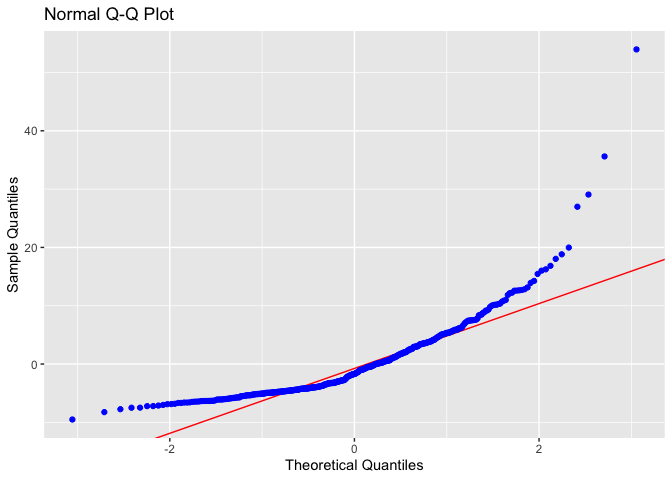
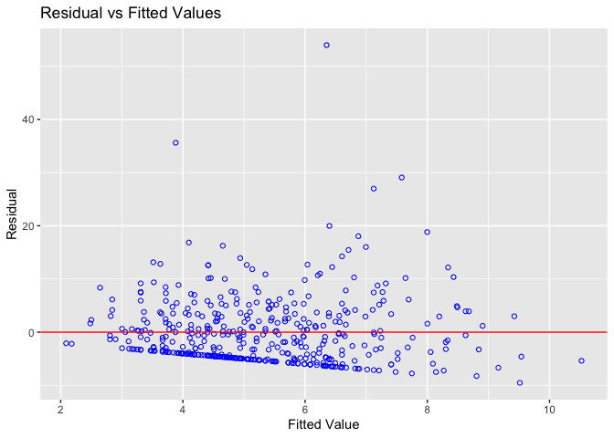
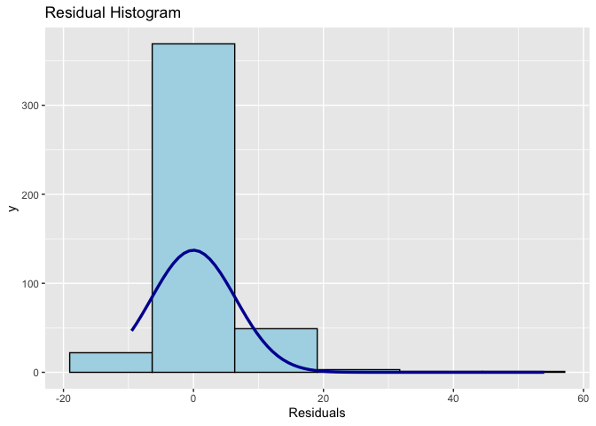

Lab 2
================

## Importing your data

Let’s first load the data `JTRAIN2.dtt`

``` r
# load your data and call it b_data 
library(haven)
b_data <- read_dta('JTRAIN2.dta')

# Descriptive statistics and the overview of the data 
# mean, std
library(psych)
describe(b_data)
```

    ##          vars   n   mean     sd median trimmed    mad    min     max   range
    ## train       1 445   0.42   0.49   0.00    0.39   0.00   0.00    1.00    1.00
    ## age         2 445  25.37   7.10  24.00   24.39   5.93  17.00   55.00   38.00
    ## educ        3 445  10.20   1.79  10.00   10.31   1.48   3.00   16.00   13.00
    ## black       4 445   0.83   0.37   1.00    0.92   0.00   0.00    1.00    1.00
    ## hisp        5 445   0.09   0.28   0.00    0.00   0.00   0.00    1.00    1.00
    ## married     6 445   0.17   0.37   0.00    0.09   0.00   0.00    1.00    1.00
    ## nodegree    7 445   0.78   0.41   1.00    0.85   0.00   0.00    1.00    1.00
    ## mosinex     8 445  18.12   5.31  21.00   18.68   4.45   5.00   24.00   19.00
    ## re74        9 445   2.10   5.36   0.00    0.71   0.00   0.00   39.57   39.57
    ## re75       10 445   1.38   3.15   0.00    0.57   0.00   0.00   25.14   25.14
    ## re78       11 445   5.30   6.63   3.70    4.18   5.49   0.00   60.31   60.31
    ## unem74     12 445   0.73   0.44   1.00    0.79   0.00   0.00    1.00    1.00
    ## unem75     13 445   0.65   0.48   1.00    0.69   0.00   0.00    1.00    1.00
    ## unem78     14 445   0.31   0.46   0.00    0.26   0.00   0.00    1.00    1.00
    ## lre74      15 445   0.42   0.89   0.00    0.21   0.00  -0.81    3.68    4.49
    ## lre75      16 445   0.28   0.80   0.00    0.17   0.00  -2.60    3.22    5.82
    ## lre78      17 445   1.14   1.14   1.31    1.10   1.66  -3.11    4.10    7.21
    ## agesq      18 445 693.98 429.78 576.00  613.78 308.38 289.00 3025.00 2736.00
    ## mostrn     19 445   7.69   9.66   0.00    6.69   0.00   0.00   24.00   24.00
    ##           skew kurtosis    se
    ## train     0.34    -1.89  0.02
    ## age       1.25     1.64  0.34
    ## educ     -0.77     1.79  0.08
    ## black    -1.79     1.19  0.02
    ## hisp      2.91     6.46  0.01
    ## married   1.76     1.12  0.02
    ## nodegree -1.36    -0.15  0.02
    ## mosinex  -0.73    -0.45  0.25
    ## re74      3.72    16.25  0.25
    ## re75      3.62    16.76  0.15
    ## re78      2.61    13.03  0.31
    ## unem74   -1.05    -0.90  0.02
    ## unem75   -0.62    -1.61  0.02
    ## unem78    0.83    -1.31  0.02
    ## lre74     1.88     2.34  0.04
    ## lre75     1.03     2.53  0.04
    ## lre78    -0.01    -0.85  0.05
    ## agesq     2.05     5.20 20.37
    ## mostrn    0.61    -1.41  0.46

``` r
# var x > 0 how I checked SLR Assumption 3
# -> MLR perfect collinearity 

###### check the correlations between all variables in your data
# train, age, educ, black, hisp, married 
round(cor(b_data[c("re78","train", "age", "educ", "black", "hisp", "married")]), 2)
```

    ##          re78 train   age  educ black  hisp married
    ## re78     1.00  0.13  0.06  0.12 -0.11  0.06    0.03
    ## train    0.13  1.00  0.05  0.07  0.02 -0.08    0.05
    ## age      0.06  0.05  1.00  0.02  0.09 -0.09    0.21
    ## educ     0.12  0.07  0.02  1.00  0.05 -0.14    0.08
    ## black   -0.11  0.02  0.09  0.05  1.00 -0.69    0.02
    ## hisp     0.06 -0.08 -0.09 -0.14 -0.69  1.00    0.01
    ## married  0.03  0.05  0.21  0.08  0.02  0.01    1.00

### Let’s create a multiple regression model

- DV: re78
- IV: train, age, educ, black, hisp, married

``` r
model3 = lm(re78 ~ train + age + educ + black + hisp + married, data=b_data)
summary(model3)
```

    ## 
    ## Call:
    ## lm(formula = re78 ~ train + age + educ + black + hisp + married, 
    ##     data = b_data)
    ## 
    ## Residuals:
    ##    Min     1Q Median     3Q    Max 
    ## -9.514 -4.509 -1.709  2.995 53.956 
    ## 
    ## Coefficients:
    ##             Estimate Std. Error t value Pr(>|t|)   
    ## (Intercept)  0.87162    2.44657   0.356  0.72182   
    ## train        1.68187    0.63179   2.662  0.00805 **
    ## age          0.05361    0.04479   1.197  0.23195   
    ## educ         0.41231    0.17580   2.345  0.01946 * 
    ## black       -2.23822    1.15867  -1.932  0.05404 . 
    ## hisp         0.07146    1.54569   0.046  0.96315   
    ## married      0.15315    0.84847   0.181  0.85684   
    ## ---
    ## Signif. codes:  0 '***' 0.001 '**' 0.01 '*' 0.05 '.' 0.1 ' ' 1
    ## 
    ## Residual standard error: 6.515 on 438 degrees of freedom
    ## Multiple R-squared:  0.04786,    Adjusted R-squared:  0.03481 
    ## F-statistic: 3.669 on 6 and 438 DF,  p-value: 0.001444

- Statistically significant IVs? train(1.68) is statistically
  significantly different from no effect. educ (0.41) is also
  statistically significantly different from no effect.

what 1.68 truly means? \> This means if you participated in training
(train=1) you will make 1.68 increase in wage, when you control for all
the other x variables constant.

What 0.41? \> This means if your educ level increase by 1, you will make
0.41 increase in wage, when you control for all the other x variables
constant.

- Overall Model fit? \> Adjust R-sqaured score was 0.034 =\> only 3.4%
  of the variance of wage is being explained by all of your independent
  variables =\> but mostly by your education and training variables.

``` r
# can you then get rid of all the "redundant" variables from model3

model4 = lm(re78 ~ train + educ, data=b_data)
summary(model4)
```

    ## 
    ## Call:
    ## lm(formula = re78 ~ train + educ, data = b_data)
    ## 
    ## Residuals:
    ##    Min     1Q Median     3Q    Max 
    ## -7.402 -4.684 -1.733  3.067 53.699 
    ## 
    ## Coefficients:
    ##             Estimate Std. Error t value Pr(>|t|)   
    ## (Intercept)   0.5514     1.8003   0.306  0.75953   
    ## train         1.6922     0.6315   2.680  0.00764 **
    ## educ          0.3968     0.1739   2.283  0.02293 * 
    ## ---
    ## Signif. codes:  0 '***' 0.001 '**' 0.01 '*' 0.05 '.' 0.1 ' ' 1
    ## 
    ## Residual standard error: 6.548 on 442 degrees of freedom
    ## Multiple R-squared:  0.02927,    Adjusted R-squared:  0.02487 
    ## F-statistic: 6.663 on 2 and 442 DF,  p-value: 0.00141

### Test Multicollinearity

`vif` function calculates the centered variance inflation factor
(Chatterjee & Hadi, 2012)

- 

``` r
#install.packages('car')  
library(car)
```

    ## Loading required package: carData

    ## 
    ## Attaching package: 'car'

    ## The following object is masked from 'package:psych':
    ## 
    ##     logit

``` r
vif(model3) #test for multicollinearity
```

    ##    train      age     educ    black     hisp  married 
    ## 1.016481 1.057840 1.038324 1.951321 2.002811 1.057639

### Normlaity of the residual

``` r
library('olsrr')
```

    ## 
    ## Attaching package: 'olsrr'

    ## The following object is masked from 'package:datasets':
    ## 
    ##     rivers

``` r
ols_plot_resid_qq(model3)
```

<!-- -->

``` r
ols_plot_resid_fit(model3)
```

<!-- -->

``` r
ols_plot_resid_hist(model3)
```

<!-- -->
