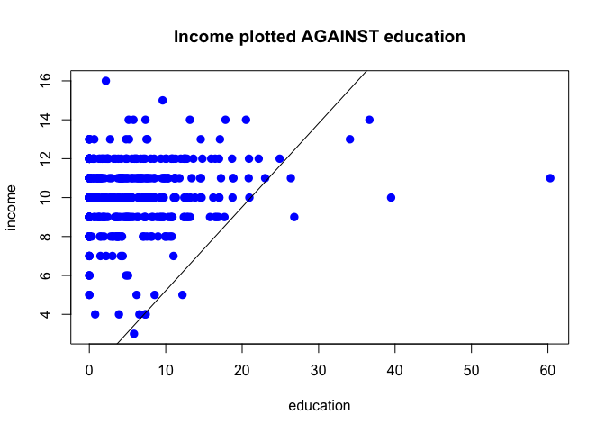
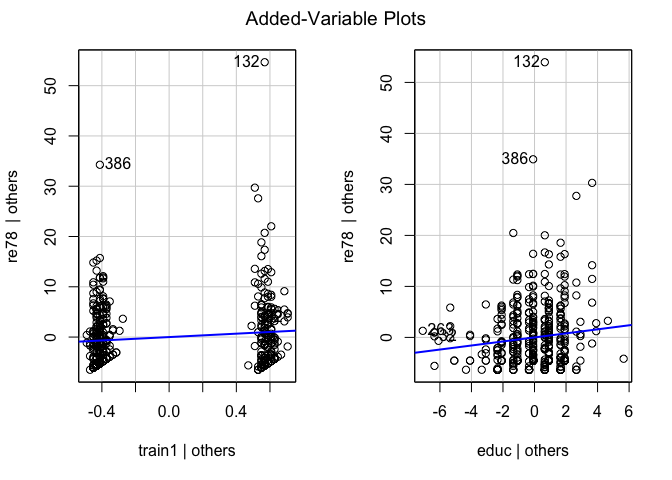
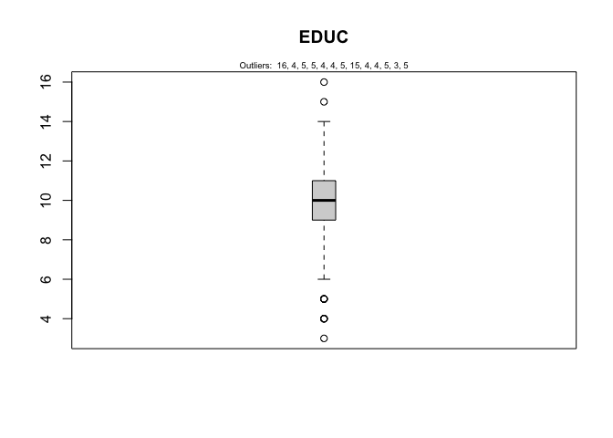
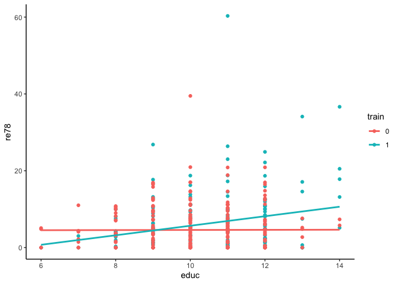
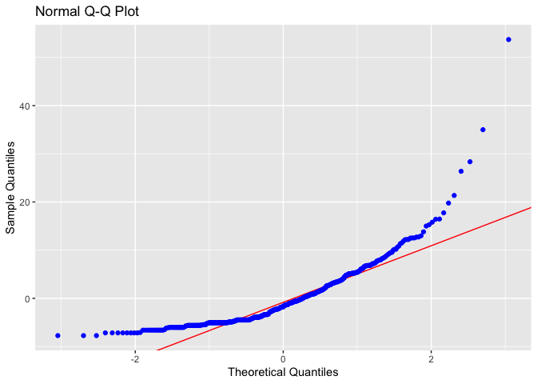
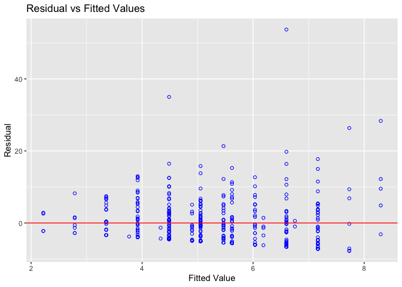

Lab 3: Asymptotic and Dummy Variables
================

## Importing your data

Let’s first load the data `JTRAIN2.dta`

``` r
# load your data and call it b_data 
library(haven)
b_data = read_dta('JTRAIN2.dta')

# Descriptive statistics and the overview of the data 

summary(b_data)
```

    ##      train             age             educ          black       
    ##  Min.   :0.0000   Min.   :17.00   Min.   : 3.0   Min.   :0.0000  
    ##  1st Qu.:0.0000   1st Qu.:20.00   1st Qu.: 9.0   1st Qu.:1.0000  
    ##  Median :0.0000   Median :24.00   Median :10.0   Median :1.0000  
    ##  Mean   :0.4157   Mean   :25.37   Mean   :10.2   Mean   :0.8337  
    ##  3rd Qu.:1.0000   3rd Qu.:28.00   3rd Qu.:11.0   3rd Qu.:1.0000  
    ##  Max.   :1.0000   Max.   :55.00   Max.   :16.0   Max.   :1.0000  
    ##       hisp            married          nodegree        mosinex     
    ##  Min.   :0.00000   Min.   :0.0000   Min.   :0.000   Min.   : 5.00  
    ##  1st Qu.:0.00000   1st Qu.:0.0000   1st Qu.:1.000   1st Qu.:14.00  
    ##  Median :0.00000   Median :0.0000   Median :1.000   Median :21.00  
    ##  Mean   :0.08764   Mean   :0.1685   Mean   :0.782   Mean   :18.12  
    ##  3rd Qu.:0.00000   3rd Qu.:0.0000   3rd Qu.:1.000   3rd Qu.:23.00  
    ##  Max.   :1.00000   Max.   :1.0000   Max.   :1.000   Max.   :24.00  
    ##       re74              re75             re78            unem74      
    ##  Min.   : 0.0000   Min.   : 0.000   Min.   : 0.000   Min.   :0.0000  
    ##  1st Qu.: 0.0000   1st Qu.: 0.000   1st Qu.: 0.000   1st Qu.:0.0000  
    ##  Median : 0.0000   Median : 0.000   Median : 3.702   Median :1.0000  
    ##  Mean   : 2.1023   Mean   : 1.377   Mean   : 5.301   Mean   :0.7326  
    ##  3rd Qu.: 0.8244   3rd Qu.: 1.221   3rd Qu.: 8.125   3rd Qu.:1.0000  
    ##  Max.   :39.5707   Max.   :25.142   Max.   :60.308   Max.   :1.0000  
    ##      unem75           unem78           lre74             lre75        
    ##  Min.   :0.0000   Min.   :0.0000   Min.   :-0.8093   Min.   :-2.5991  
    ##  1st Qu.:0.0000   1st Qu.:0.0000   1st Qu.: 0.0000   1st Qu.: 0.0000  
    ##  Median :1.0000   Median :0.0000   Median : 0.0000   Median : 0.0000  
    ##  Mean   :0.6494   Mean   :0.3079   Mean   : 0.4198   Mean   : 0.2771  
    ##  3rd Qu.:1.0000   3rd Qu.:1.0000   3rd Qu.: 0.0000   3rd Qu.: 0.1995  
    ##  Max.   :1.0000   Max.   :1.0000   Max.   : 3.6781   Max.   : 3.2245  
    ##      lre78            agesq          mostrn      
    ##  Min.   :-3.107   Min.   : 289   Min.   : 0.000  
    ##  1st Qu.: 0.000   1st Qu.: 400   1st Qu.: 0.000  
    ##  Median : 1.309   Median : 576   Median : 0.000  
    ##  Mean   : 1.136   Mean   : 694   Mean   : 7.688  
    ##  3rd Qu.: 2.095   3rd Qu.: 784   3rd Qu.:15.000  
    ##  Max.   : 4.099   Max.   :3025   Max.   :24.000

``` r
library(psych)
describe(b_data)
```

    ##          vars   n   mean     sd median trimmed    mad    min     max   range
    ## train       1 445   0.42   0.49   0.00    0.39   0.00   0.00    1.00    1.00
    ## age         2 445  25.37   7.10  24.00   24.39   5.93  17.00   55.00   38.00
    ## educ        3 445  10.20   1.79  10.00   10.31   1.48   3.00   16.00   13.00
    ## black       4 445   0.83   0.37   1.00    0.92   0.00   0.00    1.00    1.00
    ## hisp        5 445   0.09   0.28   0.00    0.00   0.00   0.00    1.00    1.00
    ## married     6 445   0.17   0.37   0.00    0.09   0.00   0.00    1.00    1.00
    ## nodegree    7 445   0.78   0.41   1.00    0.85   0.00   0.00    1.00    1.00
    ## mosinex     8 445  18.12   5.31  21.00   18.68   4.45   5.00   24.00   19.00
    ## re74        9 445   2.10   5.36   0.00    0.71   0.00   0.00   39.57   39.57
    ## re75       10 445   1.38   3.15   0.00    0.57   0.00   0.00   25.14   25.14
    ## re78       11 445   5.30   6.63   3.70    4.18   5.49   0.00   60.31   60.31
    ## unem74     12 445   0.73   0.44   1.00    0.79   0.00   0.00    1.00    1.00
    ## unem75     13 445   0.65   0.48   1.00    0.69   0.00   0.00    1.00    1.00
    ## unem78     14 445   0.31   0.46   0.00    0.26   0.00   0.00    1.00    1.00
    ## lre74      15 445   0.42   0.89   0.00    0.21   0.00  -0.81    3.68    4.49
    ## lre75      16 445   0.28   0.80   0.00    0.17   0.00  -2.60    3.22    5.82
    ## lre78      17 445   1.14   1.14   1.31    1.10   1.66  -3.11    4.10    7.21
    ## agesq      18 445 693.98 429.78 576.00  613.78 308.38 289.00 3025.00 2736.00
    ## mostrn     19 445   7.69   9.66   0.00    6.69   0.00   0.00   24.00   24.00
    ##           skew kurtosis    se
    ## train     0.34    -1.89  0.02
    ## age       1.25     1.64  0.34
    ## educ     -0.77     1.79  0.08
    ## black    -1.79     1.19  0.02
    ## hisp      2.91     6.46  0.01
    ## married   1.76     1.12  0.02
    ## nodegree -1.36    -0.15  0.02
    ## mosinex  -0.73    -0.45  0.25
    ## re74      3.72    16.25  0.25
    ## re75      3.62    16.76  0.15
    ## re78      2.61    13.03  0.31
    ## unem74   -1.05    -0.90  0.02
    ## unem75   -0.62    -1.61  0.02
    ## unem78    0.83    -1.31  0.02
    ## lre74     1.88     2.34  0.04
    ## lre75     1.03     2.53  0.04
    ## lre78    -0.01    -0.85  0.05
    ## agesq     2.05     5.20 20.37
    ## mostrn    0.61    -1.41  0.46

### Let’s create a multiple regression model

- DV: re78
- IV: train, age, educ, black, hisp, married

``` r
as.factor(b_data$train)
```

    ##   [1] 1 1 1 1 1 1 1 1 1 1 1 1 1 1 1 1 1 1 1 1 1 1 1 1 1 1 1 1 1 1 1 1 1 1 1 1 1
    ##  [38] 1 1 1 1 1 1 1 1 1 1 1 1 1 1 1 1 1 1 1 1 1 1 1 1 1 1 1 1 1 1 1 1 1 1 1 1 1
    ##  [75] 1 1 1 1 1 1 1 1 1 1 1 1 1 1 1 1 1 1 1 1 1 1 1 1 1 1 1 1 1 1 1 1 1 1 1 1 1
    ## [112] 1 1 1 1 1 1 1 1 1 1 1 1 1 1 1 1 1 1 1 1 1 1 1 1 1 1 1 1 1 1 1 1 1 1 1 1 1
    ## [149] 1 1 1 1 1 1 1 1 1 1 1 1 1 1 1 1 1 1 1 1 1 1 1 1 1 1 1 1 1 1 1 1 1 1 1 1 1
    ## [186] 0 0 0 0 0 0 0 0 0 0 0 0 0 0 0 0 0 0 0 0 0 0 0 0 0 0 0 0 0 0 0 0 0 0 0 0 0
    ## [223] 0 0 0 0 0 0 0 0 0 0 0 0 0 0 0 0 0 0 0 0 0 0 0 0 0 0 0 0 0 0 0 0 0 0 0 0 0
    ## [260] 0 0 0 0 0 0 0 0 0 0 0 0 0 0 0 0 0 0 0 0 0 0 0 0 0 0 0 0 0 0 0 0 0 0 0 0 0
    ## [297] 0 0 0 0 0 0 0 0 0 0 0 0 0 0 0 0 0 0 0 0 0 0 0 0 0 0 0 0 0 0 0 0 0 0 0 0 0
    ## [334] 0 0 0 0 0 0 0 0 0 0 0 0 0 0 0 0 0 0 0 0 0 0 0 0 0 0 0 0 0 0 0 0 0 0 0 0 0
    ## [371] 0 0 0 0 0 0 0 0 0 0 0 0 0 0 0 0 0 0 0 0 0 0 0 0 0 0 0 0 0 0 0 0 0 0 0 0 0
    ## [408] 0 0 0 0 0 0 0 0 0 0 0 0 0 0 0 0 0 0 0 0 0 0 0 0 0 0 0 0 0 0 0 0 0 0 0 0 0
    ## [445] 0
    ## Levels: 0 1

``` r
#make sure the binary variables are saved as factors 
b_data$train <- as.factor(b_data$train) #code your dataset explicitly to be "categorical" 
b_data$married <- as.factor(b_data$married)
b_data$black <- as.factor(b_data$black)
b_data$hisp <- as.factor(b_data$hisp)

model3 = lm(re78 ~ train + age + educ + black + hisp + married, data=b_data)
summary(model3)
```

    ## 
    ## Call:
    ## lm(formula = re78 ~ train + age + educ + black + hisp + married, 
    ##     data = b_data)
    ## 
    ## Residuals:
    ##    Min     1Q Median     3Q    Max 
    ## -9.514 -4.509 -1.709  2.995 53.956 
    ## 
    ## Coefficients:
    ##             Estimate Std. Error t value Pr(>|t|)   
    ## (Intercept)  0.87162    2.44657   0.356  0.72182   
    ## train1       1.68187    0.63179   2.662  0.00805 **
    ## age          0.05361    0.04479   1.197  0.23195   
    ## educ         0.41231    0.17580   2.345  0.01946 * 
    ## black1      -2.23822    1.15867  -1.932  0.05404 . 
    ## hisp1        0.07146    1.54569   0.046  0.96315   
    ## married1     0.15315    0.84847   0.181  0.85684   
    ## ---
    ## Signif. codes:  0 '***' 0.001 '**' 0.01 '*' 0.05 '.' 0.1 ' ' 1
    ## 
    ## Residual standard error: 6.515 on 438 degrees of freedom
    ## Multiple R-squared:  0.04786,    Adjusted R-squared:  0.03481 
    ## F-statistic: 3.669 on 6 and 438 DF,  p-value: 0.001444

``` r
model4 = lm(re78 ~ train + educ, data=b_data)
summary(model4)
```

    ## 
    ## Call:
    ## lm(formula = re78 ~ train + educ, data = b_data)
    ## 
    ## Residuals:
    ##    Min     1Q Median     3Q    Max 
    ## -7.402 -4.684 -1.733  3.067 53.699 
    ## 
    ## Coefficients:
    ##             Estimate Std. Error t value Pr(>|t|)   
    ## (Intercept)   0.5514     1.8003   0.306  0.75953   
    ## train1        1.6922     0.6315   2.680  0.00764 **
    ## educ          0.3968     0.1739   2.283  0.02293 * 
    ## ---
    ## Signif. codes:  0 '***' 0.001 '**' 0.01 '*' 0.05 '.' 0.1 ' ' 1
    ## 
    ## Residual standard error: 6.548 on 442 degrees of freedom
    ## Multiple R-squared:  0.02927,    Adjusted R-squared:  0.02487 
    ## F-statistic: 6.663 on 2 and 442 DF,  p-value: 0.00141

- Statistically significant IVs? “educ”, and “train”

- Model fit?

- Why changed? What changed? is this acceptable? we dropped several
  variables b/c they are not significant =\> irrelevant variables what
  did we conclude about removing irrelevant variables from your model
  =\>

- that this will not largely bias my coefficient or sampling mean

- explain your coefficient: b0, b1, and b2 b0: 0.5514 (what does this
  mean) =\> who are train=0 and their education = 0 b1: 1.69 =\> for
  those are trained) their real income in 1978 when you control for edu
  b2: 0.40 =\> one year increase in educ is increasing their income when
  you compare people with the same training status

### Plot

``` r
plot(b_data$re78, b_data$educ, pch = 16, cex = 1.3, col = "blue", 
main = "Income plotted AGAINST education", xlab = "education", ylab="income")

abline(0.9182, 0.4299)
```

<!-- -->

``` r
#abline(lm(sales ~ youtube, data = marketing))
```

### Plot (multiple)

- The x-axis displays a single predictor variable and the y-axis
  displays the response variable.
- The blue line shows the association between the predictor variable and
  the response variable, while holding the value of all other predictor
  variables constant.

``` r
#load car package
#install.packages('car')
library(car)
```

    ## Loading required package: carData

    ## 
    ## Attaching package: 'car'

    ## The following object is masked from 'package:psych':
    ## 
    ##     logit

``` r
#produce added variable plots
avPlots(model4)
```

<!-- -->

### Removing outliers (1) - univariate approach

- For a given continuous variable, outliers are those observations that
  lie outside 1.5IQR, where IQR, the ‘Inter Quartile Range’ is the
  difference between 75th and 25th quartiles.

``` r
outlier_values <- boxplot.stats(b_data$educ)$out
boxplot(b_data$educ, main="EDUC", boxwex=0.1)
mtext(paste("Outliers: ", paste(outlier_values, collapse=", ")), cex=0.6)
```

<!-- -->

``` r
#Let's explore - create a linear regression model with one IV (educ) after removing the outliers 
data_wo <- b_data[which(b_data$educ >5 & b_data$educ<15),]
  
model_wo <- lm(re78 ~ train + educ, data=data_wo)
summary(model_wo)
```

    ## 
    ## Call:
    ## lm(formula = re78 ~ train + educ, data = data_wo)
    ## 
    ## Residuals:
    ##    Min     1Q Median     3Q    Max 
    ## -7.733 -4.780 -1.690  3.140 53.708 
    ## 
    ## Coefficients:
    ##             Estimate Std. Error t value Pr(>|t|)   
    ## (Intercept)  -1.1794     2.1965  -0.537   0.5916   
    ## train1        1.5468     0.6509   2.376   0.0179 * 
    ## educ          0.5666     0.2119   2.673   0.0078 **
    ## ---
    ## Signif. codes:  0 '***' 0.001 '**' 0.01 '*' 0.05 '.' 0.1 ' ' 1
    ## 
    ## Residual standard error: 6.606 on 429 degrees of freedom
    ## Multiple R-squared:  0.03246,    Adjusted R-squared:  0.02795 
    ## F-statistic: 7.196 on 2 and 429 DF,  p-value: 0.0008434

``` r
#install.packages("ggpubr")
library(ggplot2)
```

    ## 
    ## Attaching package: 'ggplot2'

    ## The following objects are masked from 'package:psych':
    ## 
    ##     %+%, alpha

``` r
library(ggpubr)

ggplot(data_wo, aes(x=educ, y=re78, color=train)) + geom_point() + theme_classic() + stat_smooth(method=lm, se=FALSE)
```

    ## `geom_smooth()` using formula = 'y ~ x'

<!-- -->

``` r
model_interact = lm(re78 ~ train*educ, data=data_wo)
summary(model_interact)
```

    ## 
    ## Call:
    ## lm(formula = re78 ~ train * educ, data = data_wo)
    ## 
    ## Residuals:
    ##    Min     1Q Median     3Q    Max 
    ## -9.397 -4.585 -1.576  2.776 53.388 
    ## 
    ## Coefficients:
    ##              Estimate Std. Error t value Pr(>|t|)   
    ## (Intercept)   4.43154    2.91496   1.520  0.12918   
    ## train1      -11.13334    4.42590  -2.515  0.01225 * 
    ## educ          0.01537    0.28351   0.054  0.95679   
    ## train1:educ   1.22299    0.42231   2.896  0.00397 **
    ## ---
    ## Signif. codes:  0 '***' 0.001 '**' 0.01 '*' 0.05 '.' 0.1 ' ' 1
    ## 
    ## Residual standard error: 6.55 on 428 degrees of freedom
    ## Multiple R-squared:  0.05105,    Adjusted R-squared:  0.0444 
    ## F-statistic: 7.676 on 3 and 428 DF,  p-value: 5.246e-05

### Residual normality

- The error has a normal distribution (normality assumption).
- The errors have mean zero.
- The errors have same but unknown variance (homoscedasticity
  assumption).
- The error are independent of each other (independent errors
  assumption).

``` r
#install.packages('olsrr')
library(olsrr)
```

    ## 
    ## Attaching package: 'olsrr'

    ## The following object is masked from 'package:datasets':
    ## 
    ##     rivers

``` r
ols_plot_resid_qq(model_wo) #ploting the q-q plot for residuals
```

<!-- -->

``` r
# Residual normality test

ols_test_normality(model_wo) 
```

    ## Warning in ks.test.default(y, "pnorm", mean(y), sd(y)): ties should not be
    ## present for the Kolmogorov-Smirnov test

    ## -----------------------------------------------
    ##        Test             Statistic       pvalue  
    ## -----------------------------------------------
    ## Shapiro-Wilk              0.8093         0.0000 
    ## Kolmogorov-Smirnov        0.1315         0.0000 
    ## Cramer-von Mises         39.0479         0.0000 
    ## Anderson-Darling         15.7658         0.0000 
    ## -----------------------------------------------

``` r
# Residual vs Fitted Values Plot (predictor, IV)

ols_plot_resid_fit(model_wo) 
```

<!-- -->

``` r
# detects non-linearity, unequal error variances, and outliers.
```

- Let’s take a look at this: <https://i.stack.imgur.com/rtn7e.png>

###### What does this indicate?

- often caused by non-normality of the dependent variable
- This means that in that case your (regression) model does not explain
  all trends in the dataset.

### Interaction terms

``` r
# interaction between train and married 
model2 = lm(re78 ~ train*married + age, data=b_data)
# Is this model correct?
summary(model2)
```

    ## 
    ## Call:
    ## lm(formula = re78 ~ train * married + age, data = b_data)
    ## 
    ## Residuals:
    ##    Min     1Q Median     3Q    Max 
    ## -7.659 -4.583 -1.620  2.757 54.160 
    ## 
    ## Coefficients:
    ##                 Estimate Std. Error t value Pr(>|t|)   
    ## (Intercept)      3.61003    1.18921   3.036  0.00254 **
    ## train1           1.35310    0.69691   1.942  0.05283 . 
    ## married1        -0.74709    1.14213  -0.654  0.51338   
    ## age              0.04230    0.04503   0.939  0.34807   
    ## train1:married1  2.30140    1.67479   1.374  0.17010   
    ## ---
    ## Signif. codes:  0 '***' 0.001 '**' 0.01 '*' 0.05 '.' 0.1 ' ' 1
    ## 
    ## Residual standard error: 6.578 on 440 degrees of freedom
    ## Multiple R-squared:  0.02479,    Adjusted R-squared:  0.01593 
    ## F-statistic: 2.797 on 4 and 440 DF,  p-value: 0.02577

- Where did train0&married1, train1&married0 go?
- train1:married1 = 2.30 \> this means trained and married individual
  made 2.30 more than whom? \> non trained and non married what is the
  DV for average age idnividual = \> train0 & married = 3.6 -0.75 +
  0.423 \* age  
  \> train1 & non married = 3.6 + 1.35 + 0.423 \* age

Let’s fit a linear model using DV: lre78, IV: train, age, married with
the interaction term between `age` and `train`

``` r
# interaction between train and age
model3 = lm(re78 ~ train + age + married+ train*age, data=b_data)
# Is this model correct?
summary(model3)
```

    ## 
    ## Call:
    ## lm(formula = re78 ~ train + age + married + train * age, data = b_data)
    ## 
    ## Residuals:
    ##    Min     1Q Median     3Q    Max 
    ## -8.173 -4.530 -1.786  2.845 53.807 
    ## 
    ## Coefficients:
    ##              Estimate Std. Error t value Pr(>|t|)   
    ## (Intercept)  4.305736   1.510590   2.850  0.00457 **
    ## train1      -0.404092   2.363062  -0.171  0.86430   
    ## age          0.008299   0.058532   0.142  0.88731   
    ## married1     0.267442   0.854164   0.313  0.75435   
    ## train1:age   0.084546   0.089316   0.947  0.34436   
    ## ---
    ## Signif. codes:  0 '***' 0.001 '**' 0.01 '*' 0.05 '.' 0.1 ' ' 1
    ## 
    ## Residual standard error: 6.586 on 440 degrees of freedom
    ## Multiple R-squared:  0.0226, Adjusted R-squared:  0.01371 
    ## F-statistic: 2.543 on 4 and 440 DF,  p-value: 0.03909

### Mean Centering Continuous Variable

> mean centering: a technique to improve your interpretability of your
> model, especially when you are introducing interaction effect

> Does mean centering change your model? or your model fit? T/F Can we
> do mean centering on DV? (F) or your categorical IV (F) ? ONLY
> CONTINOUS OR ORDINAL IV

``` r
# Let's generate a new variable: 
# edu_centered = educ - mean(educ)
data_wo$edu_centered <- data_wo$educ - mean(data_wo$educ)

model7 = lm(re78 ~ train + edu_centered + train:edu_centered, data=data_wo)
#summary(model7)

model8 = lm(re78 ~ train + educ + train:educ, data=data_wo)
#summary(model8)

### can you mean center age variable 
#lm(re78 ~ train*age_centered, data=data_wo )
#lm(re78 ~train*age, data=data_wo)

#step1 mean center your continuous IV
data_wo$age_centered <- data_wo$age - mean(data_wo$age)

#step2 fit your model 9 and 10
model9 <- lm(re78 ~ train*age_centered, data=data_wo )
model10 <- lm(re78 ~ train*age, data=data_wo )

summary(model9)
```

    ## 
    ## Call:
    ## lm(formula = re78 ~ train * age_centered, data = data_wo)
    ## 
    ## Residuals:
    ##    Min     1Q Median     3Q    Max 
    ## -8.419 -4.589 -1.841  2.816 53.721 
    ## 
    ## Coefficients:
    ##                     Estimate Std. Error t value Pr(>|t|)    
    ## (Intercept)          4.59069    0.41607  11.034  < 2e-16 ***
    ## train1               1.70470    0.65209   2.614  0.00926 ** 
    ## age_centered         0.01188    0.06090   0.195  0.84538    
    ## train1:age_centered  0.08991    0.09526   0.944  0.34583    
    ## ---
    ## Signif. codes:  0 '***' 0.001 '**' 0.01 '*' 0.05 '.' 0.1 ' ' 1
    ## 
    ## Residual standard error: 6.653 on 428 degrees of freedom
    ## Multiple R-squared:  0.02085,    Adjusted R-squared:  0.01398 
    ## F-statistic: 3.037 on 3 and 428 DF,  p-value: 0.02894

``` r
summary(model10)
```

    ## 
    ## Call:
    ## lm(formula = re78 ~ train * age, data = data_wo)
    ## 
    ## Residuals:
    ##    Min     1Q Median     3Q    Max 
    ## -8.419 -4.589 -1.841  2.816 53.721 
    ## 
    ## Coefficients:
    ##             Estimate Std. Error t value Pr(>|t|)   
    ## (Intercept)  4.29197    1.57288   2.729  0.00662 **
    ## train1      -0.55501    2.49104  -0.223  0.82379   
    ## age          0.01188    0.06090   0.195  0.84538   
    ## train1:age   0.08991    0.09526   0.944  0.34583   
    ## ---
    ## Signif. codes:  0 '***' 0.001 '**' 0.01 '*' 0.05 '.' 0.1 ' ' 1
    ## 
    ## Residual standard error: 6.653 on 428 degrees of freedom
    ## Multiple R-squared:  0.02085,    Adjusted R-squared:  0.01398 
    ## F-statistic: 3.037 on 3 and 428 DF,  p-value: 0.02894
