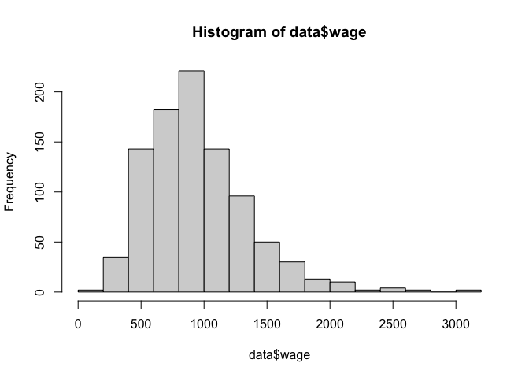
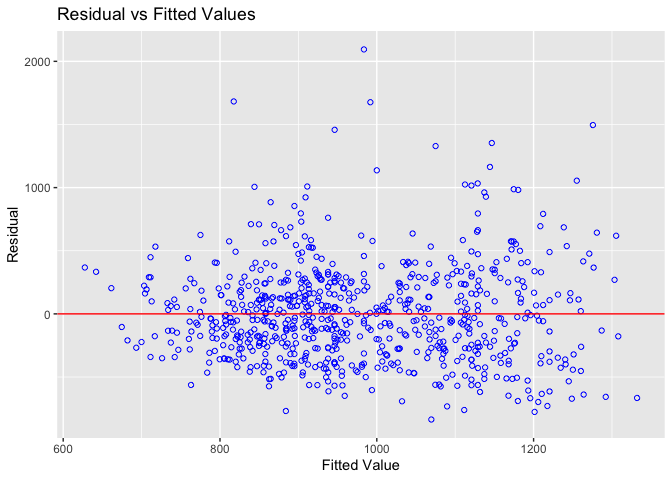
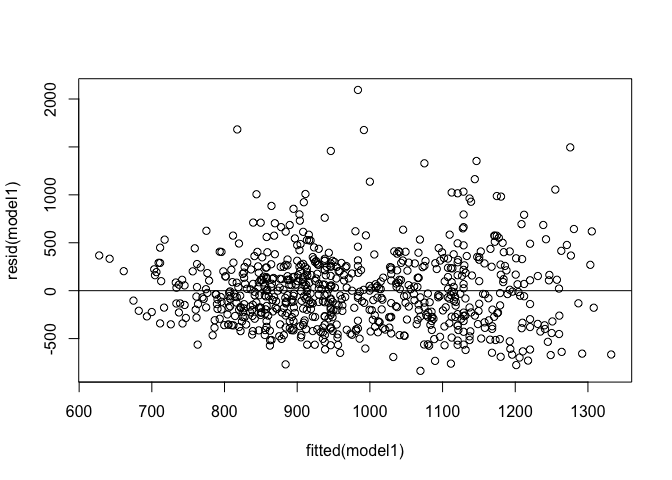

Lab 4 Heteroskedasticity & Robust/Cluster SEs
================

## Importing your data

Let’s first load the data `WAGE2.dtt`

``` r
# load your data and call it data 
library(haven)
data = read_dta('WAGE2.dta')

# Descriptive statistics and the overview of the data 

library(psych)
describe(data)
```

    ##         vars   n   mean     sd median trimmed    mad    min     max   range
    ## wage       1 935 957.95 404.36 905.00  919.69 369.17 115.00 3078.00 2963.00
    ## hours      2 935  43.93   7.22  40.00   42.80   0.00  20.00   80.00   60.00
    ## IQ         3 935 101.28  15.05 102.00  101.87  14.83  50.00  145.00   95.00
    ## KWW        4 935  35.74   7.64  37.00   35.99   7.41  12.00   56.00   44.00
    ## educ       5 935  13.47   2.20  12.00   13.33   1.48   9.00   18.00    9.00
    ## exper      6 935  11.56   4.37  11.00   11.52   4.45   1.00   23.00   22.00
    ## tenure     7 935   7.23   5.08   7.00    6.89   5.93   0.00   22.00   22.00
    ## age        8 935  33.08   3.11  33.00   33.04   4.45  28.00   38.00   10.00
    ## married    9 935   0.89   0.31   1.00    0.99   0.00   0.00    1.00    1.00
    ## black     10 935   0.13   0.33   0.00    0.04   0.00   0.00    1.00    1.00
    ## south     11 935   0.34   0.47   0.00    0.30   0.00   0.00    1.00    1.00
    ## urban     12 935   0.72   0.45   1.00    0.77   0.00   0.00    1.00    1.00
    ## sibs      13 935   2.94   2.31   2.00    2.64   1.48   0.00   14.00   14.00
    ## brthord   14 852   2.28   1.60   2.00    1.97   1.48   1.00   10.00    9.00
    ## meduc     15 857  10.68   2.85  12.00   10.76   1.48   0.00   18.00   18.00
    ## feduc     16 741  10.22   3.30  10.00   10.20   2.97   0.00   18.00   18.00
    ## lwage     17 935   6.78   0.42   6.81    6.79   0.42   4.74    8.03    3.29
    ##          skew kurtosis    se
    ## wage     1.20     2.68 13.22
    ## hours    1.59     4.14  0.24
    ## IQ      -0.34    -0.03  0.49
    ## KWW     -0.29    -0.33  0.25
    ## educ     0.55    -0.74  0.07
    ## exper    0.08    -0.57  0.14
    ## tenure   0.43    -0.81  0.17
    ## age      0.12    -1.26  0.10
    ## married -2.54     4.45  0.01
    ## black    2.22     2.93  0.01
    ## south    0.67    -1.55  0.02
    ## urban   -0.97    -1.07  0.01
    ## sibs     1.44     2.73  0.08
    ## brthord  1.75     3.50  0.05
    ## meduc   -0.50     0.92  0.10
    ## feduc   -0.04    -0.04  0.12
    ## lwage   -0.27     0.51  0.01

``` r
# Let's plot the wage distribution (`wage`)
hist(data$wage)
```

<!-- -->

### Let’s create a multiple regression model

- DV: wage
- IV: educ sibs meduc feduc

``` r
model1 = lm(wage ~ educ + sibs + meduc + feduc , data=data)
summary(model1)
```

    ## 
    ## Call:
    ## lm(formula = wage ~ educ + sibs + meduc + feduc, data = data)
    ## 
    ## Residuals:
    ##     Min      1Q  Median      3Q     Max 
    ## -836.57 -270.98  -37.71  217.11 2094.42 
    ## 
    ## Coefficients:
    ##             Estimate Std. Error t value Pr(>|t|)    
    ## (Intercept)  165.991    101.785   1.631   0.1034    
    ## educ          45.716      7.203   6.347 3.89e-10 ***
    ## sibs          -8.207      6.687  -1.227   0.2201    
    ## meduc          9.235      6.379   1.448   0.1481    
    ## feduc         10.740      5.514   1.948   0.0518 .  
    ## ---
    ## Signif. codes:  0 '***' 0.001 '**' 0.01 '*' 0.05 '.' 0.1 ' ' 1
    ## 
    ## Residual standard error: 383.5 on 717 degrees of freedom
    ##   (213 observations deleted due to missingness)
    ## Multiple R-squared:  0.1218, Adjusted R-squared:  0.1169 
    ## F-statistic: 24.85 on 4 and 717 DF,  p-value: < 2.2e-16

``` r
# siblings? one more has -8.207 effect on your wage when you hold other variables constant, but I cannot argue that this is significantly different from 0 effect 
```

### Heteroskedasticity testing

#### Breusch-Pagan test for Heteroskedasticity

- h0: constant variance

``` r
library(olsrr)
```

    ## 
    ## Attaching package: 'olsrr'

    ## The following object is masked from 'package:datasets':
    ## 
    ##     rivers

``` r
# plotting x-axis predicted wage and y-axis residual
ols_plot_resid_fit(model1)
```

<!-- -->

``` r
#ols_plot_resid_hist(model1)
#ols_test_normality(model1)


ols_test_breusch_pagan(model1)
```

    ## 
    ##  Breusch Pagan Test for Heteroskedasticity
    ##  -----------------------------------------
    ##  Ho: the variance is constant            
    ##  Ha: the variance is not constant        
    ## 
    ##               Data               
    ##  --------------------------------
    ##  Response : wage 
    ##  Variables: fitted values of wage 
    ## 
    ##          Test Summary           
    ##  -------------------------------
    ##  DF            =    1 
    ##  Chi2          =    36.5168 
    ##  Prob > Chi2   =    1.513559e-09

#### White test for Heteroskedasticity (What we focused on in the lecture)

- h0: constant variance

``` r
#install.packages('lmtest')
library(lmtest)
```

    ## Loading required package: zoo

    ## 
    ## Attaching package: 'zoo'

    ## The following objects are masked from 'package:base':
    ## 
    ##     as.Date, as.Date.numeric

``` r
model2 = lm(wage ~ educ*sibs*meduc*feduc , data=data)
summary(model2)
```

    ## 
    ## Call:
    ## lm(formula = wage ~ educ * sibs * meduc * feduc, data = data)
    ## 
    ## Residuals:
    ##    Min     1Q Median     3Q    Max 
    ## -850.2 -255.8  -24.3  211.0 2097.7 
    ## 
    ## Coefficients:
    ##                        Estimate Std. Error t value Pr(>|t|)  
    ## (Intercept)           1281.4239  1805.1761   0.710    0.478  
    ## educ                   -59.1068   135.3798  -0.437    0.663  
    ## sibs                  -282.9217   489.6438  -0.578    0.564  
    ## meduc                   21.8432   170.9621   0.128    0.898  
    ## feduc                 -253.5203   182.0869  -1.392    0.164  
    ## educ:sibs               28.3205    38.8248   0.729    0.466  
    ## educ:meduc               1.2743    12.6022   0.101    0.919  
    ## sibs:meduc              11.6685    48.4843   0.241    0.810  
    ## educ:feduc              21.7186    13.1070   1.657    0.098 .
    ## sibs:feduc              45.4918    47.2860   0.962    0.336  
    ## meduc:feduc             12.1281    15.9706   0.759    0.448  
    ## educ:sibs:meduc         -1.6643     3.7666  -0.442    0.659  
    ## educ:sibs:feduc         -4.2862     3.6715  -1.167    0.243  
    ## educ:meduc:feduc        -1.1051     1.1266  -0.981    0.327  
    ## sibs:meduc:feduc        -2.4870     4.2794  -0.581    0.561  
    ## educ:sibs:meduc:feduc    0.2706     0.3202   0.845    0.398  
    ## ---
    ## Signif. codes:  0 '***' 0.001 '**' 0.01 '*' 0.05 '.' 0.1 ' ' 1
    ## 
    ## Residual standard error: 382.4 on 706 degrees of freedom
    ##   (213 observations deleted due to missingness)
    ## Multiple R-squared:  0.1401, Adjusted R-squared:  0.1218 
    ## F-statistic: 7.669 on 15 and 706 DF,  p-value: 4.788e-16

``` r
bptest(model1, ~ I(educ*age) + I(educ^2) + I(age^2) , data=data)
```

    ## 
    ##  studentized Breusch-Pagan test
    ## 
    ## data:  model1
    ## BP = 13.323, df = 3, p-value = 0.003988

#### What should we do now?

### Robust S.E.

``` r
#create residual vs. fitted plot
plot(fitted(model1), resid(model1))

#add a horizontal line at y=0 
abline(0,0)
```

<!-- -->

``` r
#calculate robust standard errors for model coefficients
#install.packages('sandwich')
library("lmtest")
library("sandwich")
summary(model1)
```

    ## 
    ## Call:
    ## lm(formula = wage ~ educ + sibs + meduc + feduc, data = data)
    ## 
    ## Residuals:
    ##     Min      1Q  Median      3Q     Max 
    ## -836.57 -270.98  -37.71  217.11 2094.42 
    ## 
    ## Coefficients:
    ##             Estimate Std. Error t value Pr(>|t|)    
    ## (Intercept)  165.991    101.785   1.631   0.1034    
    ## educ          45.716      7.203   6.347 3.89e-10 ***
    ## sibs          -8.207      6.687  -1.227   0.2201    
    ## meduc          9.235      6.379   1.448   0.1481    
    ## feduc         10.740      5.514   1.948   0.0518 .  
    ## ---
    ## Signif. codes:  0 '***' 0.001 '**' 0.01 '*' 0.05 '.' 0.1 ' ' 1
    ## 
    ## Residual standard error: 383.5 on 717 degrees of freedom
    ##   (213 observations deleted due to missingness)
    ## Multiple R-squared:  0.1218, Adjusted R-squared:  0.1169 
    ## F-statistic: 24.85 on 4 and 717 DF,  p-value: < 2.2e-16

``` r
coeftest(model1, vcov = vcovHC(model1, type = 'HC1')) #HC0 -HC3 are estimator types more information available at: https://cran.r-project.org/web/packages/sandwich/sandwich.pdf
```

    ## 
    ## t test of coefficients:
    ## 
    ##             Estimate Std. Error t value  Pr(>|t|)    
    ## (Intercept) 165.9913   106.9150  1.5526   0.12097    
    ## educ         45.7160     7.2183  6.3333 4.234e-10 ***
    ## sibs         -8.2067     6.1130 -1.3425   0.17986    
    ## meduc         9.2353     5.5392  1.6673   0.09590 .  
    ## feduc        10.7397     5.3101  2.0225   0.04349 *  
    ## ---
    ## Signif. codes:  0 '***' 0.001 '**' 0.01 '*' 0.05 '.' 0.1 ' ' 1

### Group Exercise

Let’s load the data `HTV.dta` to answer the following questions:

``` r
data2 =  read_dta('HTV.dta')
```

1)  Estimate the regression model using OLS and report the results:

educ = b0 + b1motheuc + b2fatheuc + b3abil +b4abil^2 + tuit17 + tuit18 +
u

Make sure to test the null hypothesis that `educ` is linearly related to
`abil` against the alternative that the relationship is quadratic.

``` r
data2$abil2 = (data2$abil)^2

describe(data2[c('abil', 'abil2')])
```

    ##       vars    n mean   sd median trimmed  mad   min   max range  skew kurtosis
    ## abil     1 1230  1.8 2.18   2.15    1.98 2.11 -5.63  6.26 11.90 -0.72     0.12
    ## abil2    2 1230  8.0 7.47   5.72    7.02 7.04  0.00 39.23 39.23  1.03     0.45
    ##         se
    ## abil  0.06
    ## abil2 0.21

``` r
model_q1 = lm(educ ~ motheduc + fatheduc + abil+ abil2, data=data2)
summary(model_q1)
```

    ## 
    ## Call:
    ## lm(formula = educ ~ motheduc + fatheduc + abil + abil2, data = data2)
    ## 
    ## Residuals:
    ##     Min      1Q  Median      3Q     Max 
    ## -5.2506 -1.1274 -0.1355  1.0223  7.0482 
    ## 
    ## Coefficients:
    ##             Estimate Std. Error t value Pr(>|t|)    
    ## (Intercept) 8.240226   0.287410  28.671  < 2e-16 ***
    ## motheduc    0.190126   0.028096   6.767 2.03e-11 ***
    ## fatheduc    0.108939   0.019601   5.558 3.35e-08 ***
    ## abil        0.401462   0.030288  13.255  < 2e-16 ***
    ## abil2       0.050599   0.008304   6.093 1.48e-09 ***
    ## ---
    ## Signif. codes:  0 '***' 0.001 '**' 0.01 '*' 0.05 '.' 0.1 ' ' 1
    ## 
    ## Residual standard error: 1.758 on 1225 degrees of freedom
    ## Multiple R-squared:  0.4444, Adjusted R-squared:  0.4425 
    ## F-statistic: 244.9 on 4 and 1225 DF,  p-value: < 2.2e-16

2)  Using the equation in (1) , test the following hypothesis:

- H0: b1 = b2 against a two-sided alterantive. What is the p-value of
  the test? \#HINT: you can use `linearHypothesis()` function from
  `library(car)`. The function takes in your `model name` and your
  `hypothesis`)

``` r
library(car)
```

    ## Loading required package: carData

    ## 
    ## Attaching package: 'car'

    ## The following object is masked from 'package:psych':
    ## 
    ##     logit

``` r
linearHypothesis(model_q1, "abil = abil2")
```

    ## Linear hypothesis test
    ## 
    ## Hypothesis:
    ## abil - abil2 = 0
    ## 
    ## Model 1: restricted model
    ## Model 2: educ ~ motheduc + fatheduc + abil + abil2
    ## 
    ##   Res.Df    RSS Df Sum of Sq      F    Pr(>F)    
    ## 1   1226 4086.8                                  
    ## 2   1225 3785.2  1    301.51 97.577 < 2.2e-16 ***
    ## ---
    ## Signif. codes:  0 '***' 0.001 '**' 0.01 '*' 0.05 '.' 0.1 ' ' 1

``` r
# motheduc     vs. fatheduc     
linearHypothesis(model_q1, "motheduc = fatheduc")
```

    ## Linear hypothesis test
    ## 
    ## Hypothesis:
    ## motheduc - fatheduc = 0
    ## 
    ## Model 1: restricted model
    ## Model 2: educ ~ motheduc + fatheduc + abil + abil2
    ## 
    ##   Res.Df    RSS Df Sum of Sq      F  Pr(>F)  
    ## 1   1226 3796.8                              
    ## 2   1225 3785.2  1    11.578 3.7468 0.05314 .
    ## ---
    ## Signif. codes:  0 '***' 0.001 '**' 0.01 '*' 0.05 '.' 0.1 ' ' 1

3)  Add the two college tuition variables (`tuit17` and `tuit18`) to the
    regression in (1) and determine whether they are jointly
    statistically significant.

``` r
model_q3 <- lm(educ ~ abil +abil2 +motheduc + fatheduc + tuit18 , data=data2)
summary(model_q3)
```

    ## 
    ## Call:
    ## lm(formula = educ ~ abil + abil2 + motheduc + fatheduc + tuit18, 
    ##     data = data2)
    ## 
    ## Residuals:
    ##     Min      1Q  Median      3Q     Max 
    ## -5.1475 -1.1591 -0.1117  1.0321  7.0703 
    ## 
    ## Coefficients:
    ##             Estimate Std. Error t value Pr(>|t|)    
    ## (Intercept) 8.083886   0.312546  25.865  < 2e-16 ***
    ## abil        0.399165   0.030334  13.159  < 2e-16 ***
    ## abil2       0.050644   0.008302   6.100 1.42e-09 ***
    ## motheduc    0.192781   0.028166   6.844 1.21e-11 ***
    ## fatheduc    0.108304   0.019603   5.525 4.02e-08 ***
    ## tuit18      0.015799   0.012427   1.271    0.204    
    ## ---
    ## Signif. codes:  0 '***' 0.001 '**' 0.01 '*' 0.05 '.' 0.1 ' ' 1
    ## 
    ## Residual standard error: 1.757 on 1224 degrees of freedom
    ## Multiple R-squared:  0.4451, Adjusted R-squared:  0.4428 
    ## F-statistic: 196.3 on 5 and 1224 DF,  p-value: < 2.2e-16

``` r
#cor(data2$tuit17, data2$tuit18)
```

4)  What is the correlation between `tuit17` and `tuit18`? Explain why
    using the average of the tuition over the two years might be
    preferred to adding each separately. What happens when you do use
    the average?

``` r
cor(data2$tuit17, data2$tuit18)
```

    ## [1] 0.9808333

``` r
# create a new variable representing the  mean tuition
data2$ave_tuit <- (data2$tuit17 + data2$tuit18)/2

model_q4 <- lm(educ ~ abil +abil2 +motheduc + fatheduc + ave_tuit, data=data2)
summary(model_q4)
```

    ## 
    ## Call:
    ## lm(formula = educ ~ abil + abil2 + motheduc + fatheduc + ave_tuit, 
    ##     data = data2)
    ## 
    ## Residuals:
    ##     Min      1Q  Median      3Q     Max 
    ## -5.1469 -1.1591 -0.1132  1.0312  7.0709 
    ## 
    ## Coefficients:
    ##             Estimate Std. Error t value Pr(>|t|)    
    ## (Intercept) 8.081339   0.312614  25.851  < 2e-16 ***
    ## abil        0.399081   0.030336  13.156  < 2e-16 ***
    ## abil2       0.050599   0.008302   6.095 1.46e-09 ***
    ## motheduc    0.192863   0.028168   6.847 1.19e-11 ***
    ## fatheduc    0.108368   0.019601   5.529 3.94e-08 ***
    ## ave_tuit    0.015963   0.012373   1.290    0.197    
    ## ---
    ## Signif. codes:  0 '***' 0.001 '**' 0.01 '*' 0.05 '.' 0.1 ' ' 1
    ## 
    ## Residual standard error: 1.757 on 1224 degrees of freedom
    ## Multiple R-squared:  0.4451, Adjusted R-squared:  0.4428 
    ## F-statistic: 196.4 on 5 and 1224 DF,  p-value: < 2.2e-16
