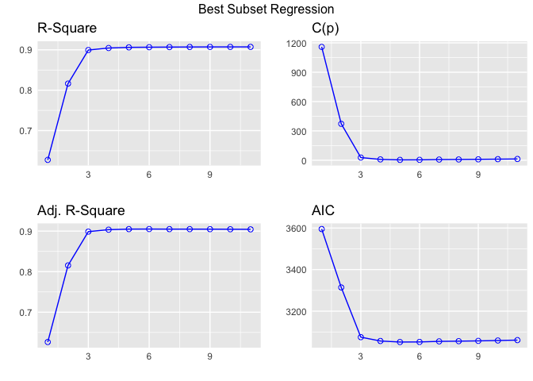
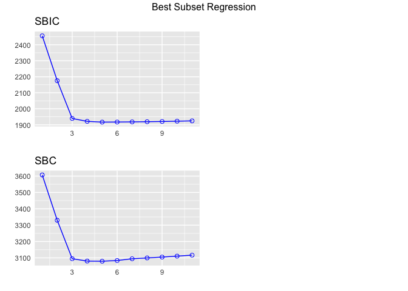

Lab 5 Variable Selection
================

## Importing your data

Let’s first load the data `WAGE2.dtt`

``` r
# load your data and call it data 
library(haven)
data = read_dta('credit.dta')

# Descriptive statistics and the overview of the data 

library(psych)
#describe(data)


# Let's plot the wage distribution (`income`)


# we need to manipulate the data b/c of how they are coded
data$gender <- ifelse(data$gender =='Female', 1, 0)
data$student <- ifelse(data$student =='No', 1, 0)
data$married <- ifelse(data$married =='Yes', 1, 0)


describe(data)
```

    ##            vars   n    mean      sd  median trimmed     mad    min      max
    ## id            1 400  200.50  115.61  200.50  200.50  148.26   1.00   400.00
    ## income        2 400   45.22   35.24   33.12   38.67   23.12  10.35   186.63
    ## limit         3 400 4735.60 2308.20 4622.50 4557.31 2130.50 855.00 13913.00
    ## rating        4 400  354.94  154.72  344.00  342.14  140.85  93.00   982.00
    ## cards         5 400    2.96    1.37    3.00    2.87    1.48   1.00     9.00
    ## age           6 400   55.67   17.25   56.00   55.68   20.76  23.00    98.00
    ## education     7 400   13.45    3.13   14.00   13.57    2.97   5.00    20.00
    ## gender        8 400    0.52    0.50    1.00    0.52    0.00   0.00     1.00
    ## student       9 400    0.90    0.30    1.00    1.00    0.00   0.00     1.00
    ## married      10 400    0.61    0.49    1.00    0.64    0.00   0.00     1.00
    ## ethnicity*   11 400    2.25    0.83    2.00    2.31    1.48   1.00     3.00
    ## balance      12 400  520.02  459.76  459.50  475.13  593.04   0.00  1999.00
    ##               range  skew kurtosis     se
    ## id           399.00  0.00    -1.21   5.78
    ## income       176.28  1.73     2.87   1.76
    ## limit      13058.00  0.83     0.96 115.41
    ## rating       889.00  0.86     1.01   7.74
    ## cards          8.00  0.79     0.90   0.07
    ## age           75.00  0.01    -1.08   0.86
    ## education     15.00 -0.33    -0.60   0.16
    ## gender         1.00 -0.07    -2.00   0.03
    ## student        1.00 -2.66     5.07   0.02
    ## married        1.00 -0.46    -1.79   0.02
    ## ethnicity*     2.00 -0.49    -1.37   0.04
    ## balance     1999.00  0.58    -0.55  22.99

### Let’s create a multiple regression model

#### (1) Best Subset Selection

``` r
#create a model with all the variable first

model <- lm(income ~., data=data)

library(olsrr)
```

    ## 
    ## Attaching package: 'olsrr'

    ## The following object is masked from 'package:datasets':
    ## 
    ##     rivers

``` r
ols_step_best_subset(model)
```

    ##                                   Best Subsets Regression                                  
    ## -------------------------------------------------------------------------------------------
    ## Model Index    Predictors
    ## -------------------------------------------------------------------------------------------
    ##      1         limit                                                                        
    ##      2         rating balance                                                               
    ##      3         rating student balance                                                       
    ##      4         limit cards student balance                                                  
    ##      5         limit rating cards student balance                                           
    ##      6         limit rating cards gender student balance                                    
    ##      7         limit rating cards gender student ethnicity balance                          
    ##      8         id limit rating cards gender student ethnicity balance                       
    ##      9         id limit rating cards education gender student ethnicity balance             
    ##     10         id limit rating cards education gender student married ethnicity balance     
    ##     11         id limit rating cards age education gender student married ethnicity balance 
    ## -------------------------------------------------------------------------------------------
    ## 
    ##                                                          Subsets Regression Summary                                                         
    ## --------------------------------------------------------------------------------------------------------------------------------------------
    ##                        Adj.        Pred                                                                                                      
    ## Model    R-Square    R-Square    R-Square      C(p)          AIC         SBIC          SBC          MSEP          FPE        HSP       APC  
    ## --------------------------------------------------------------------------------------------------------------------------------------------
    ##   1        0.6274      0.6265      0.6228    1158.9562    3595.0879    2455.8626    3607.0623    185594.5496    466.3063    1.1687    0.3763 
    ##   2        0.8164      0.8154      0.8129     372.3641    3314.0697    2175.5935    3330.0356     91701.7284    230.9722    0.5789    0.1864 
    ##   3        0.8995      0.8987      0.8975      27.4303    3074.9657    1939.4400    3094.9230     50315.3210    127.0446    0.3184    0.1025 
    ##   4        0.9045      0.9035      0.9021       8.4978    3056.4876    1921.3744    3080.4364     47925.5681    121.3093    0.3041    0.0979 
    ##   5        0.9062      0.9050      0.9033       3.6415    3051.5455    1916.6499    3079.4858     47220.8386    119.8198    0.3004    0.0967 
    ##   6        0.9065      0.9051      0.9032       4.0593    3051.9263    1917.1310    3083.8580     47150.0493    119.9341    0.3007    0.0968 
    ##   7        0.9068      0.9049      0.9024       6.8955    3054.7310    1918.0355    3094.6457     47129.5944    120.4832    0.3021    0.0970 
    ##   8        0.9070      0.9049      0.9022       7.9236    3055.7302    1919.1378    3099.6363     47132.3572    120.7856    0.3029    0.0972 
    ##   9        0.9072      0.9048      0.9019       9.2429    3057.0277    1920.5336    3104.9253     47170.6087    121.1791    0.3039    0.0975 
    ##  10        0.9073      0.9046      0.9014      11.0521    3058.8306    1922.4135    3110.7196     47268.8815    121.7278    0.3053    0.0980 
    ##  11        0.9073      0.9044      0.9009      13.0000    3060.7767    1924.4298    3116.6572     47384.6392    122.3228    0.3069    0.0985 
    ## --------------------------------------------------------------------------------------------------------------------------------------------
    ## AIC: Akaike Information Criteria 
    ##  SBIC: Sawa's Bayesian Information Criteria 
    ##  SBC: Schwarz Bayesian Criteria 
    ##  MSEP: Estimated error of prediction, assuming multivariate normality 
    ##  FPE: Final Prediction Error 
    ##  HSP: Hocking's Sp 
    ##  APC: Amemiya Prediction Criteria

- let’s plot the results

``` r
k1 <- ols_step_best_subset(model)
plot(k1)
```

<!-- --><!-- -->

#### (3) Stepwise regression model - forward (2 different methods)

``` r
#create a model with all the variable first

model <- lm(income ~., data=data)

library(olsrr)
ols_step_forward_p(model) # if you wanted to see the detailed results => details=TRUE 
```

    ## 
    ## 
    ##                                Stepwise Summary                               
    ## ----------------------------------------------------------------------------
    ## Step    Variable        AIC         SBC         SBIC        R2       Adj. R2 
    ## ----------------------------------------------------------------------------
    ##  0      Base Model    3987.992    3995.975    2849.398    0.00000    0.00000 
    ##  1      limit         3595.088    3607.062    2455.863    0.62740    0.62647 
    ##  2      balance       3320.308    3336.274    2181.767    0.81348    0.81254 
    ##  3      student       3078.751    3098.709    1943.152    0.89854    0.89777 
    ##  4      cards         3056.488    3080.436    1921.374    0.90451    0.90355 
    ##  5      rating        3051.546    3079.486    1916.650    0.90616    0.90496 
    ##  6      gender        3051.926    3083.858    1917.131    0.90653    0.90511 
    ## ----------------------------------------------------------------------------
    ## 
    ## Final Model Output 
    ## ------------------
    ## 
    ##                          Model Summary                           
    ## ----------------------------------------------------------------
    ## R                       0.952       RMSE                 10.761 
    ## R-Squared               0.907       MSE                 117.871 
    ## Adj. R-Squared          0.905       Coef. Var            24.010 
    ## Pred R-Squared          0.903       AIC                3051.926 
    ## MAE                     8.471       SBC                3083.858 
    ## ----------------------------------------------------------------
    ##  RMSE: Root Mean Square Error 
    ##  MSE: Mean Square Error 
    ##  MAE: Mean Absolute Error 
    ##  AIC: Akaike Information Criteria 
    ##  SBC: Schwarz Bayesian Criteria 
    ## 
    ##                                  ANOVA                                   
    ## ------------------------------------------------------------------------
    ##                   Sum of                                                
    ##                  Squares         DF    Mean Square       F         Sig. 
    ## ------------------------------------------------------------------------
    ## Regression    449297.925          6      74882.988    635.294    0.0000 
    ## Residual       46323.436        393        117.871                      
    ## Total         495621.361        399                                     
    ## ------------------------------------------------------------------------
    ## 
    ##                                     Parameter Estimates                                      
    ## --------------------------------------------------------------------------------------------
    ##       model       Beta    Std. Error    Std. Beta       t        Sig       lower      upper 
    ## --------------------------------------------------------------------------------------------
    ## (Intercept)    -11.489         2.804                  -4.098    0.000    -17.001     -5.976 
    ##       limit      0.019         0.004        1.245      5.285    0.000      0.012      0.026 
    ##     balance     -0.095         0.003       -1.236    -34.047    0.000     -0.100     -0.089 
    ##     student    -41.172         2.143       -0.351    -19.210    0.000    -45.386    -36.958 
    ##       cards      1.332         0.481        0.052      2.771    0.006      0.387      2.276 
    ##      rating      0.140         0.053        0.615      2.632    0.009      0.035      0.245 
    ##      gender     -1.374         1.088       -0.020     -1.263    0.207     -3.514      0.766 
    ## --------------------------------------------------------------------------------------------

- What changed in the final model?

#### (4) Stepwise regression model - backward (2 different methods)

``` r
library(olsrr)
ols_step_backward_p(model) # if you wanted to see the detailed results => details=TRUE 
```

    ## 
    ## 
    ##                                Stepwise Summary                               
    ## ----------------------------------------------------------------------------
    ## Step    Variable        AIC         SBC         SBIC        R2       Adj. R2 
    ## ----------------------------------------------------------------------------
    ##  0      Full Model    3060.777    3116.657    1924.430    0.90727    0.90439 
    ##  1      age           3058.831    3110.720    1922.413    0.90726    0.90463 
    ##  2      married       3057.028    3104.925    1920.534    0.90721    0.90482 
    ##  3      ethnicity     3054.290    3094.205    1919.672    0.90692    0.90501 
    ##  4      education     3052.972    3088.895    1918.266    0.90676    0.90509 
    ##  5      id            3051.926    3083.858    1917.131    0.90653    0.90511 
    ## ----------------------------------------------------------------------------
    ## 
    ## Final Model Output 
    ## ------------------
    ## 
    ##                          Model Summary                           
    ## ----------------------------------------------------------------
    ## R                       0.952       RMSE                 10.761 
    ## R-Squared               0.907       MSE                 117.871 
    ## Adj. R-Squared          0.905       Coef. Var            24.010 
    ## Pred R-Squared          0.903       AIC                3051.926 
    ## MAE                     8.471       SBC                3083.858 
    ## ----------------------------------------------------------------
    ##  RMSE: Root Mean Square Error 
    ##  MSE: Mean Square Error 
    ##  MAE: Mean Absolute Error 
    ##  AIC: Akaike Information Criteria 
    ##  SBC: Schwarz Bayesian Criteria 
    ## 
    ##                                  ANOVA                                   
    ## ------------------------------------------------------------------------
    ##                   Sum of                                                
    ##                  Squares         DF    Mean Square       F         Sig. 
    ## ------------------------------------------------------------------------
    ## Regression    449297.925          6      74882.988    635.294    0.0000 
    ## Residual       46323.436        393        117.871                      
    ## Total         495621.361        399                                     
    ## ------------------------------------------------------------------------
    ## 
    ##                                     Parameter Estimates                                      
    ## --------------------------------------------------------------------------------------------
    ##       model       Beta    Std. Error    Std. Beta       t        Sig       lower      upper 
    ## --------------------------------------------------------------------------------------------
    ## (Intercept)    -11.489         2.804                  -4.098    0.000    -17.001     -5.976 
    ##       limit      0.019         0.004        1.245      5.285    0.000      0.012      0.026 
    ##      rating      0.140         0.053        0.615      2.632    0.009      0.035      0.245 
    ##       cards      1.332         0.481        0.052      2.771    0.006      0.387      2.276 
    ##      gender     -1.374         1.088       -0.020     -1.263    0.207     -3.514      0.766 
    ##     student    -41.172         2.143       -0.351    -19.210    0.000    -45.386    -36.958 
    ##     balance     -0.095         0.003       -1.236    -34.047    0.000     -0.100     -0.089 
    ## --------------------------------------------------------------------------------------------
